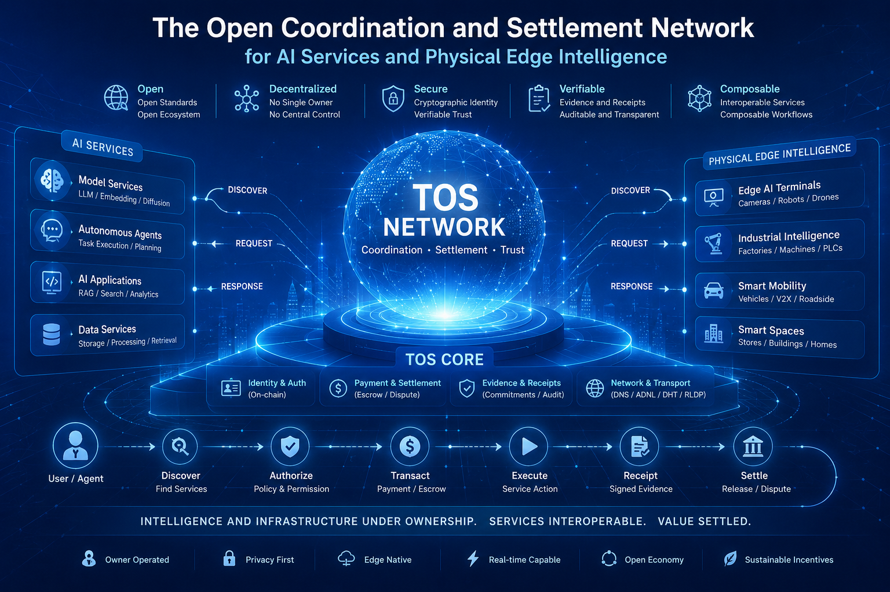
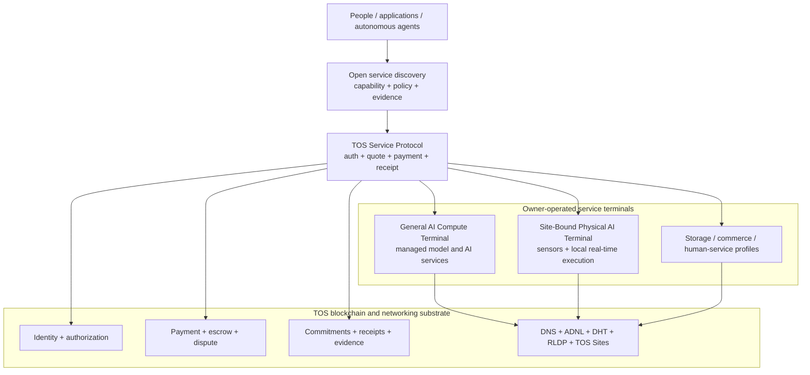
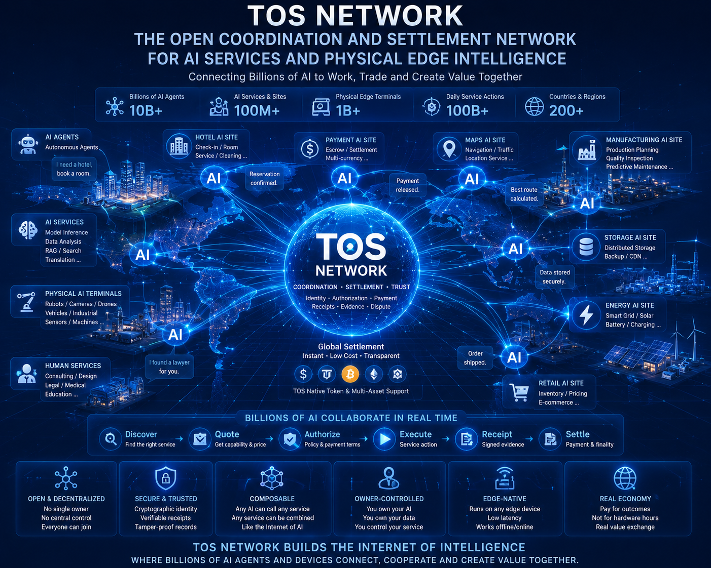

# TOS Network

## The Open Coordination and Settlement Network for AI Services and Physical Edge Intelligence

**TOS Network is an open coordination and settlement network for autonomous
agents, owner-operated AI services, and site-bound physical AI terminals.**

TOS gives independently owned software and infrastructure a common way to be
identified, discovered, authorized, paid, audited, and composed across
organizational boundaries.

TOS does not compete to train foundation models, operate a centralized cloud,
or rent bare GPUs. Its role is to provide the trust and economic layer between
the owners of intelligence, the owners of physical infrastructure, autonomous
agents, and the consumers of their services.

In capital-markets terms, TOS is designed as an asset-light transaction layer
for machine-provided services. Hardware, models, sites, and operational
responsibility remain with providers; the network standardizes market access,
authorization, service commitments, and settlement.

The distinction is:

- **TOS Core**, implemented in this repository, is The Open System blockchain,
  native actor execution environment, contract foundation, and networking
  substrate.
- **TOS Network** is the broader service economy built from TOS Core, the open
  service protocol, owner-operated terminals, discovery, clients, and
  independently released product profiles.



## The Core Idea

AI is moving in two directions at once:

1. from centralized applications toward autonomous agents and independently
   operated model services; and
2. from the cloud toward cameras, robots, vehicles, factories, stores, homes,
   and other places where latency, privacy, connectivity, and physical safety
   matter.

The result is a fragmented economy of models, agents, devices, data, tools,
and human services. These resources can execute useful work, but they lack a
shared system for persistent identity, machine-readable capability,
authorization, payment, receipts, evidence, and dispute resolution.

TOS is designed to be that system.

> Intelligence and infrastructure remain under their owners' control. TOS
> makes their services interoperable and economically composable.

## Strategic Positioning

The unit of value in TOS Network is **a completed, policy-compliant service
action**, not an hour of unidentified hardware.

A consumer requests a capability with constraints such as:

- exact model or service revision
- input and output contract
- maximum latency and price
- region and data-egress policy
- availability and cancellation behavior
- evidence or attestation level

An owner-operated terminal decides whether it can safely admit the request,
executes it through an approved local runtime, returns a signed receipt, and
settles according to the agreed payment policy.

For a physical terminal beside sensors or machinery, local safety and
real-time workloads always take precedence. TOS never replaces the local
safety controller and never puts blockchain consensus in a hard real-time
control loop.

## Where TOS Sits



Only shared trust and settlement state belongs on-chain. Models, prompts,
video, sensor data, private documents, customer information, runtime secrets,
and physical control remain off-chain and under explicit owner policy.

## Product Pillars

### Autonomous agents and service actors

TOS gives agents persistent identity, balances, programmable authority,
spending limits, task history, escrow, service calls, result commitments, and
dispute workflows.

### Managed AI services

An operator can expose approved local models and bounded AI capabilities
without exposing a shell, container socket, raw accelerator, or unrestricted
host access. Consumers buy inference, media, embedding, or other defined
service outcomes.

### Site-bound physical AI

Industrial and embedded terminals can expose privacy-preserving, location-
relevant capabilities while keeping raw data and physical authority local.
The physical-terminal profile is designed around:

- disconnected local operation
- bounded offline authorization and reconciliation
- signed model and software updates
- staged fleet rollout and rollback
- real-time workload priority
- raw sensor and actuator isolation
- independent local safety interlocks
- fleet enrollment, delegation, health, and revocation

### Open service economy

The same identity, quote, payment, receipt, and evidence foundations can
support storage, digital commerce, physical goods, human services, tools, and
compositions between them without forcing their business logic into
consensus.

## Network Economics

TOS Network is designed around paid service flow rather than rewards for idle
hardware:

- providers publish bounded services, policy, evidence, availability, and
  price
- consumers and autonomous agents authorize explicit budgets
- immediate actions use direct or per-action payment
- longer commitments use escrow, milestones, refunds, and disputes
- signed receipts connect the service action to accounting and settlement
- discovery, relay, verification, storage, and other infrastructure can
  participate through their own defined service profiles

TOS-denominated network fees and service settlement are intended to grow with
real usage. Merely being online or declaring TOPS does not create a claim on
network rewards.

The long-term network-effect thesis is cumulative interoperability:

- more compatible services improve discovery and composition
- more consumer and agent demand improves provider utilization
- persistent identities preserve authorization, receipts, evidence, and
  service history when operators change hardware or endpoints
- shared conformance reduces integration cost across models, devices, sites,
  and industries

These are design objectives, not claims that the current network has already
achieved commercial scale. Detailed monetary policy, incentives, and
governance require separate specifications.



*Conceptual long-term A2A network vision; figures shown are aspirational, not
current deployment metrics.*

## What TOS Is — and Is Not

| TOS is | TOS is not |
|---|---|
| An open identity, coordination, and settlement network | A centralized AI cloud |
| A service economy for agents and owner-operated terminals | A foundation-model company |
| A way to sell defined AI and physical-world service outcomes | A bare GPU rental marketplace |
| A blockchain-backed trust layer with off-chain execution | A system that executes models inside validators |
| A network where operators retain hardware, data, and policy control | A platform that takes custody of every provider's data or device |
| A framework for declared, observed, audited, attested, and replicated evidence | A claim that payment alone proves AI correctness |
| A local-first architecture for physical AI | A blockchain-controlled robot or safety controller |

Bare GPU rental, arbitrary consumer-supplied containers or programs, raw
accelerator access, and public physical-I/O control are outside the TOS product
plan.

## Why a Blockchain Is Necessary

TOS uses a blockchain only where multiple parties need a shared,
tamper-resistant source of truth:

- ownership and persistent service identity
- delegated authority and revocation
- capability and manifest commitments
- payment authorization and settlement
- escrow, refunds, deadlines, and disputes
- result and receipt commitments
- verifier and evidence references

Execution stays at the edge because that is where models, data, low latency,
privacy policy, physical context, and operational responsibility actually
reside.

This separation keeps consensus deterministic and focused while allowing the
service layer to evolve across different models, runtimes, accelerators,
devices, industries, and jurisdictions.

## Differentiation

### Versus centralized AI clouds

TOS does not require one company to own the model, device, customer
relationship, discovery system, and payment rail. Independent providers retain
control and can move runtimes or hardware without losing their service
identity.

### Versus decentralized GPU markets

GPU markets primarily expose infrastructure capacity. TOS exposes
policy-bound service capabilities. It can therefore include low-power,
site-bound terminals whose value comes from physical placement, private local
data, and real-time execution rather than raw throughput.

### Versus a generic Layer 1

TOS combines an actor-oriented execution model with native networking,
service/agent contracts, capability discovery foundations, and an explicit
off-chain terminal architecture. The objective is not only programmable
money, but programmable coordination between autonomous software and
independently owned services.

### Versus proprietary IoT and edge platforms

TOS separates open identity and settlement from device-vendor control.
Physical terminals keep their local safety authority, while operators can
participate in a wider service economy without publishing raw sensor data or
ceding fleet ownership to the network.

## Architecture and Repository Boundaries

TOS Network is designed as several independently released layers:

| Layer | Responsibility |
|---|---|
| `tos` — this repository | Blockchain consensus, native TVM execution, generic contracts and query APIs, wallet/crypto primitives, DNS, ADNL/DHT/RLDP, and TOS Sites |
| `tos-protocol` — planned separate repository | Base service descriptors, terminal/resource schema, authentication, quotes, payment authorization, receipts, evidence, `.tos` registrar, chain adapter, Edge Core, SDKs, discovery schema, and conformance |
| `tos-ai` — planned separate repository | General and physical AI terminal products, model/runtime adapters, resource probes, bounded and real-time scheduling, signed updates, fleet management, AI clients, and AI conformance |
| `tos-storage` — planned separate repository | Object services, storage leases, catalogs, metering, replication, and availability evidence |
| `tos-commerce` — planned separate repository | Offers, orders, inventory, physical/digital fulfillment, human services, refunds, and commerce discovery |

Application workloads do not run inside `validator-engine`. Product releases
must not require consensus upgrades merely because a model, accelerator,
terminal, store, or service profile changes.

## Current Foundation and Product Status

This repository already provides the native infrastructure on which the
network is being built:

- actor-oriented TVM execution and asynchronous account messaging
- masterchain and shardchain validation
- validator engine and full-node networking
- ADNL, DHT, RLDP, QUIC, and TOS Sites transport
- DNS resolution and resolver chaining
- wallet, crypto, JSON-RPC, indexing, and `tosctl` foundations
- Agent Account, concurrent Service Actor, Task Escrow, Dispute, Capability
  Registry, and Proof Attestation foundations

TOS is not yet a complete commercial AI terminal network. The following
product surfaces are still being specified or built outside the validator:

- base TOS Service Protocol and profile negotiation
- public `.tos` registration product
- signed terminal, resource, and service manifests
- Edge Core and terminal installers
- model managers and runtime adapters
- capability discovery and consumer clients
- quotes, low-latency payment, metering, and signed receipts
- home/site relay and reverse-tunnel services
- physical-terminal offline, update, actuator-safety, and fleet systems
- cross-implementation conformance and extended resource-soak testing

This distinction is deliberate: the chain foundation is ahead of the
off-chain product layer, and the roadmap does not present unfinished product
work as deployed network capability.

## Delivery Focus

The planned sequence is:

1. **Base protocol and Edge Core** — identity, manifests, authentication,
   quote, payment, receipt, evidence, discovery schema, and conformance.
2. **Managed inference terminal** — Tier 1 Linux/NVIDIA reference,
   operator-approved models, bounded scheduling, streaming, payment, and
   receipts.
3. **Site-bound physical terminal** — Jetson/ARM reference, disconnected local
   execution, safe signed updates, real-time priority, actuator isolation, and
   fleet management.
4. **Additional service profiles** — storage, commerce, human services, and
   controlled composition between profiles.
5. **Advanced network services** — production relays, prepaid/channel
   settlement, multi-region routing, replication, and stronger attestation.

No phase introduces bare GPU rental or arbitrary consumer execution.

## Native Execution Model

TOS treats accounts, smart contracts, agents, services, and tasks as
independent actors. Each actor owns state, receives asynchronous messages,
applies deterministic state transitions, and emits new messages.

Native execution provides:

- deterministic cell-native account state
- asynchronous delivery and bounce semantics
- gas accounting in nano-TOS
- dynamic shard split and merge behavior
- masterchain-rooted consensus, validator sets, and configuration updates

This model maps naturally to long-lived agent identities, concurrent paid
service requests, task queues, escrow, deadlines, receipts, and multi-step
workflows.

## Architecture Documents

- [TOS Protocol Implementation Plan](doc/the-tos-protocol-implementation-plan.md)
- [AI Edge Computing Terminal Architecture](doc/ai-edge-computing-terminal-architecture.md)
- [Site-Bound Physical AI Edge Terminal](doc/physical-ai-edge-terminal-use-case.md)
- [Managed AI Services on Local GPU Hardware](doc/local-gpu-sharing-use-case.md)
- [Locally Hosted Open-Weight Model Sharing](doc/local-open-weight-model-sharing-use-case.md)
- [AI Actor Model](doc/ai-actors.md)
- [AI Actor Threat Model](doc/ai-actor-threat-model.md)
- [AI Actor Testing Matrix](doc/ai-actor-testing-matrix.md)
- [Technical Roadmap](ROADMAP.md)

## Build

Build instructions are in [BUILD.md](BUILD.md). The primary C++ targets are:

- `validator-engine`
- `create-state`
- native networking and protocol libraries
- TVM, Fift, and FunC tooling

Rust operator tooling is under `tosctl/src`.

Common verification commands:

```bash
cmake -S . -B build -G Ninja -DCMAKE_BUILD_TYPE=Release
cmake --build build --target create-state validator-engine -j2
cd tosctl/src && cargo check -p contracts -p chain-rpc-client -p common -p commands -p service
```

## Repository Layout

- `crypto/` — TVM, cells, block logic, smart contracts, and genesis tooling
- `validator/` — validation, full-node, catchain, and consensus components
- `validator-engine/` — node process and JSON-RPC server
- `tosctl/` — Rust node-control and operator tooling
- `doc/` — protocol, architecture, configuration, and operator documentation
- `third-party/` — vendored dependencies

## Useful Targets

- `validator-engine`
- `create-state`
- `func`
- `fift`
- `toslib`

## License

This repository is licensed under the GNU General Public License v3.0. See
[LICENSE](LICENSE).
