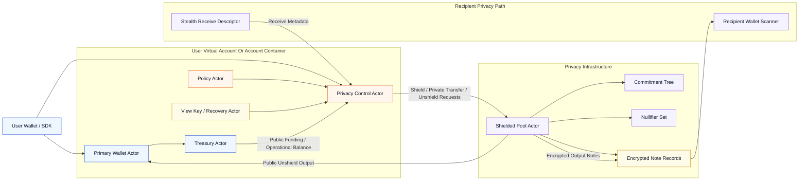
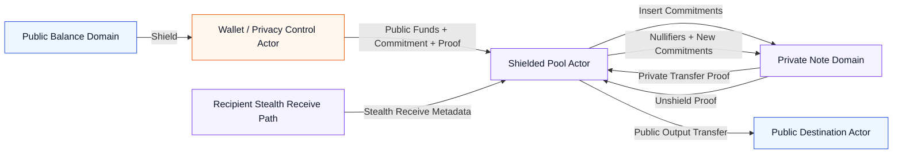
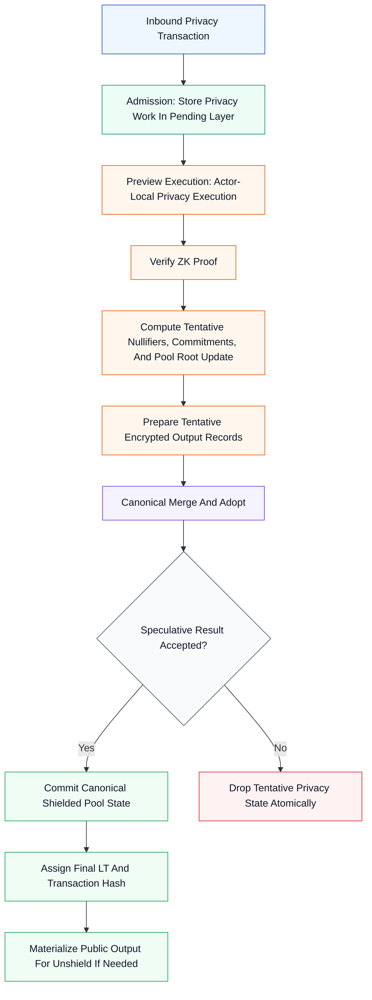

# TOS Actor Privacy Architecture — v3 Companion Design

**Status:** Draft v0.1  
**Audience:** Protocol designers, smart contract engineers, wallet/SDK engineers, validator implementers, cryptography engineers

---

## Abstract

This document defines a privacy-preserving transfer model for the TOS Actor Architecture described in [actor-v3.md](actor-v3.md). It introduces a shielded asset layer that fits both:

- **V1 Account-as-Actor**, where privacy is implemented as a coordinated set of contracts
- **V2 Protocol-Native Actors**, where privacy becomes a first-class actor workload inside one account container

The design is informed by the broad direction of Ethereum's 2030-era roadmap: account abstraction, stealth receiving, private writes, private proving, and modular proof-based scaling. The goal is not to make the entire base account model opaque. The goal is to make **private transfers, private balances, and private receive flows** possible while preserving TOS's actor-oriented execution model.

This document proposes:

- a **shielded pool actor model**
- **stealth-address-inspired receiving**
- **proof-backed private writes**
- separation between **public operational balances** and **private asset state**
- compatibility with **Admission / Preview Execution / Canonical Merge and Adopt**
- a future path toward **zk-proven actor execution**

---

## 1. Design Position

### 1.1 Why Privacy Is a Separate Companion Layer

The baseline actor model in `actor-v3.md` solves modularity, execution isolation, account abstraction, and intra-container composition. It does **not** by itself provide transaction privacy.

A privacy layer must solve different problems:

- hiding transfer amounts from the public state view
- hiding sender/receiver linkage where possible
- preventing note reuse via nullifiers
- enabling user-controlled disclosure rather than universal transparency
- keeping validator execution deterministic

For this reason, privacy is designed here as a **companion architecture** on top of actor execution, not as a rewrite of the base actor model.

### 1.2 Ethereum 2030 Reference Direction

This proposal is informed by the practical direction Ethereum has been moving toward:

- **Account abstraction** for programmable wallets and richer security policies
- **Private writes** for payments, transfers, and actions that should not be public-by-default
- **Private proving** so correctness can be verified without replaying all private internals
- **Stealth receiving** so the recipient relationship is harder to track
- **Modular scaling / proof systems** so heavy computation can be proven rather than globally re-executed forever

TOS should adopt the same high-level lesson:

> privacy should be implemented as a first-class execution pattern, not as an afterthought hidden in ad hoc contracts.

---

## 2. Core Design Principle

### 2.1 Do Not Encrypt the Entire Account Container

This document explicitly rejects the idea of turning the entire account container into an encrypted object.

That approach would make:

- gas charging
- storage fee attribution
- actor scheduling
- proofs
- wallet integration
- lite-client support

much harder than necessary.

Instead, TOS privacy uses a **split-state model**:

- **public state** remains public and pays for execution
- **private value state** lives inside dedicated privacy actors

### 2.2 Public Operational Layer + Private Asset Layer

The system is divided into two layers:

**Public operational layer**

- `shared_balance`
- actor `budget`
- gas payment
- storage fee payment
- public messages
- account/container lifecycle

**Private asset layer**

- note commitments
- nullifiers
- encrypted note payloads
- historical roots
- proof verification
- optional viewing / disclosure paths

This split is the fundamental architectural choice of this document.

---

## 3. Goals and Non-Goals

### 3.1 Goals

1. Enable private transfers on TOS without breaking the actor execution model.
2. Support both V1 and V2 rollout tracks.
3. Keep gas and storage accounting deterministic and publicly payable.
4. Allow recipients to receive privately using stealth-address-style flows.
5. Support shield, transfer, and unshield as the three primary privacy actions.
6. Make privacy logic local to specialized actors rather than global to the whole protocol.
7. Be compatible with future zk-proven execution.

### 3.2 Non-Goals

1. Hide that a privacy transaction occurred at all.
2. Hide total chain activity from validators.
3. Make the full account container opaque.
4. Make all TOS assets private by default at genesis.
5. Solve all metadata leakage in the first version.
6. Replace consensus replay with zk proofs in the first version.

---

## 4. High-Level System Model

### 4.0 Privacy Architecture Overview

**Figure 1. Actor Privacy Architecture Overview**

This diagram summarizes how the public wallet layer, privacy control layer, shielded pool, and recipient privacy path fit together.

Color coding in this diagram is illustrative, not normative.

### 4.1 Privacy Actors

The minimum privacy-capable Virtual Account or Account Container includes the following roles:
See Figure 1 for the high-level relationship between these actors and the shielded pool path.

- **Primary Wallet Actor** — public user entry point
- **Treasury Actor** — public operational balance manager
- **Policy Actor** — optional authorization / spending rules
- **Privacy Control Actor** — wallet-facing privacy coordinator
- **Shielded Pool Actor** — commitment tree, nullifier set, proof verification
- **View Key / Recovery Actor** — optional encrypted recovery and selective disclosure support

For fungible assets, two deployment styles are possible:

- **one global shielded pool per asset**
- **one shielded pool per account container**

The baseline recommendation is:

> use a **global or shard-local shielded pool actor per asset class**, while the user's account container stores control metadata, view keys, and local privacy policy.

This gives stronger anonymity sets and avoids fragmenting users into tiny isolated pools.

### 4.2 Privacy State Model

The privacy layer tracks value using notes, not public balances.

Each private note is represented by:

- a commitment inserted into a commitment tree
- encrypted payload visible only to intended recipients
- an amount and asset type hidden inside the proof circuit or ciphertext structure
- a nullifier derivation path for future spending

The public chain does **not** store a readable per-user private balance. Instead, it stores:

- pool root(s)
- nullifier set root or sparse structure
- note commitments
- encrypted note metadata

Private balance is reconstructed client-side by scanning owned notes.

---

## 5. Actor Responsibilities

### 5.1 Privacy Control Actor

The Privacy Control Actor is the user-facing privacy coordinator.

Responsibilities:

- maintain privacy settings and preferred pool configuration
- manage view keys and optional recovery delegates
- coordinate shield, transfer, and unshield requests
- decide whether a transfer should be public or private
- enforce policy hooks before a private action is sent to the pool

This actor does **not** verify heavy proofs. It coordinates and authorizes.

### 5.2 Shielded Pool Actor

The Shielded Pool Actor is the core privacy state machine.

Responsibilities:

- verify zero-knowledge proofs
- maintain the commitment tree
- maintain nullifier state
- record encrypted output notes
- enforce asset conservation rules
- reject note reuse
- mint public outputs only during unshield

The Shielded Pool Actor is the canonical source of truth for private asset state.

### 5.3 View Key / Recovery Actor

This actor is optional but strongly recommended.

Responsibilities:

- store encrypted recovery material
- register authorized disclosure delegates
- support user wallet recovery
- support selective compliance exports if enabled by the user or institution

This actor MUST NOT have unilateral spending power over shielded notes unless the user explicitly configures a delegated recovery mode.

---

## 6. Privacy Addressing Model

### 6.1 Public Actor Identity vs Private Receiving Identity

A privacy-preserving transfer must not require the sender to target the recipient's long-lived public actor identity directly.

Therefore, this design separates:

- **public actor identity** — stable account / actor address in TOS
- **private receiving identity** — one-time stealth receive descriptor

### 6.2 Stealth Receive Descriptor

Inspired by Ethereum stealth address work, each recipient publishes a privacy receive bundle containing:

- a scanning public key
- a spending public key or spending authorization reference
- optional asset/domain tags
- optional routing metadata to the recipient's Privacy Control Actor

For each inbound private payment, the sender derives a one-time receive destination and encrypted note payload using recipient-published metadata.

This provides:

- unlinkability between different receives
- better receiver privacy than reusing one static public actor address
- compatibility with client-side note discovery

### 6.3 Compatibility Rule

Stealth receiving is a **privacy-layer receive mechanism**, not a replacement for public `ActorAddress`.

Public actor addresses still exist for:

- public transfers
- gas sponsorship coordination
- shield / unshield endpoints
- policy and recovery actors
- audit and support tooling

---

## 7. Asset Model

### 7.1 Public vs Private Value Domains

Each supported asset exists in two domains:

- **public domain** — normal actor balances and transfers
- **private domain** — shielded notes inside the pool

Movement between these domains is explicit:

- `shield`: public -> private
- `unshield`: private -> public

### 7.2 Why Private Value Must Not Live in `shared_balance`

`shared_balance` and actor `budget` are unsuitable as confidential ledgers because they are needed for:

- deterministic fee accounting
- validator replay
- state readability
- public execution correctness

Therefore:

- private balances MUST NOT be represented as encrypted `shared_balance`
- private balances MUST NOT be represented as encrypted actor `budget`

Private balances exist only as client-known notes represented by commitments on-chain.

---

## 8. Core Transaction Types

### 8.0 Privacy Transaction Lifecycle Diagram

**Figure 2. Shield / Private Transfer / Unshield Lifecycle**

This diagram summarizes the three core privacy transaction types and how value moves between the public and private domains.

Color coding in this diagram is illustrative, not normative.

### 8.1 Shield

`shield` converts public balance into private notes.
See Figure 2 for the public-to-private transition path.

Flow:

1. The user authorizes a shield action through the Wallet Actor or Privacy Control Actor.
2. Public funds are sent to the Shielded Pool Actor.
3. The request includes:
   - asset type
   - value
   - new note commitment(s)
   - encrypted note payload(s)
   - proof that the shield operation is well-formed
4. The Shielded Pool Actor verifies the proof and inserts commitments.
5. The public balance decreases and private notes become spendable.

### 8.2 Private Transfer

`private transfer` moves value inside the private domain.
See Figure 2 for the note-to-note transfer path.

Flow:

1. The sender's client selects notes locally.
2. The client produces a proof showing:
   - the input notes exist under an accepted root
   - the sender is authorized to spend them
   - nullifiers are correctly derived
   - inputs equal outputs plus fees
   - new output commitments are correctly formed
3. The transaction is submitted to the Shielded Pool Actor.
4. The actor verifies the proof, marks nullifiers, inserts new commitments, and records encrypted outputs.

### 8.3 Unshield

`unshield` converts private notes into public actor-visible balance.
See Figure 2 for the private-to-public exit path.

Flow:

1. The sender proves ownership of private notes.
2. The sender specifies a public destination actor or account container.
3. The Shielded Pool Actor verifies the proof and consumes the input notes.
4. The pool emits a normal public transfer to the destination actor.

Unshield is the only privacy flow that intentionally re-enters public balance semantics.

---

## 9. Proof System Requirements

### 9.1 Statement Requirements

The privacy proof system must prove, at minimum:

1. commitment inclusion under a valid root
2. authorized spend of private notes
3. nullifier correctness
4. value conservation
5. asset identifier consistency
6. range correctness
7. output commitment correctness

### 9.2 Proof System Layering

The design should support three independent proving layers over time:

- **transaction privacy proof** — note correctness, nullifiers, commitments
- **actor execution proof** — future proof that the Shielded Pool Actor executed correctly
- **block validity proof** — future proof of Preview Execution + Canonical Merge and Adopt correctness

Version 1 of this design requires only the first layer.

### 9.3 Ethereum-Inspired Direction

Ethereum's privacy direction increasingly treats proofs as a reusable infrastructure layer, not a one-off feature. TOS should do the same:

- define reusable proof verifier interfaces
- separate proving from wallet orchestration
- make proof verification actor-local where possible
- design for client-side proving, prover marketplaces, or delegated proving later

---

## 10. Integration with V1 and V2

### 10.1 V1 Integration

In V1, privacy is contract-layer only.

The deployment pattern is:

- `Wallet Actor`
- `Treasury Actor`
- `Policy Actor`
- `Privacy Control Actor`
- one or more external `Shielded Pool` contracts

Properties:

- no protocol changes
- privacy achieved by contract conventions and zk verification inside contracts
- wallet SDK performs note scanning and proof generation
- treasury remains public and pays public fees

### 10.2 V2 Integration

In V2, privacy actors become protocol-native actors inside an account container or are referenced by protocol-native privacy pools.
Figure 1 shows the recommended baseline relationship between account-container-local privacy control and shared privacy infrastructure.

Two models are possible:

- **Container-local privacy actor**: useful for specialized app-local privacy domains
- **Shared network privacy pool actor**: preferred for fungible assets because it maximizes anonymity set size

The baseline recommendation for native coin and major fungible assets is:

> use shared privacy pools plus account-container-local privacy control actors.

Privacy execution in V2 follows the same runtime discipline as the main actor specification:

- **Admission** stores privacy-targeted external work in an actor-aware pending layer
- **Preview Execution** performs reversible actor-local proof verification and tentative state updates
- **Canonical Merge and Adopt** commits only accepted privacy results into canonical actor state

Privacy actors therefore inherit the same runtime separation requirements:

- pending runtime
- canonical runtime
- replay runtime

Privacy-specific logic MUST NOT collapse these boundaries.

---

## 11. Interaction with Admission / Preview / Canonical Adopt

### 11.0 Privacy Execution Integration Diagram

**Figure 3. Privacy Actor Integration With Admission / Preview / Canonical Adopt**

This diagram summarizes how a privacy transaction is processed through admission, speculative execution, and canonical commit.

Color coding in this diagram is illustrative, not normative.

### 11.1 Admission Responsibilities

For privacy transactions, Admission performs ingress-only handling:

- authenticate and parse the privacy-targeted external message
- perform cheap validation
- store the request in the actor-aware pending layer
- mark the request as eligible for future Preview Execution

Admission MUST NOT:

- execute proof verification
- mutate canonical shielded pool state
- mutate canonical nullifier state
- materialize canonical public outputs

### 11.2 Preview Execution Responsibilities

For privacy transactions, Preview Execution performs actor-local computation:
See Figure 3 for the full speculative-to-canonical execution path.

- parse the privacy transaction
- verify the zero-knowledge proof
- compute tentative nullifier updates
- compute tentative commitment insertions
- compute tentative pool root update
- prepare tentative encrypted output records

These are actor-local operations and fit naturally into speculative execution.

Privacy actors must obey the same queue-first and wave-based discipline as other actors:

- one wave executes at most one mailbox item per actor
- newly emitted privacy-layer internal messages become eligible only in a later wave
- same-wave recursive execution is forbidden
- a later wave may still occur in the same block if block limits allow it

### 11.3 Canonical Merge and Adopt Responsibilities

Canonical Merge and Adopt handles only the canonicalization boundary:

- commit the tentative Shielded Pool Actor state if validation passed
- assign final account-level logical time
- materialize public outputs for unshield operations
- update block descriptors and proofs

Canonical Merge and Adopt must not reinterpret confidential internals. It only decides whether the speculative actor result becomes canonical.

### 11.4 Why This Matters

This separation preserves the core V2 invariant:

- **Admission accepts work without mutating canonical state**
- **Preview Execution does expensive local compute**
- **Canonical Merge and Adopt performs deterministic canonicalization**

Privacy logic must respect that boundary.

---

## 12. Private Reads, Private Writes, Private Proving

Following Ethereum's privacy vocabulary, TOS should structure privacy work into three pillars.

### 12.1 Private Writes

Private writes are the first concrete target.

They include:

- shield
- private transfer
- unshield
- private payment intents
- private policy approval records where needed

### 12.2 Private Reads

Private reads are a later but important target.

They include:

- querying note ownership without leaking interest patterns
- retrieving encrypted note payloads privately
- private wallet syncing
- private proof queries for light clients or institutions

This likely requires relays, PIR-style systems, or trusted hardware assisted indexing in early versions.

### 12.3 Private Proving

Private proving means the user can prove facts without revealing all underlying data.

Examples:

- prove sufficient balance without revealing note set
- prove age / credential possession using the same wallet architecture
- prove policy compliance without revealing full transaction history

This should be treated as a strategic direction, not only as a transfer feature.

---

## 13. Wallet and SDK Requirements

### 13.1 Privacy-Capable Wallet

A privacy-capable TOS wallet must support:

- note scanning
- note selection
- local or delegated proof generation
- stealth receive descriptor management
- encrypted memo handling
- viewing key export and backup
- selective disclosure workflows

### 13.2 Account Abstraction Alignment

The privacy layer should be implemented as a natural extension of the actor wallet model:

- the wallet decides public vs private route
- policy actors can approve or deny privacy actions
- session keys can be scoped to privacy actions only
- recovery actors can restore view access without necessarily restoring spend access

This follows the same account abstraction logic that Ethereum wallet evolution has emphasized: wallets are programmable security and privacy agents, not merely key holders.

---

## 14. Compliance and Selective Disclosure

### 14.1 Principle

TOS privacy should support **user-controlled disclosure**, not universal hidden state with no recovery path.

### 14.2 Selective Disclosure Options

Possible mechanisms:

- outgoing view keys
- incoming view keys
- auditor-limited viewing capability
- encrypted compliance export packages
- policy-enforced institutional disclosure modes

These MUST be opt-in and separable from base spending authority.

### 14.3 Non-Custodial Rule

No disclosure actor or recovery actor may become a hidden custodian by default.

The baseline system must preserve:

- user-controlled spending keys
- user-controlled note ownership
- explicit delegation only

---

## 15. Security Model

### 15.1 Main Threats

The design must defend against:

- double spends through note reuse
- malformed commitments
- invalid proofs
- pool fragmentation reducing anonymity
- metadata leakage through repeated public entry/exit patterns
- wallet-side note scanning compromise
- recovery material exfiltration

### 15.2 Metadata Reality

This architecture improves privacy but does not eliminate all metadata leakage.

Still visible in many deployments:

- timing
- shield/unshield frequency
- asset type
- proof verification cost profile
- public interaction with the pool actor

This document targets meaningful privacy improvement, not perfect anonymity.

---

## 16. Recommended Rollout Path

### 16.1 Stage P1 — V1 Privacy Contracts

Implement privacy as contracts on top of V1:

- wallet integration
- shielded pool contract
- privacy control actor
- client note scanning and proof generation

### 16.2 Stage P2 — V2 Actor-Native Privacy

After V2 actor execution is stable:

- make privacy control actor protocol-native
- allow shielded pool logic to run in actor-native execution
- standardize actor-level privacy transaction records

### 16.3 Stage P3 — Proof-Compressed Validation

Later:

- make privacy actors proof-friendly by design
- optionally prove actor execution
- optionally prove Preview Execution + Canonical Merge and Adopt correctness

This is where the architecture can evolve toward a zk-proven actor system rather than merely a privacy-enabled actor system.

---

## 17. Baseline Recommendation

The baseline recommendation of this document is:

1. Keep `shared_balance` and actor `budget` public.
2. Implement private value as note commitments inside dedicated shielded pool actors.
3. Use stealth-receive descriptors for recipient privacy.
4. Make privacy control wallet-native through actor-based account abstraction.
5. Verify privacy proofs in Preview Execution as actor-local execution.
6. Keep Canonical Merge and Adopt free of privacy-specific semantics except canonical commit and public output materialization.
7. Design all privacy interfaces so they can later be proven by zk systems.

---

## 18. Open Questions

1. Should native coin privacy use one global pool, one shard-local pool, or both?
2. Which proving system best matches TOS's long-term proving strategy?
3. Should view keys live inside a dedicated actor or remain purely client-side with optional backup?
4. What minimum disclosure interface is acceptable for regulated institutional use?
5. How much private-read infrastructure should be part of the protocol versus SDK/indexer infrastructure?

---

## 19. Summary

TOS privacy should not be designed as "encrypt the account." It should be designed as:

- **actor-oriented account abstraction**
- **public execution plus private asset state**
- **shielded pools**
- **stealth receiving**
- **proof-backed private writes**
- **future-compatible private proving**

This gives TOS a privacy model that is consistent with the actor architecture, technically realistic for phased rollout, and aligned with the strategic lessons visible in Ethereum's long-term roadmap.
