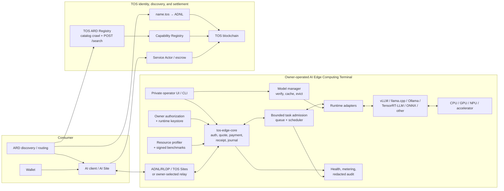

# TOS AI Edge Computing Terminal Architecture

> Implementation note (2026-08-02): the local reference now includes bounded
> cached ARD federation in `tos-service-protocol`, WorkerStreamService v0.2
> terminal-result streaming across the private Worker boundary, and signed
> bounded fleet-control/offline/canary state machines in `tos-ai`. These close
> locally executable protocol and MOCK tests. They do not certify a public
> federation perimeter, NVIDIA isolation, an operator fleet transport, or a
> physical safety controller.

## Status

- Document type: product architecture and implementation requirements
- Status: proposed, non-normative
- Date: 2026-07-31
- Related plan:
  [The TOS Protocol Implementation Plan](the-tos-service-protocol-implementation-plan.md)

## Decision

The **TOS AI Edge Computing Terminal** is the primary owner-operated execution
product for the first TOS service vertical.

It turns hardware controlled by an ordinary user into one or more bounded,
discoverable, payable AI services. It is not a validator, a consensus role, a
mining role, or a public shell. A terminal may be a small GPU server, an AI
workstation, an AI PC, an industrial edge module, or, in later compatibility
tiers, a constrained accelerator appliance.

The terminal-oriented product model is:

```text
owner-controlled hardware
  + measured resource capabilities
  + approved model/runtime adapters
  + bounded task admission
  + TOS identity and reachability
  + quote, payment, metering, and receipts
  = TOS AI Edge Computing Terminal
```

The terminal supplies production capacity; it is not the autonomous market
operator. The proposed
[OpenFox autonomous earning agent](openfox-autonomous-earning-agent.md) is a
separate off-chain process that discovers candidate paid work, applies owner
economic policy, and dispatches approved work to a terminal. In product terms,
`tos-service-protocol` establishes the trusted market, `tos-ai` supplies production
capacity, and OpenFox lets that capacity participate autonomously in the
market and earn revenue.

Consumers buy a declared service outcome under explicit constraints. They do
not receive raw access to the accelerator merely because the terminal
advertises one.

Bare GPU rental, arbitrary consumer-supplied execution, and public accelerator
access are outside the TOS product plan. They are not deferred terminal
profiles.

The terminal publishes its stable callable services through an
ARD-compatible catalog, and TOS can operate an ARD Registry for plural,
federated discovery. ARD remains outside the execution and safety boundary:
catalogs and search results cannot reserve hardware, authorize payment, change
local priority, install software, or control a physical device.

## Why the Terminal Is the Core Product Unit

The available hardware market is heterogeneous:

- Linux GPU servers provide the most mature high-throughput inference stack.
- AI workstations and unified-memory computers can host large quantized
  models but use different runtimes and operating systems.
- industrial modules prioritize continuous operation, low power, video, voice,
  robotics, and local latency.
- AI PC NPUs and dedicated accelerators are efficient for selected model
  graphs but do not provide universal model compatibility.
- mobile and embedded devices have background-execution, battery, thermal, and
  connectivity constraints.

A hardware-only marketplace exposes this complexity directly to every
consumer. A terminal instead publishes stable workload capabilities such as
text generation, embeddings, OCR, speech recognition, image generation, or
video analysis, together with model, latency, region, privacy, evidence, and
price constraints.

The scheduler may consider physical hardware, but the public contract is a
versioned service profile. Marketing values such as TOPS or TFLOPS are
advisory because vendors report different precisions, sparsity assumptions,
power envelopes, and benchmark conditions.

## Terminal Classes

The common architecture supports two initial product classes:

| Class | Primary role | Scheduling rule |
|---|---|---|
| **General AI Compute Terminal** | Owner-approved model and AI task services on a server, workstation, or AI PC | Paid work uses capacity remaining after explicit owner reservations |
| **Site-Bound Physical AI Edge Terminal** | Continuous or event-triggered perception beside sensors, robots, vehicles, or industrial equipment | Safety, control, and local real-time work have absolute priority; external services are disabled by default |

The physical class is specified separately in
[Site-Bound Physical AI Edge Terminal](physical-ai-edge-terminal-use-case.md).
It adds offline operation, signed model/software updates, actuator isolation,
real-time priority, and fleet management. It does not turn a robot or
industrial box into a small public GPU cloud.

## Terminology

| Term | Meaning |
|---|---|
| **Terminal** | The complete owner-operated product instance, including Edge Core, one or more profile adapters, local policy, identity, observability, and hardware |
| **Edge Core** | The generic protocol enforcement library and daemon foundation owned by `tos-service-protocol` |
| **AI adapter** | A `tos-ai` component that controls an inference runtime, model lifecycle, task admission, and AI-specific metering |
| **Runtime** | Existing execution software such as vLLM, llama.cpp, Ollama, TensorRT-LLM, ONNX Runtime, OpenVINO, or MLX |
| **Resource profile** | A measured description of usable CPU, RAM, accelerator, storage, network, thermal, and software capabilities |
| **Service profile** | The consumer-facing model/task contract, including schemas, limits, pricing, privacy, evidence, and receipt rules |
| **Terminal operator** | The owner or authorized administrator of the hardware and services |
| **Runtime key** | A revocable key authorized to sign short-lived terminal manifests, quotes, and receipts |
| **ARD catalog** | The protocol-neutral `ai-catalog.json` discovery envelope for stable callable resources |
| **TOS ARD Registry** | An off-chain ARD-compatible search and federation service enriched with explicitly sourced TOS chain, health, and profile data |
| **OpenFox** | A proposed autonomous earning agent that matches paid tasks to owner-approved skills and capacity under bounded economic and signing policy |

“Terminal” must not be used as a synonym for a TOS full node or validator.
Running a terminal must not grant consensus authority.

## Repository and Deployment Boundary

| Location | Responsibility |
|---|---|
| `tos` | Consensus, VM, generic contracts and query APIs, wallet/crypto primitives, DNS, ADNL/DHT/RLDP, and TOS Sites |
| `tos-service-protocol` | Base service protocol, ARD compatibility profile and Registry, Edge Core, chain adapter, terminal identity and resource schema, authentication, quotes, receipts, SDKs, and conformance |
| `tos-ai` | General and physical AI terminal distributions, ARD catalog generation for AI profiles, AI capability vocabulary, resource probes and benchmarks, model/runtime adapters, task scheduler, signed updates, fleet management, AI client, packaging, and AI conformance |
| `openfox` (proposed) | Autonomous task discovery, skill matching, planning, conservative cost/profit/risk evaluation, bounded protocol actions, execution coordination, and owner-facing accounting/audit |
| Other vertical repositories | Storage and commerce adapters that may coexist on the same host but retain separate state machines and releases |
| Terminal host | Drivers, runtimes, model artifacts, local data, runtime key, policy, caches, logs, and profile processes |

Neither `tos-service-protocol` nor `tos-ai` belongs inside `validator-engine`. New
accelerator support must not require a consensus upgrade.

The preferred implementation split is:

```text
tos-service-protocol
  ├── tos-edge-core
  └── tos-ard-registry

tos-ai
  ├── tos-edge-ai
  ├── terminal installer and supervisor
  ├── resource probes and benchmark workers
  ├── runtime adapters
  ├── model manager
  ├── task scheduler
  └── AI discovery and client

openfox
  ├── owner mandate and skill registry
  ├── bounded discovery and task state
  ├── planner, economics engine, and policy gate
  ├── tos-service-protocol and tos-ai clients
  └── delegated signer, accounting, and audit interfaces
```

OpenFox may be co-located with a terminal for an ordinary operator, but it must
not be linked into the worker process or inherit the terminal runtime key. It
uses released protocol interfaces and the terminal's private, policy-bounded
execution interface. The worker still performs authoritative admission before
loading models or reserving large resources.

The Edge Core is preferably implemented in Rust. Runtime processes may be
written in their native ecosystems. The design does not require the control
plane to reimplement inference kernels or matrix operations.

## Logical Architecture



The normal path is:

```text
intent
  -> search an ARD Registry for compatible service profiles
  -> verify catalog publisher, provenance, and TOS identity binding
  -> verify fresh signed manifest and chain commitments
  -> obtain quote bound to exact service revision
  -> authorize payment
  -> authenticate through ADNL/RLDP or relay
  -> pass bounded terminal admission
  -> execute through an approved runtime adapter
  -> stream result
  -> release all resources
  -> sign usage/result receipt
  -> settle or refund
```

## Control Plane and Data Plane

The terminal must separate:

### Control plane

- owner authorization and runtime-key rotation
- terminal and service manifests
- ARD catalog generation and publication
- hardware/runtime inventory
- benchmark evidence
- model installation and approval
- availability, price, privacy, and admission policy
- software updates, drain, rollback, and retirement
- settlement reconciliation and audit

### Data plane

- authenticated public sessions
- request validation
- queue admission and cancellation
- model/runtime execution
- bounded streaming
- metering
- terminal cleanup
- signed result and usage receipts

The administrative interface must never be exposed through the public service
listener. The public client must not be able to install a driver, approve a
model, change price policy, access the wallet, or obtain a shell.

## Capability Model

The terminal publishes both **resource declarations** and **service
capabilities**. They serve different purposes.

Stable public service capabilities belong in the ARD catalog. Rapidly changing
resource state remains in short-lived signed terminal data and live
quote/admission responses. ARD discovery is never a reservation.

### Resource declaration

A resource declaration should include:

- terminal software and schema versions
- operating system and architecture
- CPU class and usable cores
- host RAM offered and reserved
- accelerator vendor, device class, memory, and runtime versions
- supported numeric formats and tested features
- bounded local storage and model-cache capacity
- ingress transports, region, and measured network characteristics
- power/thermal policy when available
- current admission state and short expiry
- evidence level for each claim

The public declaration should avoid stable host fingerprints that make an
ordinary operator unnecessarily trackable. A terminal identity is a
revocable protocol identity, not an immutable serial-number registry.

### Service capability

A service capability should include:

- canonical capability identifier
- exact model or task profile revision
- input, output, and streaming schemas
- context, batch, duration, and output limits
- model/artifact and runtime commitments
- privacy, retention, region, and egress policy
- supported evidence level
- price units and quote rules
- advertised latency and throughput benchmark references
- health and capacity expiry

Consumers schedule against service capabilities. Hardware constraints may be
included when a workload requires a specific runtime, accelerator, precision,
or attestation class.

## Claims and Evidence Levels

The design must not treat a self-reported GPU model or benchmark as proof.
Each claim carries an evidence level:

| Level | Meaning |
|---|---|
| Declared | Signed by the terminal runtime key |
| Observed | Derived from successful consumer calls and signed receipts |
| Benchmarked | Produced by a versioned challenge and benchmark profile |
| Audited | Signed by an accepted independent auditor |
| Attested | Bound to a supported hardware/runtime attestation |
| Replicated | Compared with one or more independent executions for that task |

These levels are capability-specific. A provider may have an audited network
claim but only a declared model claim. Payment and a receipt prove agreement
and accounting; they do not by themselves prove the physical device, exact
loaded model, semantic correctness, or confidentiality.

## Runtime Adapter Contract

The AI terminal uses a common adapter interface rather than a single universal
inference engine. Each adapter must implement:

- runtime and device discovery
- model compatibility and preflight checks
- artifact commitment verification
- bounded load, warm, unload, and health operations
- request normalization and output streaming
- cancellation and deadline propagation
- usage reporting with declared confidence
- error normalization
- cleanup after success, error, timeout, disconnect, or process crash
- resource accounting suitable for admission control

Initial adapters should cover:

1. OpenAI-compatible local endpoints
2. Ollama
3. llama.cpp server
4. vLLM

TensorRT-LLM is an optimized NVIDIA path. ONNX Runtime, OpenVINO, MLX,
SGLang, and vendor-specific NPU runtimes are separate adapters. ONNX Runtime
is useful for portable model graphs but is not the universal LLM serving
interface.

## Model and Artifact Management

The terminal operator approves every artifact executable by the MVP.

The model manager must:

- pin source, revision, license metadata, and canonical hashes
- distinguish original weights from converted or quantized artifacts
- verify downloads before activation
- record runtime compatibility
- preflight RAM, VRAM, disk, and context requirements
- maintain bounded caches and an explicit eviction policy
- reserve disk space so a download cannot exhaust the host
- stage upgrades without silently changing accepted quotes
- preserve active-revision semantics during drain
- remove partial downloads and failed builds

Model distribution and replication should compose with `tos-storage`; AI
model identity and runtime compatibility remain owned by `tos-ai`.

## Task Admission and Scheduling

The terminal scheduler is authoritative for local admission. A remote
discovery service cannot reserve hardware by publishing an optimistic load
value.

Admission considers:

- exact model/profile compatibility
- current RAM, VRAM, storage, and runtime state
- bounded queue and in-flight counts
- context, batch, output, and deadline limits
- terminal owner reservations and quiet hours
- thermal and power policy
- price and payment authorization
- privacy, region, and evidence constraints
- cancellation and restart state

The scheduler must support pause, drain, reject, cancel, and terminal cleanup.
Local owner work may have priority, but the policy must not invalidate an
already accepted paid task without applying the advertised cancellation or
refund rule.

The network should optimize for a completed service action, not reward a
terminal merely for being online or declaring idle TOPS.

## Task Lifecycle

```text
DISCOVERED
  -> QUOTED
  -> PAYMENT_AUTHORIZED
  -> ADMITTED
  -> RUNNING
  -> STREAMING
  -> COMPLETED
  -> RECEIPTED
  -> SETTLED
```

Required terminal paths include:

```text
QUOTED -> EXPIRED
PAYMENT_AUTHORIZED -> REJECTED -> REFUNDABLE
ADMITTED/RUNNING -> CANCELLED -> RECEIPTED
ADMITTED/RUNNING -> FAILED -> RECEIPTED -> REFUND/SETTLEMENT
RUNNING -> DEADLINE_EXCEEDED -> CLEANUP
```

Every state is idempotent within its specified scope. Restart recovery must
not execute a paid task twice or lose a refund obligation.

## Connectivity

The primary TOS path is:

```text
name.tos or raw ADNL identity
  -> ADNL
  -> RLDP/TOS Sites
  -> terminal ingress
```

An ordinary home terminal may lack a public address or stable inbound path.
The product therefore needs an owner-selected relay or reverse tunnel unless
Phase 1 explicitly requires public ADNL reachability. A relay may forward
encrypted traffic but must not receive owner authority, unrestricted runtime
credentials, model-provider secrets, or settlement control.

QUIC, HTTPS, WebSocket, and SSE may be defined as optional profile bindings,
but they must not silently replace the TOS identity and authorization model.

Public ARD crawling uses standard HTTPS and a verifiable FQDN. A terminal
reachable only through `name.tos` or raw ADNL publishes through an approved
HTTPS gateway namespace or a private ARD Registry with an explicit `.tos`
trust policy. The catalog may carry signed `.tos`, ADNL, TOS address, and
on-chain bindings, but `.tos` is not misrepresented as conventional public
DNS proof.

## Site-Bound Physical Terminal Specialization

A physical terminal keeps TOS outside the hard real-time and safety loop:

```text
sensor
  -> local real-time scheduler
  -> approved model
  -> local policy
  -> independent safety controller
  -> optional physical action
  -> bounded event/receipt journal
  -> later TOS publication or settlement
```

Its mandatory priority is:

1. emergency and safety interlocks
2. deterministic control deadlines
3. local real-time perception and sensor fusion
4. local asynchronous analysis and maintenance
5. approved external service requests
6. background update, telemetry, and compaction

It must continue its approved local workload while disconnected, using only
unexpired cached policy and bounded offline authority. Reconnect performs
idempotent journal and settlement reconciliation and observes revocation before
new admission.

Model, runtime, firmware, and policy updates are content-addressed, signed,
compatibility-checked, staged through fleet rollout rings, activated
crash-safely, monitored by health gates, and reversible to a known-good slot.

Raw CAN, GPIO, serial, fieldbus, camera, and actuator interfaces are never
public capabilities. A narrow semantic action must pass local policy and an
independent safety interlock, which may reject an otherwise valid TOS request.

Fleet management remains off-chain and bounded. It handles enrollment,
delegation, grouping, staged rollout, health, revocation, offline expiry, and
retirement without publishing detailed site topology or continuous telemetry
on-chain.

The complete requirements are in
[Site-Bound Physical AI Edge Terminal](physical-ai-edge-terminal-use-case.md).

## Security and Privacy

The terminal must:

- treat ARD descriptions, tags, representative queries, trust metadata, and
  endpoints as untrusted data rather than instructions or authority
- run public adapters under dedicated operating-system identities or
  sandboxes
- expose no raw GPU device, Docker socket, shell, home directory, or
  administrative port
- accept only provider-approved models and task types in the MVP
- constrain filesystem and network egress per adapter
- keep owner and unrestricted wallet keys outside public processes
- authenticate runtime-key delegation and revocation
- redact prompts, outputs, personal data, credentials, and artifacts from
  public logs and metrics
- make retention and region declarations visible before quote acceptance
- treat the provider as able to observe plaintext unless a stronger,
  verifiable confidential-compute profile applies

Consumer-supplied containers, native programs, models, and raw accelerator
jobs are not accepted by the TOS terminal product.

## Mandatory Resource Bounds

Every terminal implementation must explicitly bound:

- ARD catalog entries, bytes, nesting, refresh work, publication history, and
  discovery-client result/cache state
- connections, sessions, streams, and request bodies
- quotes, nonces, idempotency entries, and replay windows
- queues, in-flight tasks, subtasks, and retries
- prompt, context, output, batch, and media dimensions
- RAM, VRAM, pinned memory, KV cache, runtime workspaces, and model cache
- model downloads, temporary files, logs, metrics, and receipt/evidence queues
- chain watchers, settlement records, reconciliation work, and durable journal
- runtime restart rate and retained crash diagnostics
- sensor/decoder buffers, retained events, and offline-journal age and bytes
- update staging, rollback versions, fleet fan-out, retries, and history
- actuator requests, deduplication state, and audit records

Completion, cancellation, timeout, disconnect, failed payment, model unload,
adapter crash, upgrade, and terminal shutdown must each have a tested cleanup
path. No anonymous or unpaid caller may cause unbounded RAM, VRAM, disk,
watcher, queue, or durable-state growth.

## Hardware Compatibility Tiers

Compatibility is released by tested terminal class, not promised for every
device at once.

| Tier | Initial scope | Product intent |
|---|---|---|
| Tier 1 | Linux x86-64, NVIDIA CUDA, stable server/workstation, approved local runtimes | First production-quality general AI compute terminal |
| Tier 2P | NVIDIA Jetson/ARM64 reference appliance | First site-bound physical terminal with offline, update, real-time, and fleet conformance |
| Tier 2G | AMD ROCm/unified-memory systems, Apple Silicon, and CPU execution | Broader owner-operated general AI compute coverage |
| Tier 3 | Intel/Qualcomm NPUs, Hailo and other dedicated accelerators, selected ARM boards | Profile-specific physical or general vision, voice, embedding, and small-model services |
| Later | Phones and platform-restricted mobile/embedded devices | Constrained service profiles with platform-specific lifecycle rules |

A tier states packaging, conformance, observability, and soak-test support. It
does not imply identical model coverage or performance across devices.

## Profile Composition

One physical terminal may run multiple isolated profiles:

- locally hosted model inference
- bounded AI media or embedding tasks
- site-bound physical AI capabilities
- storage used for public objects or model distribution
- an owner-operated storefront or human-service workflow

Profiles share the Edge Core, identity, transport, and base receipt envelopes.
They do not share unbounded queues, private databases, credentials, or mutable
business state by default. Cross-profile composition requires explicit
capabilities and budgets.

Storage capacity offered to consumers must not consume space reserved for
model artifacts. Commerce or human-service data must not be visible to AI
adapters unless the operator explicitly authorizes a task-scoped capability.

## Operator Experience

An ordinary operator should be able to:

1. install a signed terminal package without installing a validator
2. create or connect a wallet and protected owner identity
3. generate a revocable runtime key
4. detect supported hardware and runtimes
5. run local conformance and workload benchmarks
6. select approved models and task profiles
7. reserve local CPU, RAM, accelerator, disk, bandwidth, and quiet hours
8. configure prices, privacy, region, retention, evidence, and refund policy
9. expose a raw ADNL endpoint or configure a relay
10. optionally bind `name.tos`
11. configure a verifiable FQDN, approved gateway, or private ARD publication
    policy
12. publish a bounded ARD catalog plus short-lived signed terminal and service
    manifests
13. pass ARD, payment, cancellation, restart, rotation, and cleanup self-tests
14. accept work
15. inspect redacted health, revenue, load, and settlement state
16. pause, drain, upgrade, roll back, rotate, or retire safely

The default installer must preserve capacity for the owner's own use and must
not advertise all detected devices automatically.

## Phase 1 Product

Phase 1 is a **managed inference terminal**. Bare GPU rental and arbitrary
consumer execution are explicitly outside the product.

It supports:

- Tier 1 Linux/NVIDIA as the required reference platform
- a deterministic test adapter
- OpenAI-compatible, Ollama, llama.cpp, and vLLM adapters
- provider-approved open-weight models
- text and embedding profiles, with asynchronous media profiles optional
- fixed-price or token/request quotes
- bounded streaming and cancellation
- raw ADNL access plus the selected home-reachability policy
- optional `name.tos`
- ARD-compatible catalog publication and TOS ARD Registry discovery
- signed manifests, quotes, receipts, and settlement integration

It excludes:

- arbitrary consumer containers and shell access
- consumer-supplied native programs, model weights, and raw accelerator jobs
- training and unrestricted fine-tuning
- universal hardware compatibility
- rewards based only on online time or claimed hardware
- claims that payment proves correct AI output
- mandatory zero-knowledge inference

## Acceptance Criteria

The first terminal release is complete only when:

1. an ordinary Tier 1 operator can install and onboard without a validator
2. hardware, runtime, model, and public reachability preflight succeed
3. a consumer can discover a compatible service through ARD without knowing
   its origin IP
4. the consumer can verify ARD publisher/provenance, the TOS identity binding,
   exact service revision, and claim evidence
5. quote, payment, invocation, cancellation, receipt, and settlement bind to
   the same task identity
6. terminal admission remains locally bounded and authoritative
7. runtime and model failures produce normalized errors and cleanup
8. key, endpoint, model, price, and software rotation preserve active work
9. restart recovery neither duplicates paid work nor loses settlement state
10. extended load and fault-injection tests demonstrate bounded RAM, VRAM,
    disk, connections, queues, watchers, caches, and journal growth
11. a three-node TOS environment validates DNS, ADNL/RLDP, contract, and
    settlement integration
12. the Registry, client, and publisher pass pinned upstream ARD conformance
13. an independent client and terminal implementation can pass the same TOS
    conformance vectors

## Open Decisions

- canonical terminal and resource-profile schemas
- privacy-preserving hardware identification
- standard benchmark tasks and auditor policy
- freshness and capacity-advertisement rules
- exact runtime adapter ABI and process boundary
- model artifact reference and `tos-storage` integration
- quote units for token, media, task, and measured compute
- low-latency prepaid credit or voucher flow
- relay selection, abuse prevention, and availability model
- task routing and capability-specific reputation
- pinned ARD version, TOS media types, `.tos` gateway binding, federation
  policy, and migration to a stable ARD release
- supported attestation roots and evidence issuers
- energy and thermal reporting semantics
- Tier 2 and Tier 3 compatibility matrices
- offline authorization, bounded journal, reconnect, and settlement semantics
- signed update authority, compatibility, rollout, anti-rollback, and recovery
- semantic actuator capability and independent safety-controller boundary
- fleet enrollment, delegation, grouping, rollout, health, and retirement

## Related Documents

- [OpenFox Autonomous Earning Agent](openfox-autonomous-earning-agent.md)
- [TOS Network Compatibility with Agentic Resource Discovery](tos-ard-compatibility.md)
- [The TOS Protocol Implementation Plan](the-tos-service-protocol-implementation-plan.md)
- [Managed AI Services on Local GPU Hardware](local-gpu-sharing-use-case.md)
- [Site-Bound Physical AI Edge Terminal](physical-ai-edge-terminal-use-case.md)
- [Locally Hosted Open-Weight Model Sharing](local-open-weight-model-sharing-use-case.md)
- [Shared AI Inference Services over TOS Domains](ai-inference-sharing-tos-domains.md)
- [Local Storage Sharing over TOS Network](local-storage-sharing-use-case.md)
- [Owner-Operated Storefront over TOS Network](owner-operated-tos-storefront-use-case.md)
- [TOS Sites](TosSites.md)
- [AI Actor Threat Model](ai-actor-threat-model.md)
