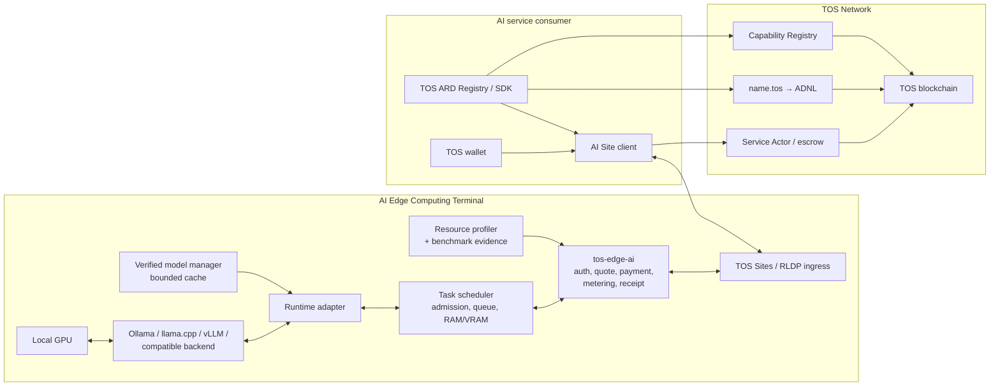
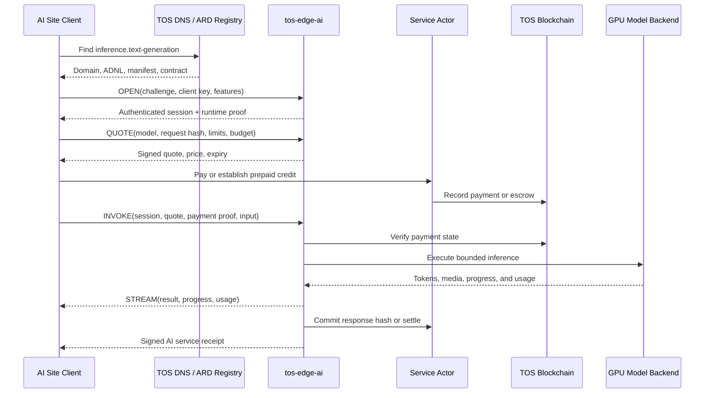

# Managed AI Services on Local GPU Hardware

## Status

- Document type: product use case and implementation requirements
- Status: proposed, non-normative
- Date: 2026-07-31
- Related architecture:
  [The TOS Protocol Implementation Plan](the-tos-service-protocol-implementation-plan.md)
- Terminal architecture:
  [TOS AI Edge Computing Terminal](ai-edge-computing-terminal-architecture.md)
- Physical-terminal use case:
  [Site-Bound Physical AI Edge Terminal](physical-ai-edge-terminal-use-case.md)
- Discovery profile:
  [TOS Network Compatibility with ARD](tos-ard-compatibility.md)

## Purpose

This document describes how an ordinary user can use local GPU hardware to
operate bounded AI services through a TOS AI Edge Computing Terminal, how
consumers discover those services, and how they pay for and use them.

The provider must not need to operate a validator or modify the TOS node. TOS
remains the identity, naming, transport, payment, and settlement substrate.
GPU-specific protocol code, terminal packaging, resource probes, runtime
management, discovery, and client tooling belong in the separate `tos-ai`
product repository defined by the implementation plan.

The public resource is a bounded service capability, not the physical GPU.
Consumers normally request a model or task with latency, region, privacy,
evidence, and budget constraints. The terminal selects a compatible approved
runtime and device. A hardware model can remain an optional consumer
constraint when a task or attestation profile requires it.

The recommended first product is a **provider-managed inference service**:

- the provider chooses and operates approved models
- consumers submit bounded inference requests
- consumers cannot execute arbitrary programs on the provider's machine
- the terminal's `tos-edge-ai` path authenticates requests, verifies payment,
  performs bounded admission, meters usage, and signs receipts

Bare GPU rental and consumer-supplied execution are outside this product.
There is no TOS terminal profile for uploading arbitrary CUDA programs,
containers, native binaries, or model weights.

Jetson and industrial devices whose primary purpose is local cameras, sensors,
robots, vehicles, or production equipment follow the separate physical-
terminal profile. Their safety and local real-time work takes absolute
priority over any approved network service.

## Managed Service Modes

### Managed inference

The provider installs and controls one or more inference backends, such as:

- Ollama
- vLLM
- an OpenAI-compatible local server
- an image-generation backend
- an embedding or reranking server
- a speech recognition or synthesis backend

Consumers call a defined inference API. They do not receive shell access,
direct device access, or permission to load arbitrary executable code.

This mode is the Phase 1 recommendation because it maps directly to the AI Site
protocol described in the implementation plan.

### Operator-approved model hosting

In a later phase, the terminal operator may install model or runtime packages
from an approved, signed registry. Packages, model weights, licenses, resource
profiles, signer authority, compatibility, and expected hashes must be checked
before activation. A consumer cannot select an unapproved package or cause a
package to be installed as part of a request.

## User Stories

### Terminal operator

As a terminal operator, I want to:

- select which local GPU devices and models are available
- preserve enough resources for my own use
- define concurrency, queue, time, memory, and spending policies
- expose the service without exposing my machine or model backend directly
- keep a persistent `name.tos` identity when my IP address or hardware changes
- advertise supported models, capabilities, prices, and availability
- receive payment before or during execution
- issue signed receipts for completed, cancelled, or failed work
- stop accepting new requests without losing pending settlement state
- publish measured service benchmarks without exposing immutable host serial
  numbers
- keep capacity for local work, quiet hours, and thermal limits

### AI service consumer

As an AI service consumer, I want to:

- find services by model, capability, region, context size, price, and health
- verify that the endpoint is authorized by its TOS identity
- obtain a signed quote with an explicit maximum cost
- stream inference output
- cancel work and stop further charges
- receive a signed result and usage receipt
- verify that payment and output refer to the same request
- understand whether hardware, model, privacy, or execution claims are merely
  declared or independently attested

## Repository and Deployment Boundary

| Location | Responsibility |
|---|---|
| `tos` core repository | consensus, VM, DNS primitives, JSON-RPC/lite APIs, wallet and crypto primitives, ADNL/DHT/RLDP, TOS Sites, and generic contract tooling |
| `tos-service-protocol` repository | Edge Core, terminal/resource schema, authentication, quote/payment/receipt envelopes, ARD compatibility profile and Registry, crawling/federation, and conformance |
| `tos-ai` repository | AI terminal distribution, AI Site schemas, inference/task profiles, resource probes and benchmarks, model/runtime adapters, scheduler, ARD catalog generation and AI-specific ranking enrichment, SDKs, deployments, and end-to-end tests |
| Terminal host | GPU drivers, approved runtimes and models, `tos-edge-ai`, bounded caches, runtime key, policy, and optionally a TOS Sites/RLDP ingress process |
| TOS blockchain | identity references, DNS, capability declarations, manifest commitments, payment, escrow, and settlement |

Prompts, private inputs, generated output, model context, and private logs must
not be placed on-chain.

## Architecture



The normal request path is:

```text
name.tos
  -> TOS DNS site record
  -> ADNL identity
  -> RLDP/TOS Sites ingress
  -> tos-edge-ai
  -> bounded task scheduler
  -> approved runtime adapter
  -> approved model backend
  -> local GPU
```

The GPU, runtime API, container socket, and terminal administrative interface
must not be exposed directly to the public network because doing so would
bypass authentication, payment, metering, admission, and resource policy.

## Provider Onboarding

### 1. Create the wallet and service identity

The provider creates:

- a TOS wallet for fees and service revenue
- a site owner key for the long-lived domain and service identity
- a separate runtime key for signing manifests, quotes, and receipts

The owner key should remain offline or in a protected administrative
keystore. The public runtime receives only revocable, time-bounded authority.
Compromise of the runtime key must not automatically transfer the domain or
the provider's funds.

### 2. Install and preflight the AI Edge Computing Terminal

The provider installs:

- supported GPU drivers
- CUDA or the corresponding device runtime
- an optional container runtime with GPU support
- one or more approved model backends
- the signed `tos-ai` terminal distribution and `tos-edge-ai`
- a server-side TOS Sites/RLDP proxy when native ingress is unavailable

The setup flow should detect:

- operating-system architecture and terminal compatibility tier
- GPU vendor and model
- device and driver compatibility
- available VRAM
- supported precision and runtime features
- host RAM, bounded disk, and model-cache capacity
- health and temperature information
- public ADNL or relay reachability
- backend reachability

Detection must not automatically publish all devices or allocate all capacity.
The operator explicitly chooses what is offered and what remains reserved for
local work.

Hardware information is useful for scheduling, but a self-reported GPU model,
runtime version, temperature, or benchmark is not cryptographic proof of the
hardware used for a request. Claims must be labeled as declared, observed,
benchmarked, audited, attested, or replicated according to the terminal
architecture.

### 3. Select the offered resources

The provider explicitly configures:

- which GPU devices are available
- the maximum VRAM assigned to public work
- the number of concurrent invocations
- the maximum admission queue
- the models that may be loaded
- maximum input, context, and output sizes
- maximum execution and idle time
- per-consumer rate and budget limits
- maximum RAM, disk cache, and temporary storage
- whether tools or outbound network access are allowed
- periods in which local use has priority

The product must not assume that the provider wants to surrender the complete
device. A provider should be able to pause admission, drain active requests,
or reserve capacity for local workloads.

### 4. Choose the advertised capabilities

Example capability identifiers could include:

```text
inference.text-generation
inference.embedding
inference.rerank
inference.image-generation
inference.speech-to-text
inference.text-to-speech
```

The final vocabulary and semantics must be specified normatively. Each model
profile should describe:

- model name and version
- model configuration or weight hash
- quantization and precision
- maximum context and output size
- supported input and output media
- streaming support
- batching behavior
- tool-call support
- expected region and availability
- pricing units
- privacy and retention policy
- optional execution or hardware attestation

Consumers generally need a model capability and service-level description,
not only a GPU model number.

### 5. Run the terminal service

For managed GPU-backed AI services, `tos-edge-core` plus `tos-edge-ai` are
responsible for:

- client challenge-response authentication
- signed quote generation
- payment and prepaid-balance observation
- admission control
- bounded scheduling and queueing
- request forwarding to an approved model
- cancellation and deadlines
- input and output limits
- usage metering
- signed result and usage receipts
- cleanup of model context, temporary files, and GPU allocations
- health, metrics, redacted audit logs, and private administration

All session, quote, replay, request, model-cache, settlement, and receipt tables
must have explicit limits and expiry behavior.

### 6. Make the endpoint reachable

A `.tos` domain is not required for connectivity. A provider may distribute a
raw ADNL address, and a consumer can connect directly through ADNL/RLDP and
verify the signed service descriptor.

Depending on the provider's network, she may still need:

- a permitted UDP ingress path
- router port forwarding
- a public ingress host
- an owner-selected relay
- a reverse tunnel

Relay and reverse-tunnel support is required for users behind strict NAT or
carrier-grade NAT, but remains a product capability to be implemented. A relay
must not gain site ownership, runtime-signing authority, or payment control.

### 7. Register and configure `name.tos`

The recommended experience is to register a readable service identity such
as:

```text
alice-gpu.tos
```

Its DNS `site` record points to the current ADNL identity. The provider can
later change her:

- public IP address
- GPU host
- ADNL ingress
- model backend
- runtime key

without changing the public service name.

### 8. Publish a signed AI Site manifest

The provider publishes the signed manifest at:

```text
/.well-known/tos-ai-site.json
```

The terminal publishes the generic base descriptor at
`/.well-known/tos-service.json` and a profile-defined AI manifest, such as the
path above. The terminal and GPU/inference profiles should include at least:

- site and service identifiers
- terminal and resource-profile versions
- owner and authorized runtime keys
- manifest and protocol versions
- ADNL, HTTPS, or relay endpoints
- supported capability and model profiles
- context, input, output, and concurrency limits
- streaming and cancellation support
- pricing units and payment profiles
- settlement contract address
- privacy, logging, and retention policy
- region and current health metadata
- workload benchmark references and evidence levels
- owner reservation and admission-state metadata
- creation and expiry times
- optional hardware or execution attestation references

The runtime signs the canonical manifest, and an appropriate service or
capability record commits its hash on-chain. Clients verify the signature,
expiry, owner authorization, and chain commitment before trusting the endpoint
or payment address.

The manifest is an advertisement. Without attestation, it does not prove the
physical GPU, exact model weights, current free capacity, or future
availability.

### ARD publication

If the service is intended for agentic discovery, the operator also publishes
an ARD catalog at:

```text
https://<publisher-fqdn>/.well-known/ai-catalog.json
```

The ARD entry advertises the stable, provider-managed inference capability and
references the versioned TOS service/AI descriptor. It must not advertise bare
GPU rental, arbitrary containers, shell access, dynamic free VRAM, or an
unreserved device handle. Current capacity, price, model residency, owner
reservation, and policy are obtained only through a live quote and admission
request.

`name.tos` remains the TOS service identity. For public ARD publisher
verification, the operator uses a conventional FQDN, an approved TOS HTTPS
gateway namespace, or a private ARD Registry with an explicit `.tos` trust
policy. The ARD identifier and the signed TOS/ADNL identity remain separately
verified.

### 9. Configure pricing

Possible units include:

- per invocation
- per 1,000 input tokens
- per 1,000 output tokens
- per generated image
- per minute of audio
- per bounded batch action

External pricing is service-based. Measured accelerator time may be included
as advisory receipt evidence or an operator cost metric, but it is not a bare
device-rental unit.

## Discovery

### Discovery by domain

When the consumer knows `alice-gpu.tos`, the client:

1. resolves the TOS DNS `site` record
2. obtains the ADNL/TOS Sites endpoint
3. fetches the descriptor and AI Site manifest
4. verifies domain ownership and runtime authorization
5. verifies the signature, expiry, and on-chain manifest commitment
6. checks current health and requests a fresh quote

### Discovery through ARD

A TOS ARD Registry can ingest the public ARD catalog, signed TOS manifests,
and on-chain discovery seeds, then expose the mandatory ARD `POST /search`
surface. It can index:

- Capability Registry entries
- Service Actor metadata
- signed public manifests
- model and capability identifiers
- context and output limits
- region, price, and endpoint health
- supported evidence or attestation
- capability-specific service history

For example, a consumer could request:

> Find a Qwen-compatible text-generation service with at least a 32K context
> window, streaming output, an endpoint in Asia, and a price below a specified
> maximum.

ARD discovery is advisory. Registry results must preserve whether each field
came from the publisher, TOS chain state, live observation, attestation, or
registry-derived ranking. Before payment or invocation, the client must
independently recheck the publisher binding, manifest, signatures, current
chain state, authorized endpoint, payment address, and fresh quote. Semantic
discovery and ranking belong in independent ARD Registry deployments, not the
TOS core indexer.

### Discovery by raw ADNL address

The provider can share her raw ADNL address directly. This bypasses `.tos` DNS
but still requires descriptor, runtime, manifest, and payment verification.
Raw addressing works but is less readable and less stable for consumers.

## Inference Purchase and Invocation Flow



### Session establishment

`OPEN` authenticates the runtime and optionally the consumer. The negotiated
session binds:

- site and runtime identity
- chain and protocol version
- supported features
- maximum request and stream sizes
- expiry and idle timeout
- client and server nonces

Anonymous ephemeral sessions may be supported, but they must still have
bounded rate, concurrency, and payment rules.

### Quote

A signed quote should bind:

- provider, site, and service identity
- runtime and manifest version
- consumer and optional payer
- model and model-configuration hash
- intent or request hash
- input, context, and maximum output
- price units and maximum total cost
- deadline and cancellation behavior
- evidence and privacy policy
- settlement contract and chain
- quote ID, creation time, and expiry

The quote must not be replayable across services, consumers, chains, models,
or incompatible requests.

### Payment

The Phase 1 pay-per-call flow can use the current Service Actor and wait for
sufficient payment confirmation before invoking the GPU.

Per-token streaming cannot wait for a chain transaction for every output
fragment. Later low-latency profiles should use:

- prepaid session credit
- signed vouchers
- a payment channel
- bounded periodic aggregate settlement

The charging rule must specify whether cancellation, timeout, backend failure,
or partial output results in no charge, a partial charge, or a defined minimum
charge.

### Invocation and streaming

After payment verification, the terminal:

1. applies admission, size, deadline, and policy checks
2. reserves bounded queue and GPU capacity
3. forwards the normalized request to the approved backend
4. streams output and usage events
5. handles cancellation and client disconnect
6. commits the final result and usage
7. releases GPU, memory, queue, and temporary resources
8. signs the final receipt

Client disconnect must not create an unbounded detached workload. The provider
may define an explicit policy to cancel immediately or finish a paid bounded
batch action, but every detached action must remain visible, bounded, and
recoverable.

## AI Service Receipt

A signed AI service receipt should bind:

- provider, site, service, and runtime identities
- consumer or session identity
- model, version, and configuration hash
- request hash
- result hash
- input and output usage
- optional measured GPU time
- start and completion times
- completion, cancellation, timeout, or failure status
- quote and manifest versions
- actual charged amount
- settlement reference
- unique receipt or request ID
- runtime signature

The client verifies the signature, result hash, quote binding, and settlement
reference.

A normal receipt can prove that the service made a signed claim about a
request and its accounting. It does not independently prove:

- the physical GPU that executed the request
- the exact model weights used
- the correctness of the output
- the accuracy of self-reported GPU time
- that the provider did not retain the prompt

Stronger claims require hardware attestation, trusted execution, replicated
execution, sampling, independent verification, or verifiable computation.

## Provider Security and Resource Bounds

The inference MVP must accept only calls to provider-approved models. It must
not accept arbitrary native programs or untrusted container execution.

The provider must enforce limits on:

- input, context, and output sizes
- execution time and idle time
- GPU VRAM
- host RAM
- CPU
- model cache and temporary disk space
- concurrent invocations
- admission queue length
- sessions and open streams
- tool calls and recursion
- outbound network access
- pending quotes, receipts, and settlements
- retries and backend restarts

The implementation must ensure:

- cancellation actually reaches or terminates backend work
- a disconnected client does not leave an unbounded action
- request completion releases KV cache and GPU buffers
- model caches have explicit byte and entry limits
- abandoned temporary files are removed with bounded work
- GPU out-of-memory errors do not cause infinite restart loops
- backend failures propagate to the client and settlement layer
- every tenant's work can be identified and terminated
- administrative endpoints are not exposed through public ingress

These controls are also required to prevent unbounded anonymous RAM, VRAM,
connection, queue, or settlement growth.

## Consumer Privacy and Trust

Transport encryption protects a request from network observers, but it does
not hide plaintext from the terminal provider. A provider can potentially
inspect:

- prompts and input documents
- generated output
- model context
- tool arguments
- timing and usage metadata

A manifest statement such as "prompts are not logged" is a policy claim unless
it is backed by an appropriate trusted-execution or verification mechanism.

For highly sensitive workloads, consumers should use some combination of:

- local execution
- minimization and redaction
- trusted execution with verified attestation
- specialized private inference
- independent duplicate execution
- sending only the minimum required context

Model and hardware declarations must also be treated as self-reported unless
their evidence policy provides stronger verification.

## Explicit Exclusion of Bare GPU Rental

The terminal accepts only bounded calls to services and artifacts installed by
the operator. Consumer-supplied containers, native programs, model weights,
training jobs, arbitrary rendering programs, raw device handles, and shell
access are rejected by design.

This is a permanent product boundary for the architecture documented here, not
a later roadmap phase.

## Availability and Verification Limits

A terminal operator may turn off her machine, lose network connectivity, or
reserve the device for local use. Discovery health signals and manifest
availability are not guarantees of future execution.

Likewise, chain payment and a signed receipt do not prove correct computation.
Potential later evidence profiles include:

- remote hardware and runtime attestation
- deterministic duplicate execution
- multi-provider comparison
- challenge or canary requests
- output-specific proof systems
- task escrow and dispute resolution

The MVP must describe its weaker trust model honestly: the provider signs a
service, price, and accounting commitment, while the consumer evaluates
whether that provider and evidence profile are suitable for the workload.

## Existing Infrastructure and Missing Product Work

| Capability | Status | Location or required work |
|---|---|---|
| TOS identity, wallet, and payment foundation | Available | TOS core |
| DNS resolution and resolver chaining | Available | TOS core |
| ADNL, DHT, RLDP, and TOS Sites | Available | TOS core |
| Agent Account | Available/partial | TOS core contract; AI delegation integration in `tos-ai` |
| Concurrent Service Actor | Available/partial | TOS core contract; quote and inference integration in `tos-ai` |
| Capability Registry | Available/partial | TOS core contract; inference vocabulary and integration in `tos-ai` |
| Task Escrow, Dispute, and Proof Attestation | Available/partial | TOS core contracts; optional compute profiles in `tos-ai` |
| Raw ADNL access without `.tos` | Available | TOS networking; manual endpoint distribution |
| Public `.tos` registration product | To build | `tos-service-protocol` application contracts, tooling, and deployment |
| ARD catalog publisher and Registry | To build | base compatibility, crawl, federation, provenance, and search in `tos-service-protocol`; AI enrichment in `tos-ai` |
| Terminal/resource schema and Edge Core | To build | `tos-service-protocol` |
| Tier 1 AI terminal distribution | To build | `tos-ai` |
| Resource probes and benchmark evidence | To build | `tos-ai` |
| GPU/inference manifest profile | To build | `tos-ai/spec/` |
| `tos-edge-ai` | To build | `tos-ai`, consuming released Edge Core |
| Task scheduler and runtime supervisor | To build | `tos-ai` |
| Ollama, llama.cpp, vLLM, and OpenAI-compatible adapters | To build | `tos-ai` |
| Session, quote, invocation, and streaming protocol | To build | base in `tos-service-protocol`, inference extension in `tos-ai` |
| Token/media metering, accelerator evidence, and AI service receipts | To build | `tos-ai` |
| ARD Registry, AI discovery enrichment, and clients | To build | `tos-service-protocol` and `tos-ai` |
| NAT relay and reverse tunnel | To build | reusable service, preferably outside validator code |
| Model, runtime, and hardware attestation | Later | separate verification profile |

Today, the existing infrastructure can manually expose a local
OpenAI-compatible endpoint through ADNL/RLDP and TOS Sites. It does not yet
provide the AI Edge Computing Terminal product with standard manifests,
resource evidence, adapters, discovery, quotes, automatic payment, bounded
scheduling, and metering.

## MVP Acceptance Criteria

The first interoperable AI terminal MVP is complete when an ordinary user can:

1. install the product without building or operating a validator
2. detect a supported Tier 1 GPU, driver, runtime, and backend
3. run a versioned local capability benchmark
4. select a provider-approved model
5. reserve owner capacity and configure VRAM, concurrency, queue, duration,
   RAM, disk, thermal, and price limits
6. create a revocable runtime identity
7. expose the service through a raw ADNL address or selected relay
8. optionally bind the service to `name.tos`
9. publish signed, expiring terminal and service manifests
10. register an inference capability and settlement contract
11. publish a conforming ARD catalog and appear through an independent TOS ARD
    Registry with publisher and field provenance intact
12. issue a signed quote with a maximum cost
13. verify payment before terminal admission
14. execute and stream bounded inference through an approved adapter
15. return a signed result and usage receipt
16. support cancellation, timeout, adapter crash, OOM, and refund rules
17. restart without duplicating work or losing settlement state
18. drain or pause public workloads safely
19. remain within configured RAM, VRAM, disk, connection, queue, cache, and
    settlement limits during an extended soak test

## Open Protocol Decisions

The normative managed-service profile must still decide:

- canonical capability and model identifiers
- model-weight and configuration hashing
- quote and result encodings
- token, image, audio, batch-action metering, and advisory accelerator-usage
  evidence
- cancellation and partial-charge behavior
- prepaid credit, voucher, channel, or per-call payment profiles
- stream resumption and idempotency
- privacy and retention declarations
- runtime, model, and hardware attestation formats
- health, load, and capacity advertisement
- capability-specific reputation
- provider draining and failover behavior
- signed operator-approved package, signer, compatibility, rollout, and
  rollback rules

These decisions require shared schemas, signature rules, maximum sizes, state
machines, and conformance vectors before independent clients and providers can
claim protocol compatibility.

## Recommended Positioning

The purpose of this design is not to turn TOS consensus into a GPU scheduling
or proof-of-compute network. It is to let an ordinary user operate a bounded
AI Edge Computing Terminal that converts selected local GPU capacity into
discoverable, authenticated, priced, payable, and composable Internet
services under a persistent `.tos` identity.
