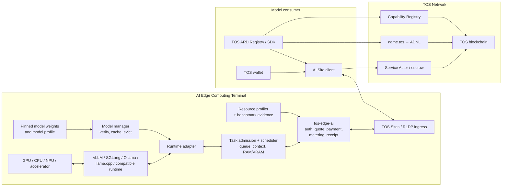
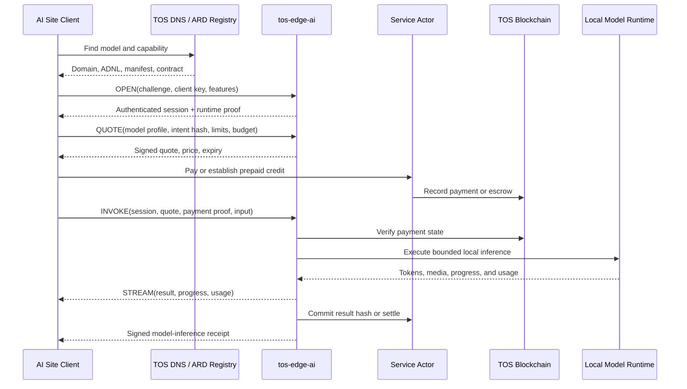

# Locally Hosted Open-Weight Model Sharing over TOS Network

## Status

- Document type: product use case and implementation requirements
- Status: proposed, non-normative
- Date: 2026-07-31
- Related architecture:
  [The TOS Protocol Implementation Plan](the-tos-protocol-implementation-plan.md)
- Terminal architecture:
  [TOS AI Edge Computing Terminal](ai-edge-computing-terminal-architecture.md)
- Related compute use case:
  [Managed AI Services on Local GPU Hardware](local-gpu-sharing-use-case.md)
- Physical-terminal use case:
  [Site-Bound Physical AI Edge Terminal](physical-ai-edge-terminal-use-case.md)
- Discovery profile:
  [TOS Network Compatibility with ARD](tos-ard-compatibility.md)

## Purpose

This document describes how an ordinary user could expose a locally deployed
open-weight large language model as an Internet service over TOS Network, how
other users could discover that service, and how they could pay for and invoke
it.

Example model families include Qwen3, DeepSeek-R1 distilled models, Kimi K3
open weights, and Llama 4. The exact model, variant, weights, quantization,
license, acceptable-use policy, and hardware requirements must be checked at
deployment time.

This use case differs from **consumer-subscription forwarding**, where
somebody proxies a personal ChatGPT, Claude, or Kimi account. It also follows
the terminal-wide prohibition on bare GPU rental and consumer-supplied
execution.

Here, the provider lawfully possesses a copy of the model weights, deploys the
model through an AI Edge Computing Terminal on hardware she controls, selects
the inference software and policy, and offers a bounded inference API.
Consumers never receive shell access, accelerator access, model-host
credentials, or the provider's owner key.

The provider does not need to run a validator. TOS supplies identity, naming,
transport, capability discovery, payment, and settlement. Model-serving,
terminal, and AI Site components belong in the separate `tos-ai` product
repository described by the implementation plan.

## Product Definition

The resource being sold is not a bare model file and not a bare GPU. It is a
versioned inference service:

```text
model weights
  + inference runtime
  + hardware allocation
  + terminal resource and evidence profile
  + input/output contract
  + safety and privacy policy
  + availability and pricing
  = discoverable TOS AI Site service
```

A provider may expose capabilities such as:

- text generation
- reasoning
- code generation
- embeddings
- reranking
- vision-language inference
- tool calling
- structured JSON output

Training, consumer-supplied models, arbitrary container execution, and raw
CUDA access are outside the terminal product.

## Open Weights Do Not Remove License Obligations

“Open weights” means that model parameters are available for local deployment.
It does not necessarily mean that every model is licensed identically, that
all uses are permitted, or that model names and logos may be used without
restriction.

The provider must review the exact license and acceptable-use policy for every
model artifact. For example:

| Model family | Official source | Deployment note |
|---|---|---|
| Qwen3 | [QwenLM/Qwen3](https://github.com/QwenLM/Qwen3) | The official repository identifies its open-weight models as Apache-2.0 licensed; the operator must still pin the exact artifact and preserve required notices |
| DeepSeek-R1 Distill | [deepseek-ai/DeepSeek-R1](https://github.com/deepseek-ai/DeepSeek-R1) | Distilled Qwen and Llama variants inherit different base-model considerations; the operator must record the exact variant and applicable upstream license |
| Kimi K3 | [MoonshotAI/Kimi-K3](https://github.com/MoonshotAI/Kimi-K3) | The official repository publishes weights under a Kimi K3-specific license that must be reviewed for the intended hosted service |
| Llama 4 | [Meta Llama 4 license](https://github.com/meta-llama/llama-models/blob/main/models/llama4/LICENSE) | Llama 4 uses a custom community license and related use policy rather than a generic permissive software license |

The protocol must not label all of these models simply as “open source.”
Instead, a service manifest should record:

- exact model repository and revision
- original weight hashes
- quantized or converted artifact hashes
- license identifier and license URL
- required attribution
- acceptable-use-policy URL and revision
- provider modifications or fine-tuning lineage
- any geographic, scale, field-of-use, or redistribution conditions

TOS identity and payment do not override model licenses. A provider is
responsible for ensuring that hosted inference, commercial charging,
redistribution, branding, and consumer use are permitted.

## User Stories

### Model provider

As a model provider, I want to:

- select a local model and hardware allocation
- publish an exact, verifiable model profile
- retain control of the model, GPU, and admission policy
- expose inference without exposing my host or private network
- use a stable `name.tos` identity when hardware or IP addresses change
- set prices per request, token, image, audio unit, or compute budget
- receive payment before admitting expensive work
- stream output and return a signed receipt
- upgrade or replace a model without silently changing existing quotes
- pause, drain, and restart safely

### Model consumer

As a model consumer, I want to:

- find services by model, capability, context length, price, region, and health
- distinguish exact models, quantizations, fine-tunes, and compatible aliases
- verify the service identity, manifest, model profile, and payment contract
- know the data-retention and safety policy before sending input
- obtain a signed quote with a maximum cost
- invoke and cancel a streaming request
- verify that the result and receipt correspond to my request
- understand which model and hardware claims are declared and which are
  independently attested

## Repository and Deployment Boundary

| Location | Responsibility |
|---|---|
| `tos` core repository | consensus, VM, DNS primitives, wallet and crypto, chain query APIs, ADNL/DHT/RLDP, TOS Sites, and generic contract tooling |
| `tos-protocol` repository | Edge Core, terminal/resource schema, authentication, quote/payment/receipt envelopes, ARD compatibility profile and Registry, crawling/federation, and conformance |
| `tos-ai` repository | AI terminal distribution, AI Site and model schemas, resource probes, model manager, runtime adapters, scheduler, ARD catalog generation and model-specific ranking enrichment, SDKs, deployments, and conformance tests |
| Terminal host | model weights, inference runtime, CPU/GPU/NPU resources, local policy, runtime key, bounded caches, `tos-edge-ai`, and optional TOS Sites/RLDP ingress |
| TOS blockchain | service identity references, DNS, capability declarations, manifest commitments, payment, escrow, and settlement |

Model weights, prompts, outputs, private context, runtime credentials, and
private logs must not be stored on-chain.

## Architecture



The normal request path is:

```text
name.tos
  -> TOS DNS site record
  -> ADNL identity
  -> RLDP/TOS Sites ingress
  -> tos-edge-ai
  -> bounded terminal admission and model scheduler
  -> approved runtime adapter
  -> local inference runtime
  -> locally deployed weights and hardware
```

The inference runtime, accelerator device, container socket, and terminal
administration must not be exposed directly to the public network. Public
requests must pass through authentication, payment, size, deadline, and
admission controls in the terminal.

## Provider Onboarding

### 1. Select the model and verify its license

The provider selects an exact artifact, not only a family name. For example:

```text
family: DeepSeek-R1-Distill-Qwen
variant: 32B
source_revision: <pinned revision>
source_hash: <canonical weight commitment>
runtime_artifact: <quantized artifact commitment>
quantization: <declared format>
```

Before serving it, the provider:

1. reads the model and base-model licenses
2. confirms that hosted inference and charging are permitted
3. records attribution and notice requirements
4. reviews the acceptable-use policy
5. records any fine-tuning data or derivative-model obligations
6. verifies downloaded weight hashes
7. scans model files and loading code as untrusted artifacts

The service must not imply endorsement by the model developer.

### 2. Confirm hardware compatibility

The setup process estimates:

- model weight memory
- KV-cache memory at the advertised context and concurrency
- runtime workspace memory
- host RAM and disk requirements
- supported precision and quantization
- tensor or pipeline parallel requirements
- expected cold-start and model-load time

The provider then chooses realistic public limits. A model that fits for a
single short request may not fit at the advertised context length and
concurrency.

### 3. Create the wallet and service identity

The provider creates:

- a TOS wallet for registration, fees, and revenue
- a site owner key for the persistent identity
- a separate runtime key for signing manifests, quotes, and receipts

The owner key should remain offline or in a protected administrative
keystore. The public runtime receives revocable, time-bounded authorization
and must not control the provider's domain or unrestricted wallet funds.

### 4. Install and preflight the AI Edge Computing Terminal

The provider installs:

- supported accelerator drivers
- an inference runtime such as vLLM, SGLang, Ollama, llama.cpp, or another
  compatible backend
- the pinned model artifacts
- the signed `tos-ai` terminal distribution and `tos-edge-ai`
- a server-side TOS Sites/RLDP proxy when native RLDP ingress is unavailable

The provider should first validate locally:

- model load and unload
- deterministic health prompts
- maximum context
- streaming
- cancellation
- structured output, if advertised
- tool-call format, if advertised
- GPU out-of-memory recovery
- process restart and model reload

### 5. Configure resource and admission policy

The provider explicitly defines:

- accelerator devices or CPU resources offered
- maximum VRAM and host RAM
- maximum model-cache disk usage
- concurrent invocations
- admission queue length
- per-consumer concurrency and rate
- input, context, and output limits
- request and idle deadlines
- batching rules
- tool and network access
- local-use reservation periods
- overload and draining behavior

The service must never infer that all available hardware should be offered.
The provider can reserve capacity, pause admission, drain active work, and
withdraw a model profile.

### 6. Run the terminal service

`tos-edge-core` plus `tos-edge-ai` provide the public service boundary:

- challenge-response authentication
- signed descriptor and manifest publication
- quote generation
- payment or prepaid-credit observation
- request validation
- bounded admission and scheduling
- runtime protocol normalization
- streaming and cancellation
- usage metering
- result hashing
- signed receipts
- redacted audit logs and private administration

The model runtime should listen only on loopback, a private Unix socket, or an
isolated internal network.

### 7. Make the endpoint reachable

A consumer can use a raw ADNL address without a `.tos` domain. The consumer
still verifies the signed descriptor, runtime authorization, and manifest.

Depending on the provider's network, reachability may require:

- a permitted UDP ingress path
- router port forwarding
- a public ingress host
- an owner-selected relay
- a reverse tunnel

A relay may forward encrypted traffic but must not receive site ownership,
runtime-signing authority, model administration, or payment control.

### 8. Register and configure `name.tos`

The recommended public identity is a readable name such as:

```text
alice-models.tos
```

Its DNS `site` record points to the current ADNL identity. The provider may
later change her:

- host or public IP address
- ADNL ingress
- accelerator hardware
- inference runtime
- model version
- runtime key

without losing the persistent service identity.

### 9. Publish a signed model manifest

The provider publishes the AI Site manifest at:

```text
/.well-known/tos-ai-site.json
```

The manifest should include:

- site and service identifiers
- owner and authorized runtime keys
- protocol and manifest versions
- ADNL, HTTPS, or relay endpoints
- capability profiles
- exact model profiles
- input, output, context, concurrency, and queue limits
- streaming, cancellation, and tool support
- pricing and settlement profiles
- privacy, retention, and logging policy
- license and acceptable-use-policy references
- region and health metadata
- optional hardware or runtime attestation
- creation and expiry times

Each model profile should bind:

- family, variant, revision, and architecture
- source and runtime artifact commitments
- quantization and precision
- tokenizer commitment
- prompt/template revision
- context and output limit
- supported media and schemas
- tool-call or reasoning-output behavior
- license identifier and notice URL
- safety-policy revision

The runtime signs the canonical manifest. An appropriate capability or service
record commits its hash on-chain.

The manifest is a signed declaration. Without stronger evidence, it does not
prove the physical hardware, exact loaded weights, current capacity, output
correctness, or future availability.

### 9.1 Publish the ARD catalog

For public agentic discovery, the provider publishes:

```text
https://<publisher-fqdn>/.well-known/ai-catalog.json
```

Each ARD entry represents a stable callable model service and references its
exact TOS service/model descriptor. The entry may point to MCP, A2A, OpenAPI,
or a TOS Service Protocol descriptor, but ARD itself does not invoke the model
or authorize payment. Frequently changing queue depth, free memory, price,
loaded revision, and admission state stay out of the catalog and are returned
by a signed live quote.

The provider must verify the public ARD publisher through a conventional FQDN,
an approved HTTPS gateway for the `name.tos` service, or an explicitly trusted
private Registry. The ARD publisher identifier is not a substitute for the
signed TOS owner, runtime, ADNL, account, or manifest bindings.

### 10. Register capabilities and settlement

Possible capability identifiers include:

```text
inference.text-generation
inference.reasoning
inference.code-generation
inference.embedding
inference.rerank
inference.vision-language
inference.tool-use
output.structured-json
transport.streaming
```

Capability Registry entries provide discovery seeds and reference the signed
manifest. A Service Actor or later low-latency payment profile provides
request payment and settlement.

### 11. Configure pricing

Possible price units include:

- per invocation
- per 1,000 input tokens
- per 1,000 output tokens
- per generated image or media unit
- per compute-second
- per batch
- a fixed maximum-price task

For a first text-inference profile, input/output token pricing or a fixed
per-request price is easier to explain and test. Compute-time pricing is
harder for consumers to verify.

The provider should account for:

- electricity
- hardware depreciation
- model load and idle memory
- ingress and egress traffic
- failed and cancelled work
- TOS settlement fees
- desired margin

## Discovery

### Discovery by `.tos` identity

When the consumer knows `alice-models.tos`, the client:

1. resolves its TOS DNS `site` record
2. obtains the ADNL/TOS Sites endpoint
3. fetches the descriptor and manifest
4. verifies domain ownership and runtime authorization
5. verifies manifest signature, expiry, and chain commitment
6. checks the exact model and capability profile
7. requests current health and a fresh quote

### Discovery by capability and model through ARD

A TOS ARD Registry can crawl the provider catalog, ingest the referenced TOS
descriptors and on-chain seeds, and answer ARD `POST /search` queries. It can
index:

- Capability Registry and Service Actor records
- signed public manifests
- model family, variant, artifact commitment, and quantization
- context, output, streaming, tool, and media support
- region, price, health, and load
- license and acceptable-use-policy references
- optional hardware/runtime attestation
- capability-specific service history

Example consumer queries include:

> Find a Qwen3-compatible code-generation service with at least a 32K context,
> streaming, tool calls, and a maximum token price.

> Find a DeepSeek-R1-Distill-Qwen-32B service in Europe whose manifest commits
> to a specified quantized artifact hash.

> Find a locally hosted vision-language model that does not retain prompts and
> supports prepaid session credit.

ARD discovery is advisory. Before payment or invocation, the client
independently rechecks publisher binding, signatures, expiry, current chain
state, endpoint authorization, payment address, exact model profile, and live
quote. Registry responses preserve field provenance. Semantic ranking belongs
in independent ARD Registry deployments, not the TOS core indexer.

### Discovery by raw ADNL address

The provider can publish her raw ADNL address directly. This bypasses `.tos`
DNS but still requires descriptor, manifest, runtime, and settlement
verification. It is suitable for direct or private distribution but is less
readable and less stable for general discovery.

## Purchase and Invocation Flow



### Session establishment

`OPEN` binds:

- site and runtime identity
- client identity or anonymous session
- chain and protocol version
- supported features
- model-profile compatibility
- maximum request and stream sizes
- expiry and idle timeout
- fresh client and server nonces

Anonymous sessions may be supported, but they still require bounded rate,
concurrency, replay, payment, and abuse controls.

### Quote

A signed quote should bind:

- provider, site, and service
- manifest and model-profile version
- exact model artifact or compatibility profile
- client and optional payer
- intent or request hash
- input, context, and maximum output
- price units and maximum total cost
- deadline and cancellation behavior
- privacy and evidence policy
- settlement contract and chain
- quote ID, creation time, and expiry

A quote must not be replayable across sites, clients, chains, models, or
incompatible inputs.

### Payment

The initial pay-per-call flow can use the current concurrent Service Actor and
wait for the required payment confirmation before admitting expensive model
work.

Token streaming cannot settle every fragment on-chain. Later low-latency
profiles should support:

- prepaid session credit
- signed vouchers
- payment channels
- bounded aggregate settlement

The protocol must define charges and refunds for queue rejection, cancellation,
timeout, runtime failure, partial output, and chain-observation failure.

### Invocation

After verifying the quote and payment, the terminal:

1. validates input, model profile, policy, and deadlines
2. reserves bounded queue, context, and accelerator capacity
3. normalizes the request for the selected local runtime
4. streams output and usage events
5. handles cancellation and client disconnect
6. commits the result and final usage
7. releases context, KV cache, queue, and temporary resources
8. signs the final receipt

The client verifies stream ordering, final result hash, usage, price, and
receipt signature.

## Model-Inference Receipt

A signed receipt should bind:

- provider, site, service, and runtime identities
- client or session identity
- model family, variant, and profile commitment
- runtime artifact and tokenizer commitments
- request and result hashes
- input and output usage
- start and completion times
- completion, cancellation, timeout, or failure status
- quote and manifest versions
- actual charge and settlement reference
- unique request or receipt ID
- runtime signature

The receipt proves that the service made a signed claim about the selected
model profile, request, output commitment, and accounting. It does not
independently prove:

- that the exact declared weights were loaded
- that no hidden system prompt changed the request
- that the declared hardware executed it
- that the model output is correct
- that the provider did not retain the prompt

Stronger evidence requires runtime attestation, reproducible model packaging,
challenge inference, independent replicated execution, trusted execution, or
verifiable computation.

## Model Versioning and Compatibility

A family name is not sufficient for reproducibility. The provider must create
a new model-profile revision when changing:

- model weights or fine-tune
- quantization
- tokenizer
- prompt or chat template
- system policy
- inference engine behavior that affects output
- tool-call schema
- maximum context or output semantics

Existing signed quotes remain bound to the earlier profile until they expire.
The provider may run multiple revisions concurrently during migration.

Discovery may support compatibility aliases such as a family-level query, but
the final quote and receipt must identify the exact profile.

## Provider Security and Resource Bounds

Public inference accepts untrusted inputs. The provider must enforce limits
on:

- request body, media, context, and output sizes
- tokenizer expansion
- execution and idle time
- accelerator memory and host RAM
- CPU and worker processes
- model cache and temporary disk
- concurrent invocations and open streams
- admission queue
- sessions, nonces, quotes, and replay records
- tool calls and recursion
- outbound network access
- receipts and pending settlements
- retries and backend restarts

The implementation must ensure:

- cancellation reaches or terminates backend work
- client disconnect does not create an unbounded detached task
- completion releases KV cache and accelerator buffers
- model and prefix caches have explicit byte and entry limits
- failed media parsing cannot crash the public service
- accelerator out-of-memory errors do not cause infinite restart loops
- abandoned temporary files are removed with bounded work
- backend failures propagate to clients and settlement
- administrative endpoints are isolated from public ingress

These controls are required to prevent unbounded anonymous RAM, VRAM,
connection, queue, cache, or settlement growth.

## Consumer Privacy and Safety

The model is local to the provider, but the provider still controls the
machine and can potentially inspect:

- prompts and uploaded files
- generated output
- tool arguments
- model context
- timing and usage metadata

Transport encryption protects data from network observers, not from the
provider. “No logging” is a policy statement unless backed by appropriate
technical evidence.

The manifest must disclose:

- prompt and output logging
- retention duration
- whether inputs are used for fine-tuning
- human access policy
- tool and external-network behavior
- region of processing
- optional trusted-execution evidence

Consumers should not send secrets to an untrusted provider merely because the
model weights are open.

The provider must also enforce the model's applicable acceptable-use policy
and relevant law. TOS discovery must not imply that open weights mean
unrestricted use.

## Availability and Verification Limits

A local provider may turn off the machine, lose connectivity, reserve the
accelerator for local work, or withdraw a model. Manifest health and a signed
quote do not guarantee indefinite availability.

Potential later evidence profiles include:

- signed reproducible model packages
- hardware and runtime attestation
- challenge prompts with committed expectations
- deterministic or sampled duplicate execution
- multi-provider result comparison
- Task Escrow and dispute resolution
- output-specific proof systems

The MVP has a weaker trust model: the provider signs the model profile, quote,
result commitment, and accounting, while the consumer decides whether that
provider and evidence policy are suitable.

## Existing Infrastructure and Missing Product Work

| Capability | Status | Location or required work |
|---|---|---|
| TOS identity, wallet, and payment foundation | Available | TOS core |
| DNS resolution and resolver chaining | Available | TOS core |
| ADNL, DHT, RLDP, and TOS Sites | Available | TOS core |
| Concurrent Service Actor | Available/partial | TOS core contract; model quote and invocation integration in `tos-ai` |
| Capability Registry | Available/partial | TOS core contract; model vocabulary and integration in `tos-ai` |
| Task Escrow, Dispute, and Proof Attestation | Available/partial | TOS core contracts; optional advanced profiles in `tos-ai` |
| Raw ADNL access without `.tos` | Available | TOS networking; manual endpoint distribution |
| Public `.tos` registration product | To build | `tos-protocol` application contracts, tooling, and deployment |
| ARD catalog publisher and Registry | To build | base compatibility, crawl, federation, provenance, and search in `tos-protocol`; model enrichment in `tos-ai` |
| Terminal/resource schema and Edge Core | To build | `tos-protocol` |
| Tier 1 AI terminal distribution | To build | `tos-ai` |
| Resource probes and benchmark evidence | To build | `tos-ai` |
| AI Site and model-profile schemas | To build | `tos-ai/spec/` |
| `tos-edge-ai` | To build | `tos-ai`, consuming released Edge Core |
| Model manager, task scheduler, and runtime adapters | To build | `tos-ai` |
| Session, quote, invocation, and streaming protocol | To build | base in `tos-protocol`, inference extension in `tos-ai` |
| Token/media metering and inference receipts | To build | `tos-ai` |
| Model-aware ARD enrichment and clients | To build | `tos-ai` |
| License and artifact provenance validation | To build | `tos-ai` |
| NAT relay and reverse tunnel | To build | reusable service, preferably outside validator code |
| Model, runtime, and hardware attestation | Later | separate verification profile |

Today, the available TOS infrastructure can manually expose a local
OpenAI-compatible inference server through ADNL/RLDP and TOS Sites. It does
not yet provide the complete AI Edge Computing Terminal, resource evidence,
model manager, adapters, manifest, discovery, quote, automatic payment,
bounded admission, metering, and receipt product described here.

## Intended Ordinary-User Experience

The final product should reduce provider onboarding to:

1. install the signed AI terminal package and a supported inference backend
2. select or import a locally downloaded model
3. review and accept the detected license and notices
4. verify artifact hashes
5. run versioned hardware, runtime, workload, and context-capacity checks
6. reserve owner capacity and choose public models, limits, retention, thermal
   policy, and price
7. create a revocable runtime identity
8. expose a raw ADNL endpoint
9. optionally register and bind `name.tos`
10. publish signed terminal and service manifests
11. register capabilities and settlement
12. pass a public self-test
13. begin accepting paid inference

The user interface must display the difference between declared and attested
claims and must not advertise unsupported capacity.

## MVP Acceptance Criteria

The first interoperable locally hosted model MVP is complete when an ordinary
user can:

1. install a Tier 1 terminal without building or operating a validator
2. import a pinned, license-reviewed model artifact
3. validate local runtime and hardware compatibility and run a versioned
   workload benchmark
4. reserve owner capacity and configure context, output, concurrency, queue,
   memory, disk, thermal, and price
   limits
5. create a revocable runtime identity
6. expose the service through raw ADNL
7. optionally bind it to `name.tos`
8. publish signed, expiring terminal and service manifests with an exact model
   profile and evidence levels
9. register capabilities and a settlement contract
10. publish a conforming ARD catalog and appear through an independent
    model-aware TOS ARD Registry with publisher and field provenance intact
11. issue a signed quote with a maximum price
12. verify payment before expensive model admission
13. execute and stream bounded inference
14. return a signed result and usage receipt
15. support cancellation, timeout, adapter crash, OOM, and refund rules
16. upgrade a model without silently changing active quotes
17. restart without duplicating work or losing required payment or settlement
    state
18. pause and drain public work safely
19. remain within configured RAM, VRAM, disk, connection, queue, cache, and
    settlement limits during an extended soak test

## Open Protocol Decisions

The normative locally hosted model profile must still define:

- canonical model, tokenizer, template, and artifact commitments
- family aliases and exact-profile matching
- converted and quantized artifact provenance
- license and acceptable-use-policy identifiers
- input, output, stream, and error schemas
- token and media metering
- cancellation and partial-charge behavior
- prepaid credit, voucher, channel, and per-call payment profiles
- health, load, and capacity advertisement
- prompt-retention and privacy declarations
- runtime, model, and hardware attestation
- capability-specific reputation
- model draining, upgrade, rollback, and failover
- safety-policy enforcement and dispute evidence

These decisions require shared schemas, signature rules, size limits, state
machines, and conformance vectors before independent providers and clients can
claim compatibility.

## Recommended Positioning

The provider is not reselling a personal third-party subscription and is not
offering hardware rental. She is operating a locally hosted, versioned model
service under her own TOS identity.

The intended result is:

> A user can turn lawfully deployed open-weight models into discoverable,
> authenticated, priced, payable, and composable Internet inference services
> without adding model execution to TOS consensus or the validator process.
