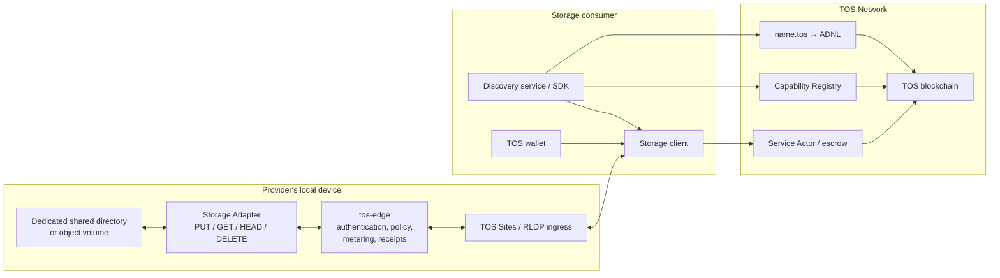
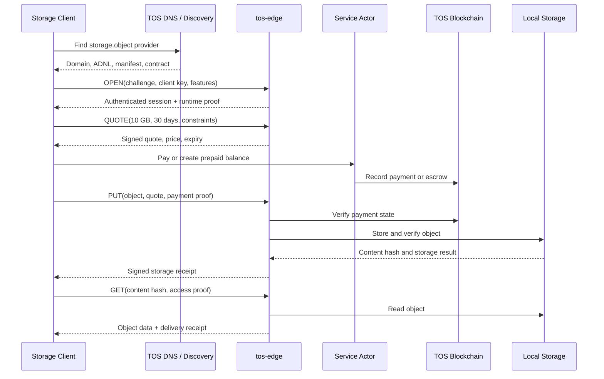
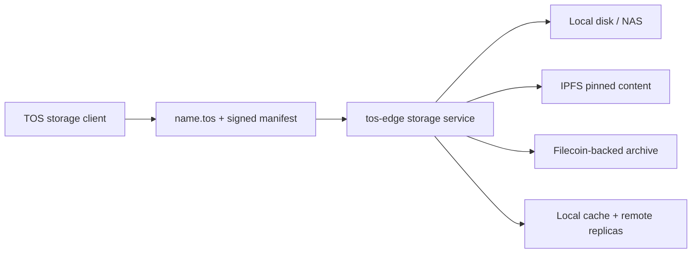

# Local Storage Sharing over TOS Network

## Status

- Document type: product use case and implementation requirements
- Status: proposed, non-normative
- Date: 2026-07-29
- Related architecture:
  [The TOS Protocol Implementation Plan](the-tos-protocol-implementation-plan.md)

## Purpose

This document describes how an ordinary user could expose part of her local
storage as an Internet resource over TOS Network, how other users could
discover that resource, and how they could upload, retrieve, and pay for
stored data.

The desired product must not require a storage provider to run a validator or
modify the TOS node. TOS remains the identity, naming, transport, payment, and
settlement substrate. Storage-specific protocol code and services belong in
the separate `tos-ai` product/protocol repository described by the
implementation plan.

This use case covers two related modes:

1. **Storage capacity sharing**: consumers pay to store their own objects on
   the provider's machine.
2. **Public content sharing**: the provider publishes existing local objects
   that other users can find and download.

Finding a storage provider and finding a particular public object are separate
discovery problems. The base capability registry can advertise storage
services, but public content requires an additional signed catalog or content
index.

## User Stories

### Storage provider

As a storage provider, I want to:

- select a dedicated local directory or volume to share
- define capacity, retention, access, and pricing policies
- expose the service without exposing the rest of my machine
- use a persistent `name.tos` identity even if my IP address changes
- receive TOS payments for storage and network usage
- issue verifiable receipts for accepted objects
- rotate the runtime host or keys without losing the service identity
- stop accepting new objects without corrupting existing leases

### Storage consumer

As a storage consumer, I want to:

- find providers by capability, price, region, capacity, and retention
- verify that an endpoint is authorized by its TOS identity
- obtain a signed quote before uploading data
- pay through a known on-chain contract
- upload and download objects with integrity checks
- receive a signed storage receipt
- use encrypted private storage without revealing plaintext to the provider
- recover funds according to defined failure and refund rules

### Public content publisher

As a publisher, I want to:

- publish a signed catalog of public objects
- identify every object by a content hash
- give users stable links through my `name.tos` identity
- update or remove catalog entries without changing unrelated objects
- optionally charge for downloads

## Repository and Deployment Boundary

The implementation follows the repository boundary defined in the main
implementation plan:

| Location | Responsibility |
|---|---|
| `tos` core repository | consensus, VM, DNS primitives, JSON-RPC/lite APIs, wallet and crypto primitives, ADNL/DHT/RLDP, TOS Sites, and generic contract tooling |
| `tos-ai` repository | storage protocol schema, storage manifest profile, Storage Adapter, `tos-edge` integration, discovery/catalog services, clients, deployment tooling, and end-to-end tests |
| Provider's device | local object data, storage backend, `tos-edge`, runtime keys, and optionally a TOS Sites/RLDP ingress process |
| TOS blockchain | identity references, DNS records, capability declarations, manifest commitments, payment, and settlement |

Storage objects, private filenames, encryption keys, and object contents must
not be stored on-chain.

## Architecture



The public identity resolves to an ADNL identity, not necessarily to the
provider's origin IP address:

```text
name.tos
  -> TOS DNS site record
  -> ADNL identity
  -> RLDP/TOS Sites ingress
  -> tos-edge
  -> Storage Adapter
  -> bounded local storage volume
```

## Provider Onboarding

### 1. Create the identity and wallet

The provider creates:

- a TOS wallet for registration, fees, and storage revenue
- a site owner key that controls the domain and long-lived service identity
- a separate runtime key used by `tos-edge` to sign quotes and receipts

The owner key should remain offline or in a protected administrative
keystore. The public service should use a revocable, replaceable runtime key
with narrowly defined authority.

### 2. Select a bounded storage volume

The provider explicitly chooses a directory, filesystem, or object-store
volume. The service must not expose the user's home directory or entire disk.

Required provider policy includes:

- total capacity offered
- reserved free space
- maximum object size
- per-tenant capacity
- maximum concurrent transfers
- maximum inbound and outbound bandwidth
- minimum and maximum retention
- public-read or authenticated-read policy
- overwrite and deletion policy
- storage price and egress price
- behavior when a lease expires
- behavior when the provider stops accepting new leases

The service should run under a dedicated operating-system identity, container,
or sandbox that cannot access files outside the configured volume.

### 3. Run the local services

The provider runs:

1. **Storage backend or Storage Adapter**

   It performs the actual object operations:

   - `PUT` or multipart upload
   - `GET` and ranged download
   - `HEAD` for metadata and availability
   - authorized `DELETE`
   - content hashing and integrity verification
   - lease and quota enforcement

2. **`tos-edge`**

   It provides:

   - session authentication
   - quote generation and verification
   - payment observation
   - tenant and object authorization
   - rate, size, deadline, and concurrency limits
   - usage metering
   - signed storage and delivery receipts
   - bounded replay, session, lease, and settlement tables
   - health, metrics, audit logging, and administrative controls

3. **TOS Sites/RLDP ingress, when required**

   Until `tos-edge` has a native supported RLDP server integration, a
   server-side TOS Sites/RLDP HTTP proxy can forward traffic to the local
   `tos-edge` listener.

The provider does not need to run a TOS validator.

### 4. Make the endpoint reachable

A raw ADNL address can be used without a `.tos` domain. A consumer who already
knows that address can connect directly and verify the signed service
descriptor.

Depending on the provider's network, she may still need:

- a permitted UDP ingress path
- router port forwarding
- a public ingress host
- an owner-selected relay
- a reverse tunnel

Relay and reverse-tunnel support is required for users behind strict NAT or
carrier-grade NAT, but it remains a product capability to be implemented. A
relay must not become the owner of the site identity or gain access to
unencrypted private objects.

### 5. Register and configure `name.tos`

The recommended user experience is to register a readable identity such as:

```text
alice-storage.tos
```

The domain's `site` record points to the current ADNL identity. The provider
can later change machines, networks, ingress services, or runtime keys by
updating the signed descriptor and DNS records without changing the public
name.

The domain is recommended for persistent identity and discovery, but it is not
required for raw ADNL access.

### 6. Publish a signed storage manifest

The provider publishes a manifest through:

```text
/.well-known/tos-ai-site.json
```

A storage profile should include at least:

- site and service identifiers
- owner and authorized runtime keys
- protocol and manifest versions
- capability identifiers
- ADNL, HTTPS, or relay endpoints
- total and currently available advertised capacity
- maximum object size
- supported upload and download operations
- retention ranges
- pricing units and payment profiles
- public or authenticated access policy
- encryption expectations
- deletion and expiry behavior
- region and availability metadata
- Service Actor or other settlement contract address
- manifest creation and expiry times

The runtime signs the manifest. Its canonical hash is committed through an
appropriate on-chain service or capability record. Clients must verify both
the signature and the on-chain commitment before trusting the endpoint,
prices, or payment address.

The manifest is an advertisement, not proof that the advertised capacity is
currently available.

### 7. Register storage capabilities

Example capability identifiers could include:

```text
storage.object.put
storage.object.get
storage.public-content
storage.encrypted-private
storage.retention.30d
```

The final names and semantics must be defined by a normative storage profile.
Capability records should reference the signed manifest and payment service.
They must not enumerate private objects.

## Service Discovery

### Discovery by domain

When the consumer knows `alice-storage.tos`, the client:

1. resolves its TOS DNS `site` record
2. obtains the ADNL/TOS Sites endpoint
3. fetches the descriptor and storage manifest
4. verifies domain ownership, key authorization, signatures, expiry, and the
   on-chain manifest commitment
5. checks endpoint health and obtains a fresh quote

### Discovery by capability

When the consumer does not know a provider, an independent discovery service
can index:

- Capability Registry entries
- Service Actor metadata
- signed public manifests
- region, capacity, retention, and pricing
- endpoint health
- capability-specific reputation or attestations

For example, a client could request:

> Find object-storage providers with at least 100 GB advertised capacity,
> 30-day retention, a maximum price, and an endpoint in Europe.

Discovery is advisory. Before payment or upload, the client must independently
recheck the signed manifest and current chain state. Semantic search and
provider ranking belong in the independent discovery service, not the core
TOS indexer.

### Discovery by raw ADNL address

The provider can share her raw ADNL address directly. This avoids DNS
resolution but provides a less readable and less stable entry point. The
consumer must still verify the service descriptor, runtime authorization, and
payment contract.

## Storage Capacity Purchase Flow



### Quote

A signed quote should bind:

- provider and service identity
- manifest version
- consumer and optional payer identity
- requested bytes
- retention period
- ingress and egress pricing
- maximum total cost
- encryption and evidence policy
- quote ID, creation time, and expiry
- settlement contract and network

The quote must not be reusable across services, chains, consumers, or
incompatible requests.

### Upload

The client:

1. encrypts private data before upload when provider confidentiality is
   required
2. calculates the expected plaintext or ciphertext content hash
3. establishes payment or prepaid credit
4. uploads the object, using resumable chunks for large data
5. verifies the returned object hash
6. stores the signed receipt

Server-side encryption alone does not protect data from the provider because
the provider controls that server. Private storage requires client-side
encryption and keys that are never sent to the provider.

### Storage receipt

A receipt should bind:

- provider, service, and runtime key
- consumer or lease identity
- object content hash
- stored byte count
- acceptance and lease-expiry times
- quoted and charged amounts
- manifest and quote versions
- storage policy or evidence profile
- monotonically ordered receipt or request ID
- provider signature

A receipt proves that the provider accepted a defined obligation. By itself,
it does not prove that the object will remain available for the entire lease.

### Download and deletion

Downloads use the content hash or an opaque object identifier plus an access
capability. The client verifies the downloaded bytes against the expected
hash.

Deletion requires authenticated authority and an idempotent request. The
protocol must specify whether deletion means immediate physical erasure,
logical inaccessibility, or garbage collection after a defined interval.

## Public Content Discovery

The provider registry helps users find a storage service; it does not reveal
which public objects the service hosts.

For public content, the provider additionally publishes a signed catalog that
maps content hashes to public metadata such as:

- display name
- media type
- byte size
- description and tags
- creation or publication time
- download price
- content license
- catalog entry expiry

A future normative URI could have a form such as:

```text
tos-storage://alice-storage.tos/<content-hash>
```

This URI is illustrative and is not currently a TOS standard. The storage
profile must define its canonical syntax, resolution, versioning, and error
behavior before clients depend on it.

Private objects must not appear in a public catalog. They should be addressed
by unguessable object identifiers and protected with signed capability or
delegation tokens.

## Security and Resource Requirements

The provider implementation must enforce explicit bounds on:

- storage capacity and reserved disk space
- per-user and per-object size
- incomplete and multipart uploads
- concurrent connections and transfers
- ingress and egress bandwidth
- sessions, quotes, nonces, and replay records
- leases and pending settlements
- receipts and audit queues
- request body and metadata sizes
- catalog size and pagination
- retention and garbage-collection work

Additional requirements include:

- never expose the administrative listener through the public endpoint
- keep the owner key separate from the runtime process
- authenticate all mutation and deletion requests
- domain-separate manifest, quote, request, and receipt signatures
- prevent path traversal and symbolic-link escapes
- verify available disk space before and during upload
- use temporary files and atomic promotion for completed objects
- clean up abandoned uploads with bounded work
- redact private object names and tokens from logs
- provide runtime-key rotation and revocation
- reject expired manifests, quotes, leases, and capabilities
- propagate chain and transport errors instead of treating them as success

No unbounded cache, waiter table, session table, upload table, receipt queue,
or retry loop is acceptable.

## Availability, Replication, and Proof Limits

A single local machine is a single point of failure. TOS payment records and
signed receipts do not prove continuing data availability.

A production storage marketplace will eventually require some combination of:

- multiple independent replicas
- periodic availability challenges
- proofs tied to object and lease identities
- repair and re-replication
- provider collateral or insurance
- failure reporting and dispute rules
- client-controlled backup and migration

These mechanisms are beyond the first storage-sharing MVP. The MVP must state
its weaker guarantee clearly: a provider accepts a signed storage obligation,
but the client should retain another copy unless a stronger verified
replication profile is in effect.

## Comparison with IPFS and Filecoin

The proposed TOS storage service is not a direct replacement for either IPFS
or Filecoin. The three systems begin at different layers:

- **TOS storage sharing** is a named, authenticated, payable Internet service.
- **IPFS** is primarily a content-addressed data distribution protocol.
- **Filecoin** is primarily a storage market with protocol-level proofs and
  crypto-economic commitments.

The shortest distinction is:

```text
TOS storage:
  Who provides this service, what is its policy, who may use it,
  how is it paid, and what receipt is returned?

IPFS:
  Which peers can provide the bytes identified by this content ID?

Filecoin:
  Which provider accepted a storage deal, and how does the network verify
  that the provider continues to satisfy its storage obligation?
```

### Capability comparison

| Dimension | Proposed TOS storage service | IPFS | Filecoin |
|---|---|---|---|
| Primary goal | Turn owner-operated storage into a discoverable, authenticated, payable service | Address and distribute data by content | Buy storage with verifiable, economically enforced commitments |
| Primary identity | `name.tos`, owner key, runtime key, and ADNL identity | Content identifier (CID) | Storage provider and on-chain deal identities |
| Data location | Service identity plus object ID or content hash | CID, independent of a particular provider | Data piece/deal associated with one or more providers |
| Native payment role | Quotes, TOS payments, Service Actor, prepaid credit, or escrow | No native storage payment in the base protocol | Native storage-market settlement |
| Persistence guarantee | Provider commitment only in the MVP | No persistence unless at least one peer continues to retain or pin the content | Stronger protocol-level proof and economic model |
| Ordinary-device participation | Intended for a user sharing a bounded directory or NAS volume | Ordinary users can run nodes and pin content | Storage-provider operation generally requires more specialized capacity and operations |
| Access control | Sessions, private objects, capability tokens, delegation, and deletion authority | Usually implemented above the content-addressing layer | Usually implemented by applications and encryption above storage deals |
| Human-readable discovery | `.tos` DNS plus capability discovery | Commonly requires IPNS, DNSLink, or an external index | Commonly requires provider or market discovery tools |
| Service API | Quote, upload, download, lease, delete, metering, and receipts | Content block exchange and retrieval | Storage deals, proofs, settlement, and data retrieval |
| AI/agent integration | Designed to compose with Agent Accounts, services, tools, memory, and task settlement | Not part of the base protocol | Not the primary responsibility of the storage protocol |
| Current maturity | Proposed product and protocol; most storage-specific components remain to be built | Established production protocol and implementations | Established production network and storage market |

### Difference from IPFS

IPFS treats content addressing as the central abstraction:

```text
object bytes -> hash/CID -> retrieve from any peer that can provide the CID
```

The identity of the original publisher or current provider is not the primary
lookup key. Identical content has the same CID regardless of which peer stores
it.

The proposed TOS flow begins with a service identity:

```text
alice-storage.tos
  -> authorized runtime
  -> signed service policy and quote
  -> payment
  -> object upload or download
  -> signed receipt
```

TOS therefore emphasizes:

- the identity that controls the service
- whether the endpoint is currently authorized
- storage and retention policy
- read, write, and deletion authority
- price and settlement destination
- receipts for a specific service obligation

IPFS emphasizes:

- content hashes
- deduplication
- location-independent retrieval
- distribution across any peer that has the content

Neither merely adding data to IPFS nor accepting it through the TOS MVP
guarantees permanent availability. IPFS content becomes unavailable when no
reachable peer retains it. A single-provider TOS object becomes unavailable
when that provider is offline or loses the object. The TOS receipt adds an
attributable service commitment, but without availability proofs and
replication it is not proof of continued possession.

### Difference from Filecoin

Filecoin makes storage commitments and their verification part of the network
and economic protocol. It is suited to storage deals in which continued
storage is backed by proofs and provider incentives.

The TOS design does not initially introduce a new storage consensus, mining
role, sector format, or proof system. It treats storage as an application
service running over existing TOS infrastructure:

```text
Filecoin:
  storage is a principal protocol and market function

TOS storage:
  storage is an owner-operated application using TOS identity,
  transport, payment, and settlement
```

This permits a lower-friction provider experience: install the product, select
a bounded directory, set a quota and price, bind an ADNL identity or
`name.tos`, and start serving. It also means that the MVP has a weaker storage
guarantee than a proof-backed Filecoin deal.

To provide a comparable class of assurance, a later TOS storage protocol would
need:

- periodic availability or possession challenges
- multiple independent replicas
- repair and re-replication
- provider collateral or insurance
- objective failure evidence
- dispute and penalty rules

Those mechanisms should not be implied by a basic signed receipt.

### TOS-specific advantages

The proposed TOS layer is useful where storage is part of a wider programmable
service:

- `.tos` provides a persistent human-readable service identity even when the
  host, IP address, ADNL ingress, or runtime key changes.
- Session authentication and capability tokens support private or delegated
  access.
- A quote can bind capacity, retention, bandwidth, region, evidence, and
  maximum cost to a particular consumer and request.
- Storage can compose with Agent Accounts, inference, tools, private memory,
  and task settlement.
- The same payment and receipt framework can meter storage duration, ingress,
  egress, or higher-level processing.

These are service-layer features. They do not replace content addressing or
proof-backed durable storage.

### Complementary deployment

`tos-edge` should allow pluggable storage backends rather than requiring every
provider to use only a local filesystem:



Example service classes are:

| Service class | Possible backend | Intended use |
|---|---|---|
| Local | One local disk or NAS | Temporary objects, low-cost sharing, and agent cache |
| Pinned | Local storage plus one or more IPFS pins | Public content distribution |
| Replicated | Multiple independent TOS storage providers | General-purpose persistence |
| Archived | Filecoin or another proof-backed storage system | Long-term archival |
| Hybrid | Local hot cache plus IPFS/Filecoin or remote replicas | Low-latency access with stronger durability |

The signed manifest and quote must state the actual service class and evidence
policy. A provider must not advertise a proof-backed or replicated service
when it stores only one local copy.

The recommended positioning is therefore:

> TOS provides the named service, authorization, policy, quote, payment, and
> receipt layer. Local disks, IPFS, Filecoin, and other storage systems can be
> selectable storage and durability backends.

## Existing Infrastructure and Missing Product Work

| Capability | Status | Location or required work |
|---|---|---|
| TOS identity, wallet, and payment foundation | Available | TOS core |
| DNS resolution and resolver chaining | Available | TOS core |
| ADNL, DHT, RLDP, and TOS Sites | Available | TOS core |
| Service Actor and escrow foundations | Available/partial | TOS core contracts; storage integration in `tos-ai` |
| Capability Registry | Available/partial | TOS core contract; storage vocabulary and integration in `tos-ai` |
| Raw ADNL access without `.tos` | Available | TOS networking; manual endpoint distribution |
| Public `.tos` registration product | To build | `tos-ai` application contracts, tooling, and deployment |
| Storage manifest profile | To build | `tos-ai/spec/` |
| Storage Adapter and object API | To build | `tos-ai` |
| Storage-enabled `tos-edge` | To build | `tos-ai` |
| Storage quote, metering, and receipt profile | To build | `tos-ai` |
| Storage client and CLI | To build | `tos-ai` |
| Provider and public-content discovery | To build | `tos-ai` |
| NAT relay and reverse tunnel | To build | reusable service, preferably outside validator code |
| Replication and availability proofs | Later | separate storage protocol phase |

Today, the existing infrastructure can expose a basic local HTTP content
service through ADNL/RLDP and TOS Sites. It does not yet provide a complete,
searchable, payable, and verifiably fulfilled storage marketplace.

## MVP Acceptance Criteria

The first interoperable storage-sharing MVP is complete when an ordinary user
can:

1. install the storage product without building or operating a validator
2. select a dedicated local directory and capacity limit
3. create a runtime identity and configure a payment address
4. expose the service through a raw ADNL address
5. optionally bind the service to `name.tos`
6. publish a signed, expiring storage manifest
7. register a storage capability and settlement contract
8. appear in an independent capability discovery service
9. issue a signed quote for a bounded storage lease
10. accept payment and a resumable object upload
11. return a signed receipt bound to the content hash
12. serve a verified ranged download
13. enforce authorized deletion and lease expiry
14. restart without losing valid objects, leases, or settlement state
15. remain within configured disk, memory, connection, and queue limits during
    an extended soak test

## Open Protocol Decisions

The normative storage profile must still decide:

- whether object identity hashes plaintext, ciphertext, or both
- canonical content-hash encoding
- upload chunking and resumability rules
- lease renewal and early-deletion semantics
- storage and egress pricing units
- prepaid balance, per-call escrow, or voucher payment profile
- public catalog schema and URI syntax
- capability-token format
- receipt aggregation
- provider shutdown and data migration behavior
- availability proof and dispute model
- minimum replication requirements for stronger service classes

These decisions should be specified and covered by shared test vectors before
independent clients and providers claim protocol compatibility.
