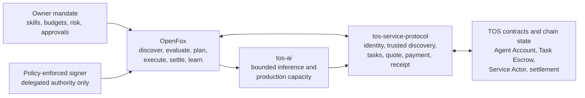

# OpenFox: Autonomous Earning Agent for TOS Network

## Status

- Document type: product positioning and architecture direction
- Status: proposed, non-normative, not yet implemented
- Date: 2026-08-01
- Related architecture:
  [TOS AI Edge Computing Terminal](ai-edge-computing-terminal-architecture.md)

## Positioning

> **OpenFox — The fox that finds AI work on the TOS Network and makes money
> while you sleep.**

The precise product promise is:

> **OpenFox is the autonomous earning agent for the TOS Network. It discovers
> profitable AI work, evaluates it under owner policy, executes it through
> approved capabilities, and settles through the TOS service protocol.**

The three product responsibilities are deliberately separate:

> **`tos-service-protocol` establishes the trusted market, `tos-ai` supplies production
> capacity, and OpenFox lets that capacity participate autonomously in the
> market and earn revenue.**

These are target architectural responsibilities. They do not claim that a
public task marketplace, end-to-end paid invocation, or OpenFox autonomy is
already deployed.

## Why OpenFox Exists

`tos-service-protocol` can define identity, discovery, authorization, tasks, quotes,
payments, receipts, evidence, and settlement. `tos-ai` can turn
owner-controlled hardware and approved models into bounded AI execution
capacity. Neither component should independently decide how an owner's money,
reputation, or hardware is used to pursue profit.

OpenFox is the missing owner-side economic actor. It continuously looks for
work that matches an owner-approved skill, verifies the opportunity, estimates
cost and risk, chooses whether to act, coordinates execution, submits the
result, and observes settlement. Its autonomy is always delegated and bounded;
it is not owner-equivalent authority.

## Product Relationship



Another useful analogy is:

| Product | Economic role |
|---|---|
| `tos-service-protocol` | The market rules, trust rails, and transaction language |
| `tos-ai` | The owner-operated AI factory |
| OpenFox | The autonomous operator that finds orders and runs the business |

OpenFox may run on the same host as a TOS AI Terminal, but it remains a
separate process and authority domain. `tos-ai-worker` must not gain wallet
keys, market-wide permissions, or an autonomous tool loop merely because
OpenFox is installed.

## Autonomous Earning Loop

```text
load owner mandate and approved skills
  -> discover candidate paid tasks
  -> verify provenance, identity, terms, and available escrow
  -> match task requirements to skills and execution capacity
  -> estimate revenue, execution cost, service cost, risk, and success chance
  -> reject, request approval, bid, or accept within policy
  -> reserve local capacity and execute through tos-ai or another approved service
  -> validate output and assemble evidence
  -> submit the result and observe acceptance, dispute, and settlement
  -> update bounded accounting and performance history
  -> repeat
```

The loop must be durable and idempotent. A restart, duplicate chain event,
indexer replay, RPC ambiguity, or model retry must not accept a task twice,
pay twice, execute an irreversible action twice, or submit conflicting results.

## Owner-Approved Skills

A skill is not an arbitrary prompt or downloaded script. An OpenFox skill is a
versioned, owner-approved capability declaration that defines:

- accepted task categories and input/output schemas
- required model, tool, data, and terminal capabilities
- maximum context, output, runtime, resource, and external-service cost
- permitted network destinations and data-retention policy
- validation and evidence requirements
- minimum price or profit policy
- failure, cancellation, dispute, and refund behavior
- skill revision, artifact commitments, and approval provenance

External task text may provide skill input. It cannot create a new skill,
change the skill policy, select a runtime endpoint, install code, expand tool
permissions, or authorize spending.

## Opportunity Evaluation

Before commitment, OpenFox should calculate a conservative expected outcome:

```text
expected net value
  = offered payment
  - local compute and energy estimate
  - model/API/tool costs
  - network and settlement fees
  - expected failure and dispute cost
  - owner-defined risk reserve
```

The deterministic policy layer, not the language model, enforces:

- minimum expected profit and minimum payment
- maximum task value, duration, and resource commitment
- per-task, daily, and rolling spend limits
- maximum cumulative loss and unresolved escrow exposure
- allowed task categories, counterparties, regions, and data classes
- required evidence, verifier, finality, and settlement terms
- concurrency, queue, retry, and pending-settlement limits
- human approval thresholds and emergency stop state

Model output may recommend an action and explain its reasoning. It is never by
itself authorization to sign, spend, accept work, invoke a privileged tool, or
change policy.

## Component Boundary

A production OpenFox implementation should keep narrow components:

| Component | Responsibility |
|---|---|
| Discovery client | Query bounded task and capability sources while preserving provenance |
| Skill registry | Load only approved, versioned skill definitions |
| Matcher | Reject incompatible tasks before model planning |
| Planner | Propose a bounded execution plan using approved skills and tools |
| Economics engine | Compute conservative cost, margin, exposure, and stop conditions |
| Policy gate | Make the authoritative accept, spend, tool, and approval decision |
| Protocol client | Use released `tos-service-protocol` schemas, SDKs, and conformance rules |
| Execution client | Reserve and invoke `tos-ai` without bypassing local admission |
| Signer client | Request narrowly scoped signatures from an external policy-enforced signer |
| Durable task store | Persist bounded state, exact request commitments, and idempotency keys |
| Audit and accounting | Record redacted decisions, costs, receipts, disputes, and realized revenue |

The first implementation should be written as a separate Go product rather
than embedded in `tos`, `tos-service-protocol`, or `tos-ai`.

## Authority and Key Separation

OpenFox must not receive an unrestricted wallet owner key. The minimum split is:

- **Owner key:** offline or protected by an operator-controlled vault; changes
  high-impact policy, rotates/revokes delegates, withdraws funds, and retires
  the agent.
- **Agent controller or delegated session key:** usable only through Agent
  Account policy with action, value, counterparty, duration, and cumulative
  limits.
- **Terminal runtime key:** signs terminal manifests, quotes, and receipts; it
  cannot move owner funds.
- **Model/update keys:** approve artifacts and software; they cannot accept
  tasks or make payments.
- **`tos-ai-worker`:** receives no owner or controller private key.

Every automated value transfer must pass both off-chain policy and the
available on-chain limit. Failure of either side is a denial.

## Task State

OpenFox should maintain a bounded local state machine that mirrors, but never
replaces, authoritative protocol and chain state:

```text
DISCOVERED -> VERIFIED -> SCORED -> APPROVED -> CLAIMING -> ACCEPTED
                                                           |
                                                           v
SETTLED <- SETTLING <- SUBMITTED <- VALIDATING <- EXECUTING

Any non-terminal state -> REJECTED / CANCELLED / FAILED / EXPIRED / DISPUTED
```

Indexed or cached state is advisory. Before signing, spending, dispatching, or
settling, OpenFox must revalidate the current authoritative identity,
authorization, task, escrow, deadline, and payment state required by the
selected profile.

## Security Boundaries

OpenFox treats all discovered content as hostile, including task descriptions,
attachments, catalog text, representative queries, tool output, model output,
and counterparty messages. Required boundaries include:

- no owner key or unrestricted wallet API in the model process
- no direct signing or payment tool exposed to natural-language instructions
- no task-selected model endpoint, executable, container, plugin, MCP server,
  credential, or network destination
- allowlisted, schema-checked tools with per-call and cumulative budgets
- sandboxed processing of untrusted files and media
- explicit taint and retention policy for prompts, outputs, and task data
- bounded discovery results, model context, memory, queues, retries, watchers,
  goroutines, logs, durable records, and unresolved settlements
- transaction simulation and exact intent display for approval-required work
- global pause, kill switch, delegation revocation, and safe restart behavior
- no self-modification or automatic policy expansion in the production path

Profit optimization must never outrank owner policy, terminal safety, legal
constraints, privacy, or an explicit stop condition.

## Protocol Capabilities Required by OpenFox

OpenFox should consume these capabilities from `tos-service-protocol` rather than
inventing private wire formats:

- authenticated, provenance-preserving discovery of open Task Escrows and
  callable Service Actors
- typed task requirements, budgets, deadlines, evidence, and settlement terms
- deterministic task claim, bid, acceptance, cancellation, result, dispute,
  and settlement messages
- Agent Account delegation with action, value, time, counterparty, and
  cumulative budget constraints
- exact task, quote, payment, invocation, result, and receipt correlation
- restart-safe observation with cursors, finality, reorganization handling,
  and bounded replay
- capability and reputation signals whose trust tier and provenance remain
  explicit and non-authoritative

Missing protocol functionality must be proposed in `tos-service-protocol`. OpenFox
must not copy protocol types locally or infer payment authority from a Registry
result.

## Delivery Stages

1. **Scout:** read-only discovery, matching, profitability estimates, and
   owner recommendations; no autonomous signing or spending.
2. **Guarded testnet worker:** automatic acceptance of allowlisted, low-value
   deterministic tasks under strict delegation and testnet funds.
3. **Bounded production worker:** audited skills, external policy signer,
   durable idempotency, human approval thresholds, accounting, and kill switch.
4. **Portfolio operator:** multiple approved skills and terminals with bounded
   allocation, exposure, and settlement, without unbounded sub-agent creation.

Each stage requires adversarial prompt-injection, economic manipulation,
duplicate-event, reorganization, signer-failure, execution-failure, dispute,
restart, and resource-soak testing before advancing.

## Relationship to PicoClaw and OpenClaw

PicoClaw and OpenClaw are useful references for an agent loop, tools, memory,
channels, and long-running assistant operations. OpenFox is not defined as a
drop-in compatible fork. Its differentiator is the TOS economic loop and the
strict separation between probabilistic planning, deterministic policy,
delegated signing, trusted settlement, and bounded execution.

Any reuse of third-party code requires a separate license, dependency,
security, update, and sandbox review. A lightweight Go implementation is an
engineering preference, not permission to inherit an assistant framework's
host access or trust model.

## Non-Goals

- artificial consciousness, personhood, or self-owned authority
- an unrestricted general-purpose shell or consumer code runner
- autonomous access to the owner key or unlimited capital
- task-driven installation of skills, models, tools, plugins, or runtimes
- speculative trading, token issuance, or yield promises
- bypassing `tos-ai` admission, model approval, or execution policy
- treating discovery, model confidence, reputation, or expected profit as
  settlement authority
- changing TOS consensus or executing the agent loop in validators

## Related Documents

- [AI Actor Model](ai-actors.md)
- [AI Actor Glossary](ai-actor-glossary.md)
- [AI Agent Workflow Example](ai-agent-workflow-example.md)
- [AI Actor Threat Model](ai-actor-threat-model.md)
- [TOS Protocol Implementation Plan](the-tos-service-protocol-implementation-plan.md)
- [TOS AI Edge Computing Terminal Architecture](ai-edge-computing-terminal-architecture.md)
- [Agent Wallet MVP](agent-wallet-mvp.md)
- [TOS ARD Compatibility](tos-ard-compatibility.md)
