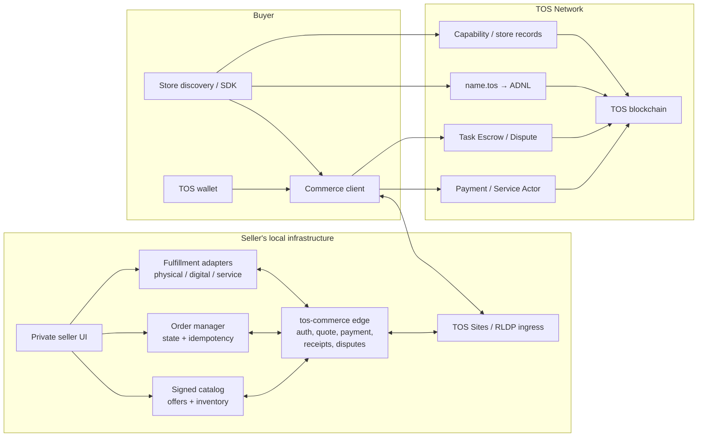
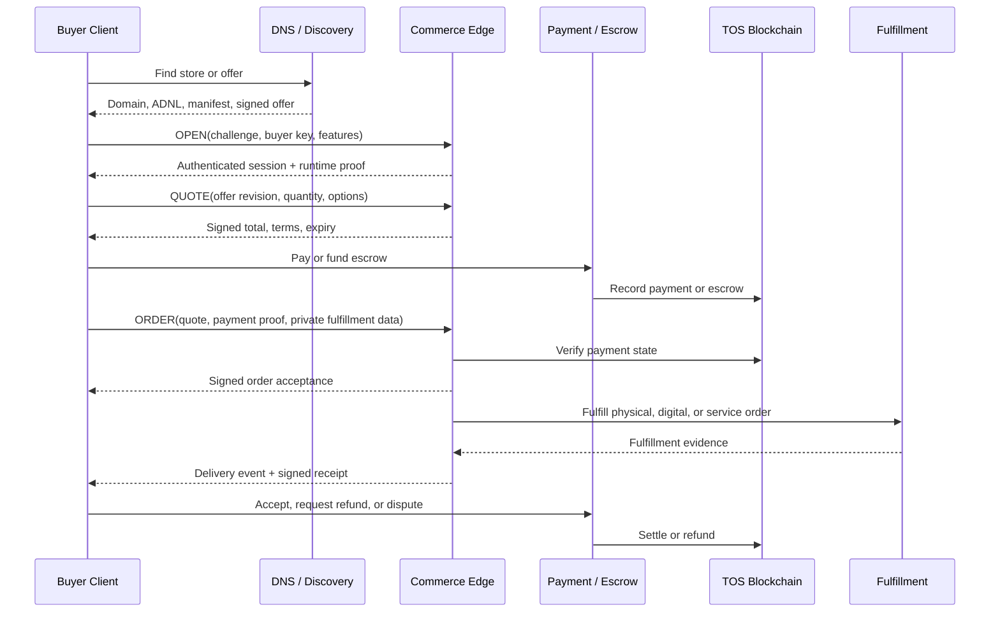
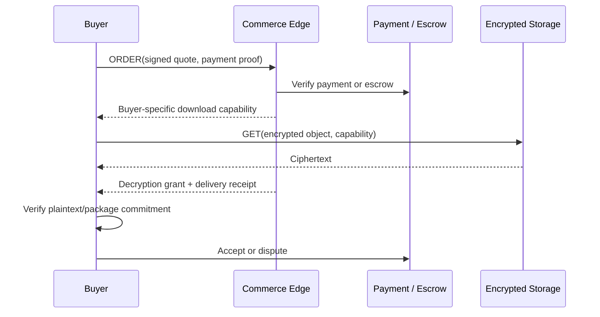
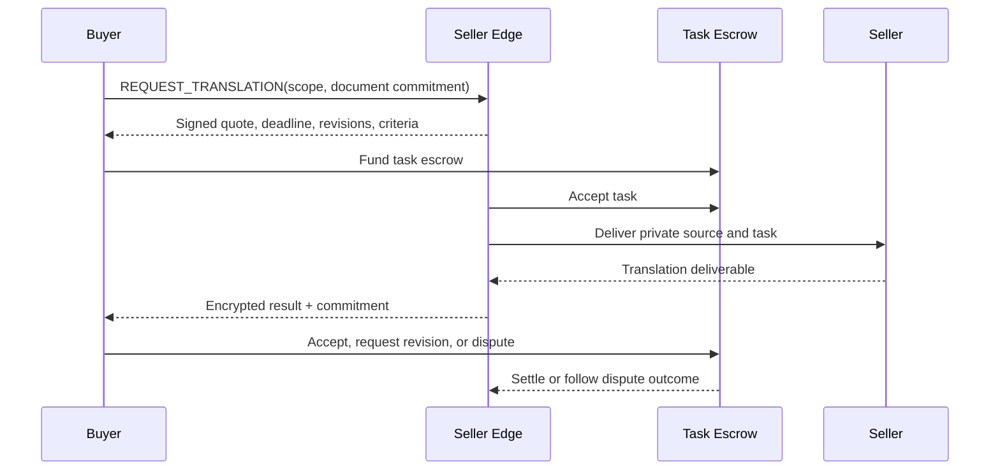

# Owner-Operated Storefront over TOS Network

## Status

- Document type: product use case and implementation requirements
- Status: proposed, non-normative
- Date: 2026-07-30
- Related architecture:
  [The TOS Protocol Implementation Plan](the-tos-protocol-implementation-plan.md)

## Purpose

This document describes how an ordinary user could operate a local
`name.tos` storefront to sell goods or personal skills over TOS Network, how
buyers could discover the store and its offers, and how orders, payment,
delivery, receipts, refunds, and disputes could work.

The storefront may sell:

1. **Physical goods**, such as crafts, used equipment, books, or other items
   shipped to a buyer.
2. **Digital goods**, such as documents, media, software, templates, or
   downloadable files.
3. **Human services**, such as article translation, editing, design,
   consultation, research, or other deliverable-based work.

The seller must not need to run a validator or add commerce logic to the TOS
node. TOS provides identity, naming, transport, payment, escrow, and settlement
primitives. The storefront, catalog, order service, discovery index, clients,
and fulfillment integrations belong in a separate application repository,
called `tos-commerce` in this document.

## Product Definition

The resource is an owner-operated Internet business under a persistent TOS
identity:

```text
seller identity
  + signed store policy
  + versioned catalog
  + order and fulfillment workflow
  + payment or escrow
  + receipt and dispute policy
  = discoverable name.tos storefront
```

The blockchain does not store the seller's inventory, product files, customer
addresses, private messages, or completed work. It provides commitments and
settlement records that off-chain clients can verify.

## User Stories

### Seller

As a seller, I want to:

- open a store from an ordinary local computer or home server
- use a readable and persistent `name.tos` identity
- publish signed, versioned product and service offers
- receive TOS payments
- avoid exposing my personal device, wallet key, or administrative interface
- update prices and inventory without invalidating accepted orders
- deliver physical goods, encrypted digital goods, or human work
- issue signed order and fulfillment receipts
- define cancellation, refund, revision, and dispute rules
- move the store to a different host without losing its identity

### Buyer

As a buyer, I want to:

- find stores and offers by category, language, region, price, and policy
- verify that an endpoint is authorized by the store owner
- see the exact offer revision before paying
- know the total price and fulfillment terms
- protect my delivery address and private order content
- use escrow when the seller is unfamiliar
- receive verifiable delivery and payment receipts
- accept delivery, request a revision, request a refund, or open a dispute

## Repository and Deployment Boundary

Commerce remains outside the TOS core repository:

| Location | Responsibility |
|---|---|
| `tos` core repository | consensus, VM, DNS, wallet and crypto, JSON-RPC/lite APIs, ADNL/DHT/RLDP, TOS Sites, and generic contract tooling |
| `tos-commerce` repository | store and offer schemas, commerce edge service, seller CLI/UI, buyer SDKs, discovery, order workflows, fulfillment adapters, deployments, and end-to-end tests |
| Seller's device | catalog, inventory, digital assets, private order data, fulfillment state, runtime key, and commerce edge service |
| TOS blockchain | DNS references, service commitments, payment, escrow, settlement, dispute references, and optional attestations |

If common AI Site protocol crates are useful, `tos-commerce` may consume
released descriptor, authentication, transport, and receipt libraries. It must
not depend on validator-private source or require a TOS node release whenever
the storefront product changes.

## Commerce Modes

### Physical goods

The seller offers a finite or made-to-order physical item. Fulfillment may
include:

- seller acceptance
- encrypted shipping-address exchange
- packing and shipment
- tracking updates
- buyer delivery confirmation
- return and refund processing

A chain transaction cannot by itself prove that the correct physical object
was delivered. Carrier attestations, buyer confirmation, timeouts, evidence,
and dispute rules remain necessary.

### Digital goods

The seller offers a file, license, or other digital deliverable. Fulfillment
may include:

- a public preview
- an encrypted content object
- a content-hash commitment
- a buyer-specific download capability
- a license or usage grant
- a download and decryption receipt

A content hash proves which bytes were delivered, not whether the bytes are
useful, lawful, safe, or accurately described.

### Human services

The seller offers work whose exact scope may be negotiated. For example, an
article translation order may specify:

- source language and target language
- source document commitment
- word or character count
- subject matter
- formatting requirements
- deadline
- confidentiality
- permitted machine-assistance policy
- number of revisions
- acceptance criteria
- price and escrow

Task Escrow and Dispute are a better foundation for this mode than immediate
irreversible payment.

## Architecture



The normal network path is:

```text
name.tos
  -> TOS DNS site record
  -> ADNL identity
  -> RLDP/TOS Sites ingress
  -> commerce edge
  -> catalog, order manager, and fulfillment adapter
```

The private seller UI, inventory database, digital asset store, and wallet
administration must not be directly reachable through the public storefront
listener.

## Seller Onboarding

### 1. Establish the store identity

The seller creates:

- a TOS wallet for fees, revenue, refunds, and optional escrow
- a store owner key for the persistent identity
- a separate runtime key for signing manifests, offers, quotes, order events,
  and receipts

The owner key should remain offline or in a protected administrative
keystore. The public runtime receives revocable, time-bounded authority and
must not have unrestricted access to store funds.

### 2. Register `name.tos`

The seller registers a readable name such as:

```text
alice-shop.tos
```

Its DNS `site` record points to the store's current ADNL identity. The seller
can later replace her:

- local computer
- public IP address
- ADNL ingress
- commerce edge process
- runtime key
- inventory software

without changing the public store identity.

A domain is recommended but not mandatory. A buyer who knows a raw ADNL
address can connect directly and verify the signed store descriptor.

### 3. Install the local storefront

The seller runs:

- the `tos-commerce` edge service
- a local catalog and inventory database
- order and fulfillment state
- a protected credential and runtime-key store
- a server-side TOS Sites/RLDP proxy when native ingress is unavailable
- optional digital storage, carrier, messaging, or document-workflow adapters

The intended ordinary-user product should provide a local web or desktop
administrative UI. The seller should not need to edit blockchain data
structures manually.

### 4. Configure the store policy

The seller defines:

- store display name and description
- supported languages
- seller region and fulfillment regions
- accepted payment and escrow profiles
- order acceptance policy
- cancellation, refund, return, and dispute policy
- contact and response expectations
- privacy and retention policy
- prohibited categories
- store availability and vacation mode
- optional seller attestations

The protocol does not determine whether a product is legal to sell. Sellers,
buyers, discovery operators, and application developers remain responsible
for applicable consumer, tax, licensing, privacy, sanctions, export, product,
professional-services, and marketplace obligations in their jurisdictions.

### 5. Create product and service offers

Every offer has a stable `offer_id` and an immutable signed revision. A
revision should include:

- store and seller identity
- offer type: physical, digital, or service
- title and description
- category and tags
- media commitments
- price and currency unit
- quantity or availability
- fulfillment regions and estimated time
- cancellation and refund terms
- offer creation and expiry time
- license or usage terms, when relevant
- safety, age, or regulatory attributes, when relevant
- offer revision and signature

Accepted orders remain bound to the revision that the buyer approved. Changing
the current catalog must not silently change an existing order.

#### Physical offer fields

Physical goods additionally need:

- SKU or unique item identity
- stock or made-to-order status
- condition
- dimensions and weight, when relevant
- shipping methods and regions
- shipping-price calculation
- handling time
- return window and condition
- optional provenance or authenticity evidence

#### Digital offer fields

Digital goods additionally need:

- content or package commitment
- media type and byte size
- compatibility requirements
- preview or sample
- download limit and expiry
- buyer license
- update policy
- malware-scanning declaration
- refund rules after delivery or decryption

The public catalog must not expose the unencrypted paid object.

#### Service offer fields

Human services additionally need:

- scope template
- supported input formats
- pricing basis
- minimum and maximum task size
- expected delivery time
- included revisions
- acceptance criteria
- confidentiality policy
- permitted subcontracting
- optional human-only or machine-assisted declaration
- dispute evidence and timeout rules

### 6. Publish a signed store manifest

The store publishes a proposed well-known document at:

```text
/.well-known/tos-store.json
```

The exact path and media type require normative specification. The manifest
should include:

- store and owner identity
- authorized runtime keys
- protocol and manifest versions
- ADNL, HTTPS, or relay endpoints
- catalog endpoint and catalog commitment
- supported offer types and categories
- payment and escrow profiles
- privacy, refund, dispute, and retention policies
- seller region and optional attestations
- contact and support capabilities
- creation and expiry times

The runtime signs the canonical manifest. An appropriate on-chain service or
capability record commits its hash.

The manifest is a signed seller declaration. It is not automatic proof of
legal identity, inventory, product quality, professional skill, or future
fulfillment.

### 7. Register store capabilities

Example capability identifiers could include:

```text
commerce.store
commerce.physical-goods
commerce.digital-goods
commerce.human-services
service.translation
service.editing
service.design
delivery.encrypted-download
payment.direct
payment.escrow
dispute.supported
```

The final vocabulary requires a normative commerce profile. Capability records
provide discovery seeds and reference the signed store manifest; they do not
contain private order details.

### 8. Make the endpoint reachable

Depending on the seller's network, she may need:

- a permitted UDP ingress path
- router port forwarding
- a public ingress host
- an owner-selected relay
- a reverse tunnel

A relay must not gain control of the store identity, catalog-signing key,
orders, digital goods, customer data, or payments.

### 9. Pass a storefront self-test

Before listing the store as available, the product should verify:

- DNS and descriptor resolution
- manifest and catalog signatures
- offer revision retrieval
- quote generation
- payment and escrow observation
- duplicate-order idempotency
- inventory reservation and release
- fulfillment receipt signing
- restart recovery
- expiration and refund paths
- resource and queue limits

## Store Discovery

### Direct discovery by domain

When a buyer knows `alice-shop.tos`, the commerce client:

1. resolves the TOS DNS `site` record
2. obtains the ADNL/TOS Sites endpoint
3. fetches the signed store descriptor and manifest
4. verifies owner and runtime authorization
5. verifies manifest expiry and chain commitment
6. fetches the signed catalog
7. requests a fresh quote for the selected offer revision

### Discovery by category and capability

An independent commerce discovery service can index:

- store capability records
- signed public store manifests
- signed public offer revisions
- category, language, region, price, and fulfillment
- offer expiry and inventory availability
- payment, escrow, return, and dispute profiles
- optional seller or product attestations
- capability-specific order history and buyer feedback

Example queries include:

> Find a seller shipping handmade notebooks to my region for less than a
> specified TOS amount.

> Find an English-to-Chinese article translator who accepts Task Escrow,
> supports confidential documents, and promises delivery within three days.

> Find a downloadable design template with a commercial-use license and an
> encrypted delivery profile.

Discovery is advisory. Before payment, the client independently rechecks:

- store and offer signatures
- offer revision and expiry
- current chain state
- payment or escrow address
- total quote
- fulfillment, refund, and dispute terms

Discovery and ranking belong in independent `tos-commerce` services, not the
TOS core indexer. Multiple discovery operators should be possible.

### Discovery by raw ADNL address or link

The seller may publish a raw ADNL address or a signed store/offer link. This
bypasses `.tos` DNS but still requires descriptor, runtime, manifest, offer,
and payment verification.

## Quote and Order Creation

A buyer must not pay directly from a mutable catalog page. The store returns a
signed, expiring quote bound to:

- store and runtime identity
- offer ID and exact revision
- buyer and optional payer
- quantity
- item or task options
- subtotal
- shipping, tax, platform, or other disclosed charges
- total maximum payment
- fulfillment region or a commitment to private destination data
- payment or escrow contract
- delivery and acceptance deadline
- cancellation, return, refund, and dispute terms
- quote ID, creation time, and expiry

The buyer signs an order acceptance that references the quote. The seller
returns a stable `order_id`.

Order creation must be idempotent. Repeating the same buyer request after a
network timeout must not create or charge a second order.

## General Purchase Flow



## Physical-Goods Fulfillment

### Private shipping data

The buyer's name, address, phone number, delivery instructions, and tracking
details must not be placed on-chain or in the public catalog.

The buyer sends fulfillment data through an authenticated encrypted session,
bound to the order. The seller stores it only as long as required by the
declared policy and applicable obligations.

### Inventory reservation

For finite stock, the store uses an atomic state transition:

```text
available
  -> reserved for a bounded quote/order window
  -> paid
  -> accepted
  -> shipped
  -> delivered
  -> settled
```

Expiration, cancellation, or failed payment releases the reservation exactly
once. Concurrent orders must not oversell one item.

### Shipping and delivery evidence

The seller may provide:

- a shipment commitment
- carrier and tracking reference commitment
- signed shipping event
- third-party carrier attestation
- buyer delivery confirmation

No single tracking number guarantees that the correct item was delivered.
Escrow release must follow the order's stated evidence and timeout policy.

## Digital-Goods Fulfillment

A digital-good flow can use:

1. a content commitment in the signed offer
2. an encrypted object stored locally or through a compatible storage service
3. a buyer-specific download capability
4. payment or escrow confirmation
5. encrypted delivery
6. a key or decryption grant
7. buyer verification of the delivered content hash
8. a signed delivery receipt



This does not create perfect trustless fair exchange. The buyer cannot inspect
the complete paid object before receiving it, while the seller cannot always
prove subjective quality. Previews, precise commitments, limited escrow, and
dispute evidence reduce but do not eliminate this problem.

## Human-Service Fulfillment

Human work normally begins with a task-specific scope rather than an immediate
fixed purchase.

For an article translation:

1. the buyer submits an encrypted source document or document commitment
2. the seller reviews size, language, deadline, and confidentiality
3. the seller returns a signed task quote
4. the buyer funds Task Escrow
5. the seller accepts the task
6. the seller uploads the encrypted translated document
7. the buyer verifies the deliverable commitment
8. the buyer accepts, requests an included revision, or disputes
9. escrow settles according to the task state and deadlines



Subjective quality cannot be fully evaluated by a smart contract. The task
must define objective evidence where possible, while human arbitration or
agreed external evaluators may still be required.

## Payment, Escrow, and Settlement

Recommended payment profiles are:

1. **Direct payment** for low-value, immediate, or trusted transactions.
2. **Payment on seller acceptance** for stock or schedule-dependent offers.
3. **Escrow** for unfamiliar sellers, physical shipment, valuable digital
   goods, and human services.
4. **Milestone escrow** for longer services.
5. **Subscription or prepaid credit** for repeat buyers, later.

Every payment must bind the store, buyer, offer revision, quote, order, amount,
network, and expiry.

If a price is displayed relative to another currency or unit, the signed quote
must specify the exact TOS amount and expiry. The protocol must not silently
recalculate an accepted quote after payment.

## Receipts and Order Events

Signed events may include:

- quote issued
- order submitted
- seller accepted or rejected
- payment observed
- inventory reserved or released
- digital delivery granted
- work submitted
- physical shipment announced
- buyer accepted
- cancellation requested
- refund issued
- dispute opened or resolved
- settlement completed

The final receipt should bind:

- store, runtime, buyer, and optional payer
- order ID
- offer ID and revision
- quote and payment reference
- total charged and refunded
- fulfillment type
- delivery or deliverable commitment
- terminal order state
- event sequence commitment
- receipt time and signature

Receipts prove signed claims and chain settlement references. They do not by
themselves prove physical quality, legal compliance, subjective service
quality, or buyer satisfaction.

## Trust, Attestation, and Reputation

A `.tos` name proves control of a TOS identity. It does not automatically prove
the seller's legal name, address, qualifications, product authenticity, or
professional license.

Optional attestations may cover:

- legal or business identity
- region
- professional qualification
- product provenance
- carrier delivery
- digital signature or package audit
- dispute-arbitrator membership

Clients must display who issued an attestation and what it actually asserts.
No single universal reputation score should be mandatory.

Reputation should be:

- tied to a store identity and capability
- based on verifiable order or receipt references where possible
- resistant to duplicate and self-generated reviews
- separated by physical goods, digital goods, and service categories
- portable without exposing private order content
- advisory rather than authorization

## Privacy Requirements

The following must remain off-chain:

- shipping names and addresses
- phone numbers and email addresses
- private buyer/seller messages
- source and translated documents
- paid digital objects and decryption keys
- tax documents and identity evidence
- private tracking data
- dispute evidence containing personal data

Public commitments should reveal no more than required for settlement and
later verification.

The seller must define:

- what buyer data is collected
- why it is needed
- where it is processed
- how long it is retained
- who receives it
- how deletion or correction is requested
- what must be retained for legal or dispute purposes

## Security and Resource Bounds

The storefront must enforce explicit limits on:

- public connections and sessions
- catalog and offer size
- search pagination
- quote and replay tables
- pending orders
- inventory reservations
- uploaded documents and media
- message size and attachment count
- digital downloads and capabilities
- fulfillment tasks
- receipt and settlement queues
- retries and chain watchers
- dispute evidence
- log size and retention

Additional requirements include:

- isolate the private administration interface
- keep owner and unrestricted wallet keys out of the public process
- authenticate all catalog, inventory, refund, and fulfillment mutations
- domain-separate manifest, offer, quote, order, event, and receipt signatures
- make order creation and payment observation idempotent
- use atomic inventory transitions
- reject expired offers, quotes, capabilities, and sessions
- prevent path traversal in digital delivery
- scan untrusted uploads without executing them
- clean abandoned uploads and reservations with bounded work
- propagate chain, payment, carrier, and storage failures
- rate-limit anonymous catalog scraping and order creation

No unbounded session, quote, order, upload, reservation, receipt, dispute,
watcher, retry, or discovery queue is acceptable.

## Failure and Dispute Boundaries

The protocol must distinguish:

- no payment observed
- seller rejected the order
- inventory became unavailable
- buyer cancellation
- seller cancellation
- shipment delayed or lost
- digital delivery unavailable
- content commitment mismatch
- service deadline missed
- deliverable rejected
- buyer failed to respond
- settlement or refund delayed

Every state has:

- authorized actors
- legal transitions
- timeout
- evidence requirements
- payment consequence
- terminal state

Smart contracts can enforce payment state and objective commitments. They
cannot determine every real-world fact or subjective quality judgment.

## Existing Infrastructure and Missing Product Work

| Capability | Status | Location or required work |
|---|---|---|
| TOS identity, wallet, and payment foundation | Available | TOS core |
| DNS resolution and resolver chaining | Available | TOS core |
| ADNL, DHT, RLDP, and TOS Sites | Available | TOS core |
| Service Actor and concurrent request escrow | Available/partial | TOS core contract; commerce integration in `tos-commerce` |
| Task Escrow and Dispute | Available/partial | TOS core contracts; human-service workflow in `tos-commerce` |
| Capability Registry | Available/partial | TOS core contract; commerce vocabulary and integration in `tos-commerce` |
| Proof Attestation | Available/partial | TOS core contract; optional seller, delivery, and product profiles |
| Raw ADNL access without `.tos` | Available | TOS networking; manual store distribution |
| Public `.tos` registration product | To build | application contracts, tooling, and deployment |
| Store, offer, quote, order, and receipt schemas | To build | `tos-commerce/spec/` |
| Commerce edge and seller UI | To build | `tos-commerce` |
| Buyer SDK, wallet flow, and commerce client | To build | `tos-commerce` |
| Store and offer discovery | To build | `tos-commerce` |
| Physical fulfillment and carrier adapters | To build | `tos-commerce` |
| Encrypted digital delivery | To build | `tos-commerce`, optionally using a storage service |
| Human-service task workflow | To build | `tos-commerce` using Task Escrow |
| NAT relay and reverse tunnel | To build | reusable service, preferably outside validator code |
| Optional seller/product/carrier attestations | Later | plural independent issuers |

Today, TOS can expose a basic local website through ADNL/RLDP and accept a
wallet payment. It does not yet provide the complete signed catalog, discovery,
order state machine, escrow integration, encrypted delivery, fulfillment,
refund, and dispute product described here.

## Intended Ordinary-User Experience

The final seller product should reduce onboarding to:

1. install the standalone storefront application
2. create or connect a TOS wallet
3. create a revocable store runtime identity
4. register or connect `name.tos`
5. choose physical, digital, or service sales
6. configure store, privacy, payment, refund, and dispute policies
7. create signed offer revisions
8. test ADNL/TOS Sites reachability
9. publish the signed store manifest and catalog
10. register commerce capabilities
11. pass payment, order, fulfillment, refund, restart, and resource self-tests
12. become discoverable and begin accepting orders

The application must clearly distinguish public catalog data from private
buyer and fulfillment data.

## MVP Acceptance Criteria

The first interoperable storefront MVP is complete when an ordinary seller can:

1. install it without building or operating a validator
2. create a store identity and protected runtime key
3. expose the store through raw ADNL
4. optionally bind it to `name.tos`
5. publish a signed, expiring store manifest
6. publish immutable signed offer revisions
7. appear in an independent commerce discovery service
8. issue a signed quote with a complete maximum price
9. accept direct payment or escrow
10. create an idempotent order
11. reserve and release finite inventory safely
12. deliver at least one physical, digital, or human-service order profile
13. issue signed order and fulfillment receipts
14. support cancellation, expiry, refund, acceptance, and dispute paths
15. protect shipping, document, and digital-delivery data from public exposure
16. upgrade catalog and runtime versions without changing accepted orders
17. restart without losing paid order or settlement state
18. pause and drain the store safely
19. remain within configured disk, memory, connection, upload, order, watcher,
    receipt, and dispute limits during an extended soak test

## Open Protocol Decisions

The normative commerce profile must still define:

- canonical store, offer, quote, order, event, and receipt schemas
- signature domains and versioning
- product and service capability vocabulary
- offer revision and inventory semantics
- physical shipping and delivery evidence
- encrypted buyer-data exchange
- digital delivery and decryption grants
- task acceptance and revision workflows
- direct, escrow, milestone, subscription, and refund payment profiles
- quote currency and expiry rules
- dispute evidence and arbitrator selection
- seller, product, carrier, and qualification attestations
- privacy-preserving order-backed reviews
- store migration, draining, failover, and recovery
- prohibited-product and jurisdiction-policy interfaces

These decisions require shared schemas, size limits, state machines, signature
rules, and conformance vectors before independent stores and buyers can claim
protocol compatibility.

## Recommended Positioning

TOS should not become a centralized marketplace operator or place commerce
logic in validator consensus. It should provide open infrastructure that lets
independent sellers, buyers, discovery services, attestation issuers, carriers,
and dispute providers interoperate.

The intended result is:

> An ordinary user can turn her physical goods, digital products, or personal
> skills into a discoverable, authenticated, priced, payable, and independently
> operated Internet storefront under a persistent `name.tos` identity.
