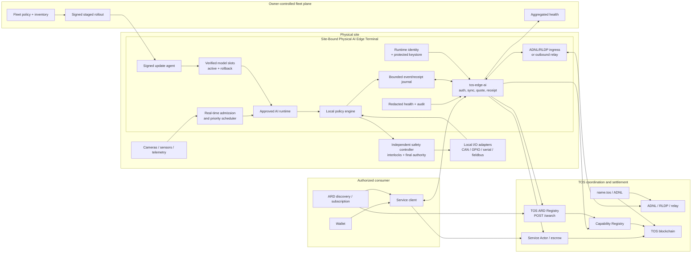

# Site-Bound Physical AI Edge Terminal over TOS Network

## Status

- Document type: product use case and implementation requirements
- Status: proposed, non-normative
- Date: 2026-07-31
- Related architecture:
  [TOS AI Edge Computing Terminal](ai-edge-computing-terminal-architecture.md)
- Main plan:
  [The TOS Protocol Implementation Plan](the-tos-protocol-implementation-plan.md)

## Purpose

This document defines how an owner-operated AI computer installed beside
cameras, sensors, robots, vehicles, machinery, or a production line
participates in TOS Network.

Examples include NVIDIA Jetson systems, industrial ARM computers, video
analytics appliances, robotics controllers, and other accelerator-equipped
edge boxes. Their primary value is not idle TOPS. It is their trusted physical
placement, low latency, local data access, deterministic operating policy, and
ability to continue useful work when the Internet is unavailable.

The product name is **Site-Bound Physical AI Edge Terminal**. The term
“terminal” is intentional: it is not a TOS validator, full node, consensus
role, mining device, or remotely rentable bare GPU.

## Product Decision

A physical terminal exposes bounded application capabilities such as:

- safety-event detection
- visual inspection
- OCR or license-plate recognition
- local speech processing
- sensor fusion
- robot-perception results
- privacy-preserving counts and statistics
- signed device or model health reports

It does not expose:

- a public shell
- a Docker or container runtime socket
- raw GPU/NPU access
- arbitrary consumer-supplied programs or models
- unrestricted camera streams
- raw CAN, GPIO, serial, fieldbus, or actuator control

Local safety and real-time workloads always take precedence over network
requests. External capabilities are operator-approved services with explicit
data, latency, safety, payment, and evidence policies.

## How It Differs from a General AI Compute Terminal

| Property | General AI Compute Terminal | Site-Bound Physical AI Edge Terminal |
|---|---|---|
| Primary value | Available model/task throughput | Physical placement and low-latency local execution |
| Typical host | GPU server or workstation | Industrial box, robot, vehicle, camera gateway, or machine controller |
| Primary workload | Network-requested inference | Site-owned continuous or event-triggered work |
| Priority | Owner reservations plus paid admission | Safety and local real-time work are absolute |
| Connectivity | Usually continuously reachable | May be outbound-only, mobile, intermittent, or offline |
| Data | Request-scoped consumer inputs | Sensor/video/operational data that may never leave the site |
| Physical I/O | Usually none | Cameras, sensors, CAN, GPIO, serial, fieldbus, or a local controller |
| Charging | Request, token, media, or service action | Device/site subscription, event, SLA, update, or approved service action |
| Fleet | Optional | Common and operationally important |

Both products reuse Edge Core, TOS identity, signed manifests, capability
discovery through ARD, payments, receipts, and evidence envelopes. They
require different admission, offline, safety, update, and fleet profiles.

## User Stories

### Site operator

As a site operator, I want to:

- keep raw sensor and video data on premises
- run critical inference without depending on Internet availability
- reserve all resources required by safety and real-time workloads
- authorize only explicitly reviewed external capabilities
- update models and policies safely across a fleet
- roll back a faulty update
- see terminal health without exposing sensitive site details
- receive payment for approved events, results, or services
- disable network services without stopping local control
- rotate terminal hardware and keys without losing the service identity

### Service consumer

As a consumer, I want to:

- discover a specific physical-world capability in an allowed region through
  a standard ARD Registry
- know whether raw data, derived events, or both can leave the site
- verify the terminal, service, model, policy, and evidence revisions
- obtain a quote for a bounded result or subscription
- receive a signed event, result, or usage receipt
- understand whether a claim is declared, observed, audited, or attested
- avoid depending on an exact public IP address

### Fleet operator

As a fleet operator, I want to:

- group terminals by owner, site, hardware, workload, policy, and rollout ring
- delegate bounded site administration without sharing fleet owner keys
- stage and pause model, runtime, and policy rollouts
- detect unhealthy, incompatible, or stale terminals
- revoke one terminal without revoking an entire fleet
- reconcile bounded offline journals after reconnect
- aggregate privacy-preserving health and service metrics

## Repository and Deployment Boundary

| Location | Responsibility |
|---|---|
| `tos` | Consensus, VM, generic contracts/query APIs, wallet/crypto, DNS, ADNL/DHT/RLDP, and TOS Sites |
| `tos-protocol` | Edge Core, ARD compatibility profile and Registry, base terminal/resource schema, authentication, quote/payment/receipt envelopes, delegation, SDKs, and conformance |
| `tos-ai` | Physical-terminal ARD catalog mapping, profile, Jetson/ARM packaging, sensor/actuator policy schema, real-time admission, signed update controller, fleet management, AI adapters, client, and conformance |
| Terminal | Drivers, local models, sensor adapters, safety policy, bounded journals, runtime key, and local operator state |
| Site safety controller | Independent hard or soft safety interlocks and final actuator authority |
| TOS blockchain | Identity references, manifest commitments, capability records, payment, escrow, and settlement |

Raw video, sensor samples, actuator commands, site maps, model credentials,
personal data, detailed fleet topology, and private operating logs remain
off-chain.

## Architecture



The safety controller is a separate trust boundary. A successful TOS payment,
valid terminal signature, or authenticated network request never overrides a
local safety interlock.

## Local-First Execution Model

The normal physical execution path is:

```text
sensor or local event
  -> local real-time admission
  -> approved model/runtime
  -> local policy
  -> optional safety-controller decision
  -> local result or physical action
  -> bounded event/receipt journal
  -> optional TOS publication and settlement
```

TOS coordinates identity, service discovery, authorized policy, model
commitments, payment, receipts, and later audit. It is not in the hard
real-time control loop.

An optional network-triggered service follows:

```text
authenticated bounded request
  -> local policy and payment check
  -> reject if it can affect reserved real-time capacity
  -> execute an operator-approved capability
  -> return a bounded result
  -> sign receipt
```

Network work is disabled by default on safety-critical terminals.

## Mandatory Execution Priority

Every physical-terminal profile declares and enforces this priority order:

1. emergency stop and safety interlocks
2. deterministic control-loop deadlines
3. site-owned real-time perception and sensor fusion
4. site-owned asynchronous analysis and maintenance
5. approved external service requests
6. background model download, indexing, compaction, and telemetry

Lower-priority work must be preemptible or deferrable. It must not cause a
higher-priority deadline miss, thermal excursion, memory shortage, storage
exhaustion, or unsafe actuator state.

The scheduler must reserve CPU, accelerator memory, host RAM, I/O bandwidth,
disk IOPS, network, and thermal headroom for local work before advertising any
external capacity. “Idle” means safe capacity remaining after those
reservations, not simply low instantaneous GPU utilization.

## Connectivity and Offline Operation

Physical terminals support three explicit connectivity states.

### Online

- refresh short-lived manifests and capability health
- verify chain/payment state
- accept approved network services
- receive authorized updates
- stream bounded results and receipts

### Disconnected

- continue safety and local real-time workloads from verified cached policy
- reject operations that require fresh chain authorization
- accept only pre-authorized offline capabilities with bounded quota and
  expiry
- append results, counters, and receipts to a bounded tamper-evident journal
- stop nonessential telemetry and downloads
- retain no unbounded retry queue

### Reconnecting

- authenticate the current fleet and chain view
- upload bounded journal segments idempotently
- reconcile vouchers, subscriptions, events, receipts, and settlement
- detect policy/model/key revocation before accepting new work
- discard expired queued network requests
- compact acknowledged journal segments with bounded work

Offline operation is not permission to invent payment authority. A terminal
may use a pre-funded voucher, bounded subscription allowance, or site-owned
task while disconnected. Otherwise it records local work without promising
network settlement.

## Identity and Authority

The minimum key hierarchy separates:

- fleet owner key
- site owner or administrator key
- terminal runtime key
- update-signing authority
- model-package signer
- optional auditor/attestation issuer
- local actuator/safety authority
- payment and treasury authority

The terminal runtime must not hold an unrestricted fleet owner, wallet, or
actuator key. A fleet delegation is scoped by terminal group, capability,
configuration fields, rollout action, value, and expiry.

Compromise of:

- one terminal must not authorize another terminal
- an update server must not transfer funds
- a model signer must not issue actuator commands
- a payment contract must not disable local safety
- an ARD Registry or discovery client must not change local policy

## Physical-Terminal Manifest

A signed profile should include:

- terminal class and schema version
- owner, site, fleet, and authorized runtime references
- hardware/runtime/driver and power-mode declarations
- local workload and reservation policy
- supported application capabilities
- safe input/output schemas
- model, preprocessing, postprocessing, and policy commitments
- service-level latency and throughput benchmarks
- connectivity state and manifest expiry
- offline capability, quota, and maximum journal window
- sensor categories without unnecessary unique serial numbers
- actuator policy category, normally `none` or `local-policy-only`
- raw-data egress and retention policy
- coarse service region without sensitive precise location
- software/model update channel and minimum accepted security revision
- evidence level for every material claim
- pricing, subscription, payment, refund, and SLA profile

Example:

```json
{
  "terminal_class": "site-bound-physical-ai",
  "service": "warehouse-safety-monitoring",
  "primary_workload": "person-detection",
  "realtime_budget_ms": 20,
  "local_priority": "absolute",
  "external_requests": "disabled-by-default",
  "offline_operation": true,
  "offline_quota": {
    "max_hours": 24,
    "max_journal_bytes": 67108864
  },
  "data_egress": "derived-events-only",
  "raw_video_egress": false,
  "actuator_access": "local-policy-only",
  "model_commitment": "<hash>",
  "policy_commitment": "<hash>",
  "runtime": "jetpack+tensorrt",
  "power_mode": "25W",
  "benchmark": {
    "profile": "person-detection-1080p",
    "streams": 4,
    "fps_per_stream": 25,
    "evidence": "benchmarked"
  }
}
```

Marketing TOPS alone is not a schedulable capability.

### ARD publication

The public ARD catalog advertises stable, callable physical-world service
capabilities, not raw device inventory. A fleet should normally expose a
stable task-broker, MCP, A2A, OpenAPI, or TOS Service Protocol entry while
keeping individual terminals and sensitive site topology private.

The catalog may describe capabilities such as warehouse safety events,
inspection workflows, OCR, local speech, or privacy-preserving counts. It must
not publish raw camera administration, CAN, GPIO, serial, fieldbus, shell,
container, update, fleet-control, or unrestricted actuator endpoints.

ARD publisher identity and search ranking do not authorize physical work. The
client must still obtain a live TOS quote and admission result, and every
physical action remains subject to local priority, cached authority, semantic
capability policy, and the independent safety controller.

When the site has only `name.tos` or outbound ADNL reachability, its catalog is
published through an approved HTTPS gateway namespace or a private ARD
Registry with an explicit `.tos` policy. The catalog can carry signed `.tos`,
ADNL, TOS address, and on-chain commitment bindings without claiming that
`.tos` is conventional public DNS proof.

## Safe Model and Software Updates

An update package must be signed and content-addressed. Its manifest includes:

- package type and version
- target terminal classes and hardware revisions
- operating system, driver, runtime, and firmware compatibility
- model source, exact weights, quantization, preprocessing, and tokenizer
- configuration and policy schema migration
- license and required notices
- minimum disk/RAM/accelerator requirements
- vulnerability and security-revision metadata
- rollout constraints and rollback compatibility
- hashes for every artifact
- update signer and signature domain

The terminal update process is:

```text
download to bounded staging area
  -> verify signature, hash, authority, target, and policy
  -> run compatibility and resource preflight
  -> run deterministic local canary
  -> activate in a rollout window
  -> observe bounded health gates
  -> commit or roll back to the previous known-good slot
```

Required controls:

- active and known-good rollback slots
- atomic activation or an equivalent crash-safe transition
- staged fleet rollout: lab, canary, small cohort, larger cohorts, full fleet
- automatic pause on safety, latency, crash, memory, thermal, or accuracy gates
- operator-approved emergency rollback
- anti-rollback for known-vulnerable security revisions, with a separately
  authorized break-glass procedure
- bounded download, staging, retry, log, and retained-version storage
- recovery after power loss during every update phase
- no update activation while it would violate a real-time safety window

A model update is not trusted merely because its bytes have a valid hash. The
signer, authority scope, compatibility, policy, and rollout state must also be
valid.

## Actuator and Physical-I/O Isolation

Raw physical interfaces remain local. Public profiles must not expose generic:

- CAN frame transmission
- GPIO writes
- serial commands
- fieldbus writes
- motor, steering, brake, door, valve, or robotic-joint control

An allowed physical action is represented as a narrow semantic capability,
for example `request-safe-stop`, and passes through:

1. authenticated caller and task-scoped capability
2. current local policy and operating-mode check
3. value, rate, time, location, and state constraints
4. optional human or site-controller approval
5. independent safety interlock
6. idempotent action identifier
7. local audit event and bounded receipt

The local safety controller has final authority and can reject a validly
signed request. Loss of TOS connectivity must leave the actuator in the
site-defined safe operating mode.

## Privacy and Data Egress

The terminal declares separately whether it releases:

- raw sensor/video/audio
- cropped or redacted media
- embeddings
- structured detections
- aggregate counts
- alerts
- model and system health

“Local processing” is a policy claim unless supported by audit or attestation.
Logs, metrics, discovery, fleet inventory, and receipts must not accidentally
reveal faces, license plates, patient data, factory layouts, exact vehicle
routes, customer identities, or precise sensitive site locations.

Discovery should normally use a coarse service region and capability, not the
terminal's exact physical coordinates.

## Fleet Management

Fleet management belongs in `tos-ai`, outside validators and consensus. It
provides:

- terminal enrollment and revocation
- owner/site/fleet delegation
- logical groups and rollout rings
- desired configuration and observed version
- signed policy and update distribution
- bounded health and compatibility inventory
- staged rollout, pause, rollback, and retirement
- offline terminal status and last-contact expiry
- aggregate capability and service availability
- privacy-preserving metrics and audit export

The blockchain stores commitments and settlement-relevant identities, not
every heartbeat, temperature sample, camera, update event, or fleet topology.
Fleet dashboards and indexes are advisory and must not override local safety
or chain authorization.

Large fleets require bounded fan-out, pagination, work queues, retry budgets,
history retention, and per-terminal reconciliation. A permanently offline
terminal must not create an immortal watcher or retry record.

## Service and Payment Models

Suitable payment profiles include:

- per terminal or site subscription
- per camera or sensor pipeline
- per signed detection/event
- per inspection or bounded analysis
- availability or response-time SLA
- signed model/update delivery and maintenance
- privacy-preserving aggregate data service

GPU-second rental is not a physical-terminal payment profile. The consumer
purchases a declared physical-world service outcome. Accelerator time may be
retained as bounded operator telemetry or advisory receipt evidence. A receipt
proves the terminal's signed statement and accounting, not automatically the
real-world truth of an event or the safety of an action.

## Resource Bounds

In addition to the common terminal limits, a physical profile must bound:

- sensor streams, resolution, frame rate, and decoder buffers
- real-time and asynchronous queues
- retained frames, clips, audio, embeddings, and events
- offline journal bytes, entries, and age
- unacknowledged receipts and settlement records
- model/update staging bytes and retained rollback versions
- fleet commands, rollout work, retries, and history
- telemetry rate and disconnected backlog
- actuator requests, deduplication window, and audit records
- RAM, accelerator memory, DMA/pinned buffers, disk, and network

Sensor disconnection, corrupt input, model failure, OOM, thermal throttling,
network loss, power loss, update failure, and terminal restart each require a
tested bounded recovery path.

## Threats

Physical terminals add threats beyond ordinary inference:

- poisoned ARD descriptions or forged publisher bindings redirect clients to
  an unauthorized fleet, terminal, or actuator-like endpoint
- stale ARD availability is mistaken for live site capacity or permission
- a network request starves a safety or control workload
- malicious or faulty model update changes physical behavior
- stolen update key compromises an entire fleet
- stale offline policy accepts revoked work
- reconnect duplicates events, actions, charges, or settlement
- raw actuator interface bypasses semantic policy
- telemetry leaks sensitive site or personal data
- fleet retry and journal state grows without bound
- one compromised terminal impersonates or controls its peers
- a rollback restores a known-vulnerable package

These threats are incorporated into the common
[AI Actor Threat Model](ai-actor-threat-model.md).

## Test Matrix

### Deterministic priority and safety

- external load cannot cause a local real-time deadline miss
- emergency and safety work preempts every lower class
- thermal or memory pressure rejects external work first
- valid TOS authorization cannot bypass a local safety interlock
- raw CAN/GPIO/serial/fieldbus operations are absent from public APIs
- actuator requests are bounded, idempotent, and locally auditable

### Offline and reconnect

- local inference continues with the last valid cached policy
- fresh-chain operations fail closed while disconnected
- offline voucher/subscription quota and expiry are enforced
- journal size, entries, age, and retry work remain bounded
- reconnect reconciliation is idempotent
- revoked policy, key, model, or terminal is detected before new admission
- expired queued requests are discarded

### Model and software update

- reject wrong signer, hash, target, compatibility, and security revision
- reject partial, truncated, oversized, and replayed packages
- power loss at every phase preserves an active or known-good slot
- canary health failure pauses rollout and rolls back
- model/runtime/policy revision remains bound to active quotes and receipts
- update cache, staging files, retries, and history remain bounded

### Fleet

- one terminal revocation does not revoke or authorize another
- scoped site administrator cannot change fleet-owner policy
- rollout rings advance only after explicit health gates
- pagination and fan-out work remain bounded for large fleets
- permanently offline terminals expire from active health without leaking
  watchers or retries
- aggregate health does not expose prohibited site data

### Three-node TOS integration

- bind a physical terminal to raw ADNL and optionally `name.tos`
- publish a valid ARD catalog through a verifiable FQDN or approved gateway
- discover the stable physical service through a TOS ARD Registry
- reject forged publisher/URN/TOS bindings, stale catalogs, unsafe endpoints,
  and catalog text attempting to override client or terminal policy
- publish and verify terminal, capability, model, policy, and evidence
  commitments
- complete an online event/subscription payment and receipt
- disconnect the terminal, continue local work, and create bounded receipts
- reconnect, reconcile idempotently, and settle once
- rotate runtime/update authority and reject the old authority
- restart validators without affecting local safety execution

The common test requirements are also recorded in the
[AI Actor Testing Matrix](ai-actor-testing-matrix.md).

## Existing Infrastructure and Missing Work

| Capability | Status | Location or required work |
|---|---|---|
| TOS identity, wallet, contracts, and payment | Available/partial | TOS core; terminal integration remains |
| DNS, ADNL, DHT, RLDP, and TOS Sites | Available | TOS core |
| ARD catalog mapping and TOS ARD Registry | Reference available | `tos-protocol`, including bounded cached federation; Physical AI entry policy remains in `tos-ai` |
| Edge Core and terminal/resource schema | To build | `tos-protocol` |
| Physical-terminal profile and packaging | To build | `tos-ai` |
| Jetson/ARM runtime and resource probes | To build | `tos-ai` |
| Real-time local admission and priority policy | Reference available | `tos-ai`; hard-real-time safety remains outside Go and requires site evidence |
| Offline bounded journal and reconciliation | Reference available | `tos-ai` task and fleet journals plus base receipt/settlement protocol |
| Signed update controller and rollback slots | Reference available | `tos-ai`; target service-manager and hardware rehearsal remain external |
| Actuator semantic capability and safety boundary | To build | `tos-ai`; site safety controller remains external |
| Fleet enrollment, rollout, health, and revocation | Partial reference | Signed per-terminal authority, exact replay, offline queue/reconnect, canary and rollback are implemented in `tos-ai`; operator transport, inventory aggregation and target-site certification remain |
| Relay/reverse tunnel for outbound-only sites | To build | reusable owner-selected connectivity service |
| Hardware/runtime attestation | Later | profile-specific verification |

## Delivery Phases

| Phase | Scope |
|---|---|
| P0 | Completed locally: deterministic MOCK runtime/GPU telemetry, offline fleet state, update slots, canary and rollback fault injection |
| P1 | One Jetson/ARM reference terminal, local inference, events-only egress, no public actuator action |
| P2 | Signed staged model/runtime updates, rollback, bounded offline journal, reconnect settlement |
| P3 | Fleet enrollment, delegation, rollout rings, health, and multi-terminal soak |
| P4 | Narrow audited semantic actuator capabilities and optional attestation |

Raw GPU rental and arbitrary consumer execution are not later phases.

## Acceptance Criteria

The first production physical-terminal profile is complete only when:

1. installation does not require a validator
2. the terminal runs its primary local workload without TOS connectivity
3. local real-time and safety reservations are measured and enforced
4. public services expose no raw device, container, or physical-I/O access
5. data-egress policy is machine-readable and enforced
6. signed model/runtime/policy updates are compatible, staged, crash-safe, and
   reversible
7. offline work and receipts remain within fixed storage and age limits
8. reconnect reconciliation is idempotent and observes revocation
9. fleet authority is scoped and each terminal can be revoked independently
10. actuator policy cannot override an independent safety interlock
11. fault injection demonstrates bounded RAM, accelerator memory, disk,
    journals, queues, watchers, retries, and update history
12. ARD publisher, Registry, client, and Physical AI mappings pass pinned
    upstream and TOS security conformance
13. the three-node TOS suite validates identity, ARD discovery, payment,
    receipt, reconnect, key rotation, and exactly-once settlement

## Related Documents

- [TOS Network Compatibility with Agentic Resource Discovery](tos-ard-compatibility.md)
- [TOS AI Edge Computing Terminal Architecture](ai-edge-computing-terminal-architecture.md)
- [The TOS Protocol Implementation Plan](the-tos-protocol-implementation-plan.md)
- [Managed AI Services on Local GPU Hardware](local-gpu-sharing-use-case.md)
- [Locally Hosted Open-Weight Model Sharing](local-open-weight-model-sharing-use-case.md)
- [AI Actor Threat Model](ai-actor-threat-model.md)
- [AI Actor Testing Matrix](ai-actor-testing-matrix.md)
- [TOS Sites](TosSites.md)
