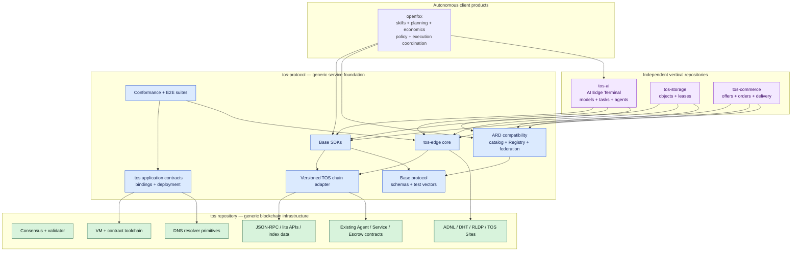
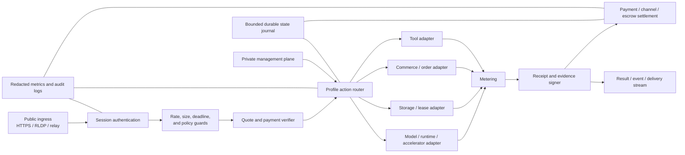
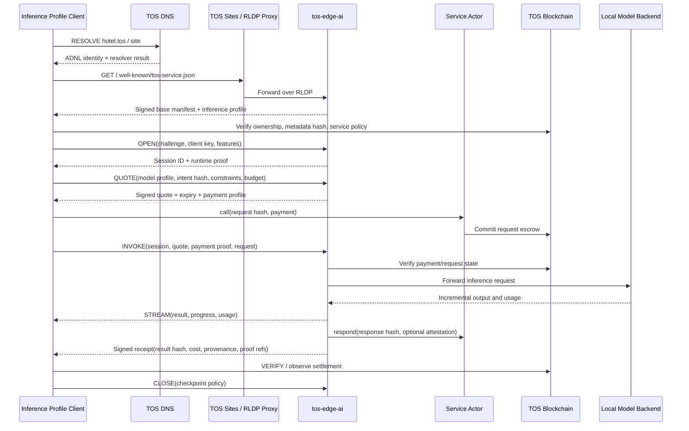
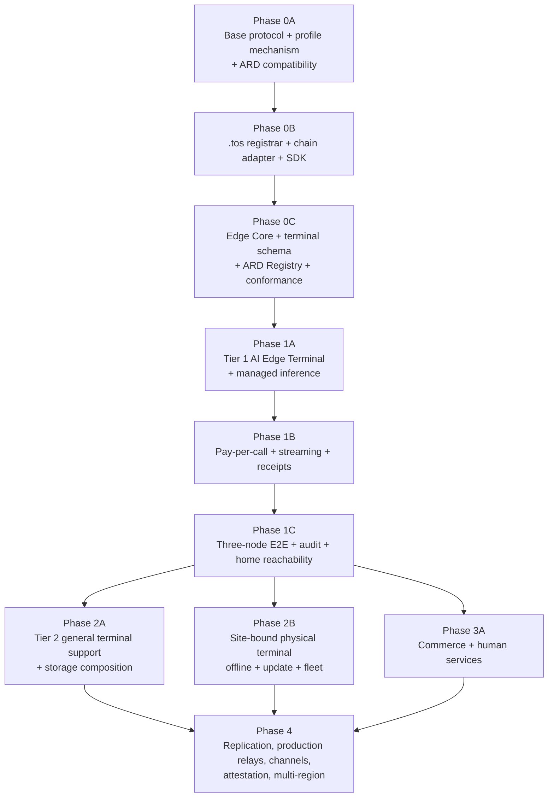

# The TOS Protocol Implementation Plan

## Status

- Live delivery status:
  [TOS Network Development Roadmap](tos-network-roadmap.md)
- Source vision document: [The-TOS-Protocol.docx](The-TOS-Protocol.docx)
- Companion PDF: [The-TOS-Protocol.pdf](The-TOS-Protocol.pdf)
- Assessment date: 2026-07-31
- Scope: repository-level gap analysis and an implementation roadmap for
  owner-operated Internet services, with an AI Edge Computing Terminal and
  local model inference as the first reference product
- Repository model: TOS core as a dependency, a separate generic service
  protocol repository, and independently released vertical product profiles
- External discovery baseline: Agentic Resource Discovery (ARD) v0.9 Draft,
  pinned and versioned until a stable ARD release is available

## Executive Summary

`The-TOS-Protocol.docx` is a vision paper and reference architecture. It
describes the intended Internet primitive, trust model, protocol grammar, edge
node, discovery model, and economic model, but it is not yet a normative
protocol specification that independent implementations can follow.

The use cases derived from the vision cover more than AI inference. An
owner-operated `name.tos` endpoint may expose a local model, a managed AI
service backed by local accelerators, a site-bound physical AI capability,
storage capacity, physical or digital goods, human skills, tools, or a
composition of these resources. These services share identity, discovery,
authentication, quote, payment, receipt, evidence, privacy, and transport
requirements, but have different business state machines.

TOS Network adopts Agentic Resource Discovery (ARD) as its standard public
discovery envelope. Providers and gateways publish ARD-compatible
`/.well-known/ai-catalog.json` documents, and the off-chain TOS ARD Registry
implements the standard HTTP search
interface. TOS does not fork ARD's general catalog, identifier, or federation
model. TOS extends the flow after discovery with live admission, edge
execution, signed quotes, payment, metering, receipts, evidence, disputes, and
settlement.

The repository already contains substantial trust and settlement
infrastructure:

- TOS DNS and resolver chaining
- ADNL, RLDP, and the TOS Sites HTTP proxy
- Agent Account controller keys and spending limits
- concurrent Service Actor request escrow
- Task Escrow, Dispute, Capability Registry, and Proof Attestation contracts
- chain-backed query/indexing APIs
- wallet, JSON-RPC, `tosctl`, and JavaScript SDK foundations

The main missing common surfaces are:

- a public `.tos` root domain registration application
- signed generic service descriptors and manifests with versioned profiles
- a normative TOS service session, quote, payment, and receipt protocol
- an owner-operated Edge Core with independently deployable profile adapters
- durable invocation, lease, order, task, fulfillment, refund, and dispute
  state machines
- client SDKs for the base protocol and vertical profiles
- an ARD-compatible Registry, plural service discovery, and user-agent
  foundations
- multi-region routing, relays, subscriptions, streaming settlement, and
  advanced verification

The proposed
[OpenFox autonomous earning agent](openfox-autonomous-earning-agent.md) is the
owner-side product that turns those foundations into a bounded economic loop:
it discovers work, matches approved skills, evaluates profit and risk,
coordinates execution, and observes settlement. The product relationship is
intentional: `tos-protocol` establishes the trusted market, `tos-ai` supplies
production capacity, and OpenFox lets that capacity participate autonomously
in the market and earn revenue. This is a target boundary, not a statement
that the public market or OpenFox is already implemented.

The first deployable product is centered on the
[TOS AI Edge Computing Terminal](ai-edge-computing-terminal-architecture.md):
an owner-operated appliance or workstation that measures its usable
resources, runs approved runtime adapters, admits bounded tasks, exposes them
through TOS networking, and produces payable signed receipts. The terminal is
not a validator, consensus participant, mining role, public shell, or raw GPU
lease merely because it contains an accelerator.

This changes the primary product abstraction from “a remote GPU” to “a
versioned AI service capability.” Consumers describe a model or task,
constraints, privacy/evidence requirements, region, and budget. Terminal and
discovery software select a compatible local runtime and device. Hardware
model numbers and vendor TOPS remain scheduling evidence, not the service
contract.

The Phase 1 MVP should not modify validator consensus, execute application
workloads inside `validator-engine`, or place the complete product stack in
this repository. TOS should remain the general-purpose blockchain, naming,
settlement, and ADNL/RLDP networking substrate.

Before implementing multiple vertical products, Phase 0 should define a
generic TOS Service Protocol, profile extension mechanism, and terminal
foundation. Phase 1 should validate that common layer with one bounded,
owner-operated managed-inference terminal on a Tier 1 Linux/NVIDIA reference
platform. The site-bound physical terminal, storage, and commerce remain
separate profiles and release tracks rather than being forced into the
inference protocol, terminal base, or TOS node. Bare GPU rental and arbitrary
consumer execution are excluded rather than deferred.

## Repository Boundary and Ownership

The implementation should use one generic protocol repository and separate
vertical product repositories. Names below are illustrative and can be changed
when the repositories are created.

The central boundary rule is:

> `tos` provides reusable blockchain infrastructure; `tos-protocol` defines
> interoperable service foundations and ARD compatibility; vertical
> repositories implement specific resource profiles and products; OpenFox is
> an autonomous client product that operates them under owner policy.

| Repository | Owns | Does not own |
|---|---|---|
| `tos` (this repository) | consensus and validators, VM and generic smart-contract tooling, chain data and stable query APIs, wallet/crypto primitives, DNS resolution, ADNL/DHT/RLDP, and TOS Sites transport | application manifests, model/storage/commerce execution, derived discovery, or vertical product releases |
| `tos-protocol` | base descriptor and manifest schemas, ARD compatibility profile, ARD Registry/crawler/federation, profile mechanism, authentication, quotes, payment authorization, receipts, evidence, `.tos` registrar application, chain adapter, common SDKs, Edge Core libraries, generic terminal/resource schema, conformance vectors, and compatibility matrix | consensus rules, validator internals, model runtimes, storage engines, application content catalogs, or vertical business policy |
| `tos-ai` | General and physical AI Edge Computing Terminal distributions, inference and physical-world task profiles, local open-weight models, resource probes and benchmarks, model/runtime adapters, bounded and real-time scheduling, signed updates, fleet management, AI clients, model provenance, packaging, and AI-specific conformance tests | bare GPU rental, consumer-supplied execution, generic domain ownership, or unrelated storage/commerce workflows |
| `openfox` (proposed) | off-chain agent loop, owner mandate, approved skills, task discovery and matching, conservative cost/profit/risk evaluation, deterministic policy gates, protocol and execution clients, bounded durable decision state, and accounting/audit | consensus, protocol schemas, settlement authority, owner-key custody, model runtimes, terminal admission, or unrestricted task-supplied tools and code |
| `tos-storage` | object APIs, storage leases, content catalogs, storage metering, replication, and availability evidence | TOS consensus or AI model execution |
| `tos-commerce` | store and offer schemas, orders, inventory, physical/digital fulfillment, human-service workflows, refunds, and commerce discovery | TOS consensus, generic transport, or model execution |

Existing AI Actor contracts and query APIs in `tos` do not need to be moved.
Product repositories consume their deployed ABIs and stable APIs as existing
infrastructure. New application contracts are developed, versioned, tested,
and deployed from the repository that owns their protocol, without being built
into the validator.

A change belongs in `tos` only when it is a genuinely reusable blockchain or
network capability that is missing from the public integration surface.
Such work must be proposed as a separate core PR, remain independent of
vertical releases, and preserve compatibility where practical.
Application-specific behavior must not be added to validator or consensus code
merely to simplify a profile implementation.

### Repository boundary diagram



### Proposed repository layouts

```text
tos-protocol/
  spec/base/
  spec/profile-registry/
  contracts/tos-domain/
  crates/protocol/
  crates/chain-adapter/
  crates/edge-core/
  crates/ard-catalog/
  services/ard-registry/
  crates/ard-federation/
  sdk/typescript/
  apps/cli/
  deploy/
  tests/conformance/
  tests/e2e/

tos-ai/
  spec/
  apps/terminal/
  probes/
  benchmarks/
  adapters/models/
  adapters/accelerators/
  adapters/sensors/
  services/tos-edge-ai/
  services/fleet/
  services/update-controller/
  apps/ai-client/
  tests/

openfox/
  cmd/
  internal/discovery/
  internal/skills/
  internal/planner/
  internal/economics/
  internal/policy/
  internal/taskstate/
  pkg/protocolclient/
  pkg/executionclient/
  pkg/signer/
  tests/

tos-storage/
  spec/
  services/tos-edge-storage/
  apps/storage-client/
  tests/

tos-commerce/
  spec/
  services/tos-commerce-edge/
  apps/seller/
  apps/buyer/
  tests/
```

This plan may remain under `tos/doc/` as the initial architecture and
transition record. Once `tos-protocol` exists, the normative base specification
and implementation plan should move there; this repository should retain a
short pointer to the new source of truth. Vertical normative profiles remain
with their owning product repositories and depend on released base protocol
versions.

## Status Legend

| Status | Meaning |
|---|---|
| **Available** | Implemented in TOS core and suitable as an external dependency |
| **Partial** | A TOS primitive exists, but base protocol or profile integration is missing |
| **To build** | Implement in `tos-protocol` or the owning vertical repository unless a row identifies a TOS core gap |
| **Later** | Outside the minimum viable vertical slice |

## Architecture Coverage Map

```mermaid
flowchart TB
    subgraph Client["Protocol Clients and Discovery"]
        Browser["Service Browser / User Agent<br/>TO BUILD"]
        ClientSDK["Rust + TypeScript Base SDKs<br/>TO BUILD"]
        VerticalClients["AI / Storage / Commerce Clients<br/>TO BUILD BY PROFILE"]
        Catalog["ARD ai-catalog.json<br/>TO BUILD"]
        Registry["TOS ARD Registry<br/>POST /search<br/>AVAILABLE REFERENCE"]
        Federation["Bounded cached ARD federation<br/>AVAILABLE REFERENCE"]
        ChainIndex["Capability/service chain index<br/>AVAILABLE"]
    end

    subgraph Trust["TOS Core Trust and Settlement"]
        DNS["TOS DNS + resolver chaining<br/>AVAILABLE"]
        Registrar[".tos root registrar<br/>TO BUILD"]
        Agent["Agent Account<br/>AVAILABLE / EXTEND"]
        Service["Service Actor concurrent escrow<br/>AVAILABLE / INTEGRATE"]
        Capability["Capability Registry<br/>AVAILABLE / EXTEND"]
        Task["Task Escrow + Dispute<br/>AVAILABLE"]
        Attest["Proof Attestation<br/>AVAILABLE"]
        Chain["TOS blockchain and finality<br/>AVAILABLE"]
    end

    subgraph Protocol["tos-protocol: Base Service Plane"]
        Descriptor["Signed service descriptor<br/>TO BUILD"]
        Manifest["Canonical base manifest<br/>TO BUILD"]
        Profiles["Versioned profile extensions<br/>TO BUILD"]
        Session["OPEN + authenticated session<br/>TO BUILD"]
        Quote["QUOTE + payment authorization<br/>TO BUILD"]
        Action["Profile action state machines<br/>TO BUILD"]
        Receipt["Signed receipts and evidence envelope<br/>TO BUILD"]
        Delegate["DELEGATE capability token<br/>TO BUILD"]
    end

    subgraph Network["TOS Core Connectivity + Service Integration"]
        ADNL["ADNL / DHT / RLDP<br/>AVAILABLE"]
        Sites["rldp-http-proxy / TOS Sites<br/>AVAILABLE"]
        HTTPS["HTTPS / WebSocket / SSE binding<br/>PARTIAL"]
        Relay["NAT relay / reverse tunnel<br/>TO BUILD"]
        Routing["Multi-runtime policy routing<br/>TO BUILD"]
    end

    subgraph Edge["Owner-Operated Terminal Plane"]
        EdgeDaemon["tos-edge core<br/>TO BUILD"]
        Terminal["AI Edge Terminal distribution<br/>TO BUILD BY tos-ai"]
        Profiler["Resource probes + benchmarks<br/>TO BUILD BY tos-ai"]
        Ingress["Authenticated ingress + rate limits<br/>TO BUILD"]
        Supervisor["Runtime supervisor / sandbox<br/>TO BUILD"]
        Model["Model/runtime adapters<br/>TO BUILD BY tos-ai"]
        Scheduler["Bounded task scheduler<br/>TO BUILD BY tos-ai"]
        Physical["Physical-terminal profile<br/>TO BUILD BY tos-ai"]
        Update["Signed update + rollback<br/>TO BUILD BY tos-ai"]
        Fleet["Signed fleet agent + canary rollout<br/>REFERENCE IMPLEMENTED IN tos-ai"]
        StorageAdapter["Storage adapter<br/>TO BUILD BY PROFILE"]
        CommerceAdapter["Commerce adapter<br/>TO BUILD BY PROFILE"]
        Tools["MCP-style tool gateway<br/>TO BUILD"]
        Memory["Encrypted memory and retrieval<br/>TO BUILD"]
        Meter["Metering + receipt signer<br/>TO BUILD"]
        Policy["Wallet and policy enforcement<br/>PARTIAL"]
        Observe["Health, metrics, and audit logs<br/>TO BUILD"]
    end

    Browser --> ClientSDK
    VerticalClients --> ClientSDK
    ClientSDK --> DNS
    ClientSDK --> Registry
    Catalog --> Registry
    Registry --> Federation
    Registry --> ChainIndex
    DNS --> Registrar
    DNS --> Descriptor
    Descriptor --> Manifest
    Manifest --> Profiles
    Descriptor --> Sites
    Descriptor --> HTTPS
    Manifest --> Session
    Session --> Quote
    Quote --> Service
    Quote --> Action
    Action --> Receipt
    Delegate --> Agent
    Receipt --> Attest
    Service --> Chain
    Agent --> Chain
    Capability --> Chain
    Task --> Chain
    Attest --> Chain
    Sites --> ADNL
    Sites --> Ingress
    HTTPS --> Ingress
    Relay --> Ingress
    Routing --> Ingress
    Ingress --> EdgeDaemon
    Terminal --> EdgeDaemon
    Terminal --> Profiler
    EdgeDaemon --> Supervisor
    EdgeDaemon --> Model
    EdgeDaemon --> Scheduler
    Scheduler --> Model
    Terminal --> Physical
    Physical --> Scheduler
    Physical --> Update
    Physical --> Fleet
    EdgeDaemon --> StorageAdapter
    EdgeDaemon --> CommerceAdapter
    EdgeDaemon --> Tools
    EdgeDaemon --> Memory
    EdgeDaemon --> Meter
    EdgeDaemon --> Policy
    EdgeDaemon --> Observe

    classDef available fill:#d8f3dc,stroke:#2d6a4f,color:#081c15;
    classDef partial fill:#fff3bf,stroke:#e67700,color:#5f3b00;
    classDef missing fill:#ffe3e3,stroke:#c92a2a,color:#5c0000;
    classDef later fill:#e9ecef,stroke:#6c757d,color:#212529;

    class DNS,ChainIndex,Task,Attest,Chain,ADNL,Sites available;
    class Agent,Service,Capability,HTTPS,Policy partial;
    class Browser,ClientSDK,VerticalClients,Catalog,Registry,Federation,Registrar,Descriptor,Manifest,Profiles,Session,Quote,Action,Receipt,Delegate,Relay,Routing,EdgeDaemon,Terminal,Profiler,Ingress,Supervisor,Model,Scheduler,Physical,Update,Fleet,StorageAdapter,CommerceAdapter,Tools,Memory,Meter,Observe missing;
```



## Common and Profile Components

The original whitepaper is AI-oriented, while the derived use cases expose
which components are common and which belong in vertical profiles.

| Component | Status | Existing repository foundation | Required work |
|---|---|---|---|
| Human-readable `name.tos` identity | Partial | [DNS.md](DNS.md), DNS smart contracts, ConfigParam 4 resolution | Implement the root `.tos` collection/item registry, ownership lifecycle, CLI, SDK, and deployment |
| ARD capability catalog | To build | ARD v0.9 provides the public data model and `/.well-known/ai-catalog.json` convention | Pin the supported ARD version, import its authoritative schemas, generate bounded catalogs, define TOS media-type mappings, and keep `.tos`/ADNL/on-chain identity bindings as verified extensions |
| TOS ARD Registry | To build | ARD defines the mandatory HTTP REST discovery baseline and federated-registry model | Implement bounded crawling, `POST /search`, provenance, federation, private catalogs, chain-index enrichment, `.tos` gateway ingestion, policy filters, and upstream/TOS conformance |
| Signed service descriptor | To build | ADNL identity and existing asymmetric key infrastructure | Define the base descriptor schema, signature domain, controller/runtime authorization, expiry, health window, and endpoint selection |
| Base service manifest and profiles | To build | Service Actor and Capability Registry metadata hashes; ARD supplies the protocol-neutral discovery envelope | Define canonical JSON/CBOR operational manifests, profile negotiation, critical extensions, TOS media types, signatures, on-chain commitments, update/version rules, and an explicit mapping from ARD entries to TOS descriptors |
| Owner/controller key hierarchy | Partial | Agent Account owner/controller separation | Add runtime keys, session keys, bounded delegation, revocation, multi-controller support, and recovery semantics |
| Capability declaration | Partial | Capability Registry and metadata hashes | Standardize base capability identifiers, profile vocabularies, input/output schemas, languages, regions, pricing, evidence, and critical extensions |
| Quote, order, lease, and task binding | Partial | Service Actor and Task Escrow request identities | Define common signed quotes plus profile-specific durable state machines, idempotency, event ordering, deadlines, and terminal cleanup |
| Persistent/ephemeral memory | To build | Generic storage and database libraries only | Add encrypted site memory, tenant separation, retention, deletion, retrieval, and backup policies |
| Runtime locators | Partial | DNS ADNL records and TOS Sites | Add signed multi-endpoint descriptors, transport/version negotiation, region/load metadata, expiry, and fallback |
| Terminal/resource profile | To build | Host and accelerator information is locally observable | Define privacy-preserving terminal identity, hardware/runtime declarations, claim evidence levels, freshness, owner reservations, and compatibility rules |
| Resource probes and benchmarks | To build | No common AI terminal benchmark surface exists | Implement versioned probes and workload-level benchmarks; distinguish declared, observed, benchmarked, audited, and attested claims |
| Runtime supervisor | To build | Process, container, and systemd foundations exist operationally | Create isolated workload lifecycle, resource quotas, network/file/tool grants, restart policy, and upgrades |
| Model/runtime adapter layer | To build | No AI model runtime is part of the node | Define a common adapter contract and initial OpenAI-compatible, Ollama, llama.cpp, and vLLM adapters without treating one engine as universal |
| Model/artifact manager | To build | Generic storage and hashing libraries are reusable | Add artifact commitments, license/provenance records, compatibility preflight, bounded cache, staged activation, drain, and cleanup |
| Task admission and scheduler | To build | Service Actor provides payment state, not local resource reservation | Add authoritative local admission, queue/RAM/VRAM/context bounds, owner reservations, cancellation, deadline, thermal policy, and terminal cleanup |
| Offline journal and reconnect | To build | Generic storage, signatures, receipts, and settlement primitives are reusable | Define bounded offline authority, tamper-evident journal, idempotent upload/reconciliation, revocation observation, expiry, compaction, and failure recovery |
| Safe update and rollback | To build | Hashing/signature and process-management foundations are reusable | Define package authority, compatibility, active/known-good slots, crash-safe activation, health gates, staged rollout, anti-rollback, and bounded retention |
| Physical-I/O safety boundary | To build | No public actuator protocol exists or is implied | Define narrow semantic capabilities, local policy, independent safety-controller authority, deduplication, safe offline behavior, and audit receipts; never expose raw CAN/GPIO/serial/fieldbus |
| Fleet management | Partial | `tos-ai/pkg/fleetcontrol` now provides signed terminal/fleet-scoped commands, monotonic generations, exact replay, bounded durable offline queues, real-time priority gates, reconnect drain, deterministic canary rings and signed rollback | Integrate a deployment-selected authenticated transport; add deployment inventory/group policy and physical-site health/actuator certification without moving continuous fleet state on-chain |
| Tool gateway | To build | AI Actor contracts reference services and tools conceptually | Add MCP-style tool registration, policy enforcement, credentials isolation, auditing, and cancellation |
| Wallet/policy service | Partial | Agent Account limits, Service Actor access policy, Task Escrow | Add session budgets, service/category restrictions, quote binding, subscription and subcontracting rules |
| Metering and receipts | Partial | Service Actor request/response commitments and attestation | Define usage units, canonical receipts, provenance, state delta, aggregate receipts, and signer rotation |
| Native per-action payment | Partial | Concurrent Service Actor escrow | Bind quotes and profile actions to durable identities, provide edge observation, idempotency, confirmation policy, and refunds |
| Subscription/streaming payment | To build | Payment channel primitives and examples may be reusable | Define session credits, vouchers/channels, replay protection, incremental settlement, close and dispute paths |
| Task escrow and dispute | Available | Task Escrow and Dispute contracts | Integrate them as optional long-running task, milestone, acceptance, and dispute profiles |
| Evidence and attestation | Partial | Proof Attestation and domain-separated response commitments | Standardize receipt/evidence envelopes, verifier references, issuer trust, and off-chain proof adapters |
| HTTP/RLDP access | Available | [TosSites.md](TosSites.md), `rldp-http-proxy` | Add generic service/profile well-known paths, authenticated sessions, event/stream bindings, and profile-specific limits |
| NAT traversal and relays | To build | ADNL tunneling foundations exist, but not a complete owner-operated relay product | Add owner-selected relays/reverse tunnels without transferring site authority |
| Service discovery | Partial | Chain-wide service/capability index plus a bounded ARD Registry and cached federation crawler now exist in `tos-protocol`; federation enforces exact HTTPS origins, redirect/body/depth/source quotas, cycles, TTL and atomic replacement | Add authoritative upstream List/filter conformance, health/pricing/reputation indexes and deployment policy; revalidate authority before every transaction |
| Service Browser | To build | Wallet/connect/client SDK foundations | Build a CLI/desktop/extension base user agent with inference, storage, and commerce modules for consent, budgets, receipts, and composition |
| Observability | Partial | Validator and service metrics/logging patterns | Add privacy-preserving edge health, bounded metrics, tracing, usage audit, and redaction |

### Vertical profile coverage

| Profile | Required protocol surface | Owning repository |
|---|---|---|
| Local model inference | exact model/artifact profile, provenance and license, context/output limits, streaming, cancellation, token/media metering, model receipt | `tos-ai` |
| Managed AI terminal | terminal/resource declaration, runtime adapter, exact service profile, bounded admission, model lifecycle, cancellation, metering, cleanup, and evidence | `tos-ai` |
| Site-bound physical AI terminal | local-first execution, offline journal/reconnect, real-time priority, sensor-data policy, signed updates/rollback, actuator isolation, fleet enrollment/rollout, and physical-service receipts | `tos-ai` |
| Storage | object identity, upload/download, lease/renew/delete, retention, capacity and egress metering, content catalog, replication and availability evidence | `tos-storage` |
| Commerce | store manifest, immutable offer revisions, quote/order state, inventory reservation, physical/digital fulfillment, refunds, disputes, private buyer data | `tos-commerce` |
| Human services | negotiated scope, deliverable commitment, deadlines, revisions, milestone/task escrow, acceptance and dispute evidence | `tos-commerce` |

The base protocol must support all of these profiles without embedding their
business fields into one universal manifest or state machine.

## Existing Infrastructure That Should Be Reused

### DNS and TOS Sites

The current DNS stack resolves on-chain records and supports resolver chaining.
`rldp-http-proxy` already resolves the `site` DNS category into an ADNL or
storage address and forwards HTTP over RLDP. These components should remain the
network foundation:

- [DNS.md](DNS.md)
- [TosSites.md](TosSites.md)
- [`rldp-http-proxy/DNSResolver.cpp`](../rldp-http-proxy/DNSResolver.cpp)
- [`rldp-http-proxy/rldp-http-proxy.cpp`](../rldp-http-proxy/rldp-http-proxy.cpp)

For the MVP, a `.tos` DNS item can keep using the existing `site` record to
point to an ADNL identity. A generic service entry document should be served
at:

```text
/.well-known/tos-service.json
```

An ARD-compatible HTTPS publisher additionally serves:

```text
/.well-known/ai-catalog.json
```

The ARD catalog is the protocol-neutral discovery envelope and may reference
the TOS service descriptor, MCP server card, A2A agent card, OpenAPI document,
or nested catalog. The TOS descriptor remains authoritative for TOS
authentication, live quote, payment, receipt, and endpoint semantics.

It references one or more signed profile documents, for example inference,
storage, or commerce manifests. Profile paths such as
`/.well-known/tos-inference.json`, `/.well-known/tos-storage.json`, and
`/.well-known/tos-store.json` remain profile-defined. The base manifest hash
can be committed through the Service Actor or Capability Registry. This avoids
inventing a new DNS record type before descriptor and profile specifications
stabilize.

Because ARD identifiers are anchored in a verifiable public FQDN, `name.tos`
must not be presented as conventional ARD domain proof by itself. Operators
use an operator-controlled DNS name, an approved HTTPS gateway namespace, or
a private ARD Registry with an explicit `.tos` trust policy. The ARD record can
carry signed `name.tos`, ADNL, TOS address, and on-chain commitment bindings as
extension metadata.

### Service, Escrow, and Attestation Contracts

The following contracts already provide useful authority and settlement
boundaries. They remain TOS core/deployed dependencies; application
repositories should consume their versioned ABI rather than copy their source:

- [`agent-account-code.fc`](../crypto/smartcont/agent-account-code.fc)
- [`service-actor-code.fc`](../crypto/smartcont/service-actor-code.fc)
- [`task-escrow-code.fc`](../crypto/smartcont/task-escrow-code.fc)
- [`capability-registry-code.fc`](../crypto/smartcont/capability-registry-code.fc)
- [`dispute-code.fc`](../crypto/smartcont/dispute-code.fc)
- [`proof-attestation-code.fc`](../crypto/smartcont/proof-attestation-code.fc)

The current Service Actor is particularly valuable because it already
supports concurrent requests, request identity, policy snapshots, response
commitments, bounded live dictionaries, refunds, cleanup, and optional
attestation. It should be integrated rather than replaced for the first
pay-per-action flow. Task Escrow and Dispute remain important for human
services, milestones, subjective acceptance, and other long-lived workflows.

It is not, by itself, a real-time inference protocol. The inference profile
still needs off-chain quote negotiation, request forwarding, streaming, usage
metering, receipt signing, and a rule for when the gateway considers an
on-chain payment confirmed. Storage and commerce profiles additionally require
leases, orders, fulfillment events, refunds, and dispute state.

### Query and Indexing APIs

The existing `tosctld` query/indexing surface can classify and expose Agent
Account, Service Actor, Task Escrow, Dispute, and Capability Registry state:

- [`agent_query_api.rs`](../tosctl/src/node-control/service/src/http/agent_query_api.rs)
- [`indexer_task.rs`](../tosctl/src/node-control/service/src/indexer/indexer_task.rs)
- [`store.rs`](../tosctl/src/node-control/service/src/indexer/store.rs)

This is a useful source for chain-authoritative fields and discovery seeds.
Semantic discovery remains a separate, non-authoritative derived service.

### Stable integration boundary

`tos-protocol` and all vertical repositories should integrate with TOS through
released, versioned surfaces:

- JSON-RPC and lite-server APIs
- DNS resolver and TOS Sites behavior
- supported ADNL/RLDP client interfaces
- contract ABI/schema versions and deployed code hashes
- chain/network identifiers and configuration addresses
- signed releases of any reusable client libraries

`tos-protocol` should maintain a compatibility manifest that pins the supported
TOS release range, network configuration, ABI versions, contract code hashes,
and required feature flags. Each vertical repository pins a released base
protocol version. CI should run conformance and E2E tests against every
supported combination. No application repository should vendor a mutable copy
of the node source or reach into validator-private headers and databases.

## Specification Work Required Before Protocol Coding

The vision paper contains useful concepts but leaves security-critical choices
undefined. The first engineering deliverable should be a generic `TOS Service
Protocol v0.1` specification package. The inference profile is the first
conforming vertical implementation, not the definition of the base protocol.

### Required specification artifacts

```text
tos-protocol/spec/
  ard/
    compatibility-profile.md
    media-types.md
    identity-binding.md
    registry-policy.md
    pinned-upstream/
    test-vectors/
  base/
    protocol.md
    service-descriptor.schema.json
    service-manifest.schema.json
    profile-reference.schema.json
    capability.schema.json
    session.schema.json
    delegation.schema.json
    quote.schema.json
    payment-authorization.schema.json
    receipt.schema.json
    evidence.schema.json
    authentication.md
    ard-handoff.md
    payment-and-settlement.md
    transport-http.md
    transport-rldp.md
    errors.md
    versioning.md
    security-considerations.md
    test-vectors/

  profile-registry/
    README.md
    registrations/

tos-ai/spec/
  inference/
  physical-terminal/

tos-storage/spec/
  storage/

tos-commerce/spec/
  commerce/
  human-services/
```

The base specification must define:

- canonical field ordering and encoding
- hash algorithm and domain separation labels
- signature algorithm and key representation
- owner, controller, runtime, session, and delegation key relationships
- nonce, timestamp, expiry, and clock-skew rules
- correlation IDs and idempotency keys
- replay boundaries across sites, sessions, quotes, and requests
- critical versus advisory manifest fields
- profile identifiers, version negotiation, and compatibility rules
- profile discovery and profile-specific well-known document references
- the pinned ARD version, ARD identifier and media-type mapping, and
  catalog-to-TOS descriptor handoff
- the distinction between stable ARD discovery data, registry-derived fields,
  and authoritative live quote/admission state
- unknown extension handling
- maximum sizes and nesting limits
- state transitions and legal message ordering
- cancellation and partial-stream behavior
- error taxonomy and retry safety
- payment confirmation and reorganization policy
- receipt aggregation and subcontract provenance
- privacy, retention, and selective context disclosure
- durable event ordering, crash recovery, and terminal-state cleanup
- evidence levels and the distinction between declarations and proofs
- resource provenance, license, terms, and authorization metadata

### Base operations and profile operations

The base protocol should define common operations and envelopes:

```text
RESOLVE
DESCRIBE
OPEN
QUOTE
AUTHORIZE
RECEIPT
VERIFY
SETTLE
CLOSE
```

Profiles define their own legal actions and state machines:

```text
Inference:
  INVOKE, STREAM, CANCEL

Storage:
  PUT, GET, HEAD, LEASE, RENEW, DELETE

Commerce:
  OFFER, ORDER, ACCEPT, FULFILL, DELIVER, CANCEL, REFUND, DISPUTE
```

Implementations must not assume every service follows an
`INVOKE -> STREAM -> CLOSE` lifecycle.

### Profile definition requirements

Every normative profile must publish:

- a globally unique profile identifier and semantic version
- canonical schema and test-vector commitments
- required and optional base protocol versions
- capability vocabulary
- legal actions, events, and state transitions
- quote, receipt, evidence, and discovery extensions
- privacy/data classification
- maximum sizes and resource dimensions
- compatibility, deprecation, and migration rules

Profile identifiers and schemas must not be silently reassigned. Multiple
organizations may define profiles, but clients need an explicit registry or
URI-based authority model to avoid naming collisions and ambiguous semantics.

### Common signed quote

All profiles should extend one signed quote envelope that binds:

- service, profile, manifest, and resource/offer revision
- client, caller, buyer, and payer roles as applicable
- intent or request commitment
- quantity, limits, and maximum total payment
- payment or escrow contract and chain
- fulfillment, acceptance, cancellation, and refund policy references
- evidence and privacy policy
- creation time, expiry, and replay scope

Profile extensions add token limits, storage lease terms, inventory/fulfillment
terms, milestones, or other business-specific data.

### Durable state classes

The base specification must support several durable classes without merging
their semantics:

| State class | Typical profile | Required properties |
|---|---|---|
| Invocation | inference and tools | admission, stream ordering, cancellation, partial result, metering |
| Asynchronous action | approved AI media and batch services | queue, start, progress, deadline, cancellation, terminal cleanup |
| Lease | storage | allocation, upload, retention, renewal, expiry, deletion |
| Order | commerce | offer revision, inventory reservation, payment, fulfillment, refund |
| Task | human services | negotiated scope, acceptance, milestones, revisions, dispute |

Each class must define idempotent creation, authorized transitions, event
ordering, timeouts, chain reconciliation, recovery after restart, terminal
states, and bounded history retention.

### Evidence levels

Manifests, discovery results, and clients should use a common evidence
vocabulary:

```text
declared
observed
benchmarked
audited
attested
replicated
cryptographically-proven (profile-specific)
```

Signature/authorization (`runtime-signed`, `owner-authorized`) and publication
(`on-chain-committed`) are separate attributes rather than higher truth
levels. A signature proves who made a statement, and an on-chain hash proves
which statement was committed; neither proves the statement true. User
interfaces must display issuer, claim, scope, expiry, authorization,
commitment, and evidence level without presenting a runtime declaration as
verified execution.

### Data classification

The base privacy model should classify fields and payloads as:

```text
public
signed-public
counterparty-visible
counterparty-confidential
encrypted-object
commitment-only
on-chain-safe
never-on-chain
```

Profiles then classify prompts, stored objects, shipping addresses, digital
delivery keys, source documents, credentials, and dispute evidence. Public
commitments must reveal no more than required for settlement and later
verification.

### Whitepaper inconsistencies to resolve

Before declaring version 1.0:

1. The paper says there are nine protocol verbs but names ten. The final
   specification must correct the count and separate generic operations from
   inference-profile actions rather than treating the original list as a
   universal service state machine.
2. The paper says an Edge Node contains eight components, but the prose lists
   more. This plan resolves the ambiguity by defining Edge Core as the generic
   protocol-enforcement foundation and the AI Edge Computing Terminal as the
   operator-facing product containing resource probes, model management,
   runtime adapters, bounded scheduling, ingress, policy, metering, receipts,
   observability, and private administration.
3. The phrase "direct a name.tos identity toward an owner-operated local edge
   IP" must be reconciled with the existing TOS Sites model, where DNS
   normally resolves to an ADNL identity rather than exposing the origin IP.
4. The initial payment profile must choose whether a request waits for
   on-chain inclusion, consumes a prepaid balance, or uses an off-chain
   voucher/payment channel.
5. The phrase "AI Site" must be scoped as a vertical profile. It must not make
   generic identity, manifest, discovery, quote, payment, and receipt formats
   unusable for storage, compute, commerce, or human services.

## On-Chain Work

The contracts in this section are application-layer code. Generic domain and
service contracts are owned by `tos-protocol`; profile-specific contracts are
owned by their vertical repositories. They are compiled with the TOS contract
toolchain and deployed to the TOS chain, but they do not need to be built into
the node repository. Network configuration changes, such as assigning the
root resolver through ConfigParam 4, remain explicit governance/deployment
operations rather than product code coupling.

### `.tos` domain registry

Implement the design already outlined in
[ai-inference-sharing-tos-domains.md](ai-inference-sharing-tos-domains.md):

#### `TosDomainCollection`

- fixed registration price
- `TosDomainItem` code reference
- registration and grace period constants
- DNS label validation
- deterministic item address derivation
- first-deployment `StateInit`
- renewal/re-registration routing
- excess-payment refund
- administrative price/treasury policy, if governance permits it

#### `TosDomainItem`

- standard NFT ownership
- `dnsresolve` get method and resolver chaining
- `owner`, `expires_at`, and DNS dictionary
- owner-only renewal during active/grace periods
- permissionless re-registration after grace
- mandatory DNS dictionary clearing on ownership replacement
- record update authorization
- transfer behavior and expiry interaction
- deterministic address stability

#### Tooling and deployment

- `tos-protocol` CLI commands for domain registration, renewal, transfer, record
  updates, and resolution
- Rust SDK and TypeScript SDK bindings
- root collection deployment
- ConfigParam 4 governance/deployment procedure
- sandbox, property, and local multi-node tests

### Agent Account extensions

The current single controller plus per-transaction/daily limits are a useful
MVP foundation. Full whitepaper delegation requires:

- more than one bounded delegation
- service or capability category allowlists
- per-service and per-session limits
- expiration and revocation
- subcontracting permission
- maximum delegation depth
- maximum aggregate task budget
- runtime/session key authorization
- recovery and controller rotation without ambiguous in-flight authority

These changes affect contract state and message formats and therefore require
explicit migration/versioning. Prefer a versioned application contract or
wrapper owned by the relevant protocol repository. Change the existing TOS
core contract only if the new capability is broadly useful outside application
profiles and can be introduced through a separate, compatible core PR. Neither
approach requires a new VM or execution domain.

### Payment profiles

Define progressively:

1. **Direct payment** for low-value, immediate, or trusted actions.
2. **On-chain pay per action** using the current Service Actor.
3. **Prepaid session balance** for multiple low-latency actions.
4. **Subscription capability** with an expiry and bounded quota.
5. **Signed vouchers or payment channel** for metered actions.
6. **Streaming or aggregate settlement** for long-running work.
7. **Order or lease escrow** for delayed delivery and retention commitments.
8. **Task or milestone escrow** for acceptance/dispute-dependent workflows.

Every profile must bind:

- service contract address
- base manifest, profile, and resource/offer revision
- quote ID and expiry
- client, caller/buyer, and payer roles
- intent or request commitment
- quantity, price, and maximum budget
- delivery, retention, acceptance, or milestone terms as applicable
- evidence policy
- cancellation, refund, dispute, and settlement rules

Payment observation must be idempotent and recoverable after restart.
Reorganizations, duplicate notifications, partial fulfillment, timeouts, and
refunds require explicit state transitions and bounded reconciliation work.

## AI Edge Computing Terminal and Off-Chain Work

The terminal architecture and compatibility policy are defined in
[TOS AI Edge Computing Terminal Architecture](ai-edge-computing-terminal-architecture.md).
The terminal is the Phase 1 operator-facing product; Edge Core is its generic
protocol enforcement foundation. One physical terminal may later host
isolated storage or commerce profiles, but those profiles retain independent
schemas, credentials, queues, and durable state.

`tos-edge-core` belongs in `tos-protocol` and should be an independent library
and service foundation, preferably implemented in Rust. Vertical repositories
may embed the released library or run separate processes such as
`tos-edge-ai`, `tos-edge-storage`, or `tos-commerce-edge`.

The Edge Core should use a small, versioned chain adapter over stable
JSON-RPC/lite APIs, contract ABIs, and supported ADNL/RLDP interfaces. It must
not depend on validator internals, share mutable source trees with `tosctl`, or
be embedded in the validator process. If reusable client functionality
currently exists only inside `tosctl`, expose or extract the smallest generic
interface through a separate TOS core change instead of linking an application
to node-control implementation details.

### Logical component map



### Minimum daemon features

- owner and runtime key loading from a protected keystore
- signed descriptor generation and renewal
- bounded ARD `ai-catalog.json` generation with pinned-version validation
- `/.well-known/tos-service.json` plus profile document routing
- protocol endpoints for base operations and negotiated profile actions
- challenge-response peer authentication
- optional anonymous ephemeral sessions
- pluggable profile adapters with independent release and policy boundaries
- action cancellation, deadlines, and terminal-state enforcement
- idempotency and bounded replay cache
- chain/payment observation
- direct, escrow, refund, and settlement reconciliation
- profile-specific usage and fulfillment metering
- canonical signed receipts
- bounded connection, session, invocation, asynchronous-action, lease, order,
  task, receipt, watcher, and evidence tables
- bounded durable journal and crash/restart recovery
- explicit profile resource quotas and cleanup
- isolated credentials, digital delivery keys, and administrative data
- private administrative socket/port
- health, metrics, structured logs, and profile-aware redaction
- systemd and Docker Compose packaging

The `tos-ai` terminal distribution additionally requires:

- privacy-preserving CPU, RAM, accelerator, storage, network, and runtime
  probes
- versioned workload benchmarks and evidence classification
- approved model/artifact manager with bounded cache and verified hashes
- a common runtime adapter ABI
- OpenAI-compatible, Ollama, llama.cpp, and vLLM reference adapters
- authoritative local task admission with owner reservations
- explicit RAM, VRAM, KV-cache, context, batch, thermal, and power limits
- terminal compatibility tiers, signed packages, upgrades, drain, and rollback
- fault injection and extended anonymous-load resource-soak tests

The site-bound physical-terminal distribution additionally requires:

- local-first execution outside the blockchain and network control loop
- explicit safety/control/real-time/background priority classes
- bounded disconnected operation and idempotent reconnect reconciliation
- content-addressed signed updates, compatibility checks, active/rollback
  slots, staged fleet rollout, health gates, and power-loss recovery
- raw sensor and actuator isolation with narrow semantic capabilities and an
  independent local safety controller
- fleet enrollment, scoped delegation, grouping, rollout, health, revocation,
  offline expiry, and retirement
- bounded sensor buffers, offline journals, update storage, fleet fan-out,
  retries, watchers, telemetry, and action audit

The inference profile additionally supplies OpenAI-compatible endpoints,
streaming, AI service schemas, token/media metering, tool allowlists,
encrypted memory, and prompt redaction. Storage and commerce features remain
in their own adapters rather than becoming mandatory AI terminal
dependencies.

### Later edge features

- multi-region runtime descriptors
- latency/load/jurisdiction routing
- replicated memory
- confidential computing and remote attestation
- Tier 2/3 accelerator packaging and compatibility matrices

### Home-network reachability

Owner-selected relays and reverse tunnels are not merely optional production
optimizations when the target provider is an ordinary home user. The plan must
choose one of two Phase 1 requirements:

1. require the provider to supply a publicly reachable ADNL path; or
2. include a minimally trusted relay/reverse-tunnel product in the MVP.

Relays may forward traffic but must not acquire owner/runtime authority,
application secrets, or payment control.

## Protocol Flow for the Phase 1 Vertical Slice



For low-latency production use, the on-chain `call` step should later be
replaced or supplemented by prepaid session credit or signed vouchers. The
MVP may wait for chain inclusion because correctness is more important than
latency in the first interoperable implementation.

This sequence is the first reference profile. Storage leases and commerce
orders use the same resolution, descriptor, session, quote, payment, receipt,
and evidence envelopes but define different profile actions and durable state.

## Client and Discovery Work

Base clients, SDKs, the
[TOS ARD compatibility profile](tos-ard-compatibility.md), and the standalone
TOS ARD Registry belong to `tos-protocol`. Vertical clients and
profile-specific derived fields belong to their profile repositories. They
consume TOS data and transport services but have release lifecycles independent
from the validator.

### Rust SDK

Provide:

- ARD catalog fetch, schema validation, registry search, provenance, and
  federation handling
- DNS and descriptor resolution
- manifest parsing and verification
- profile discovery, negotiation, and critical-extension handling
- owner/controller/runtime authorization checks
- protocol session state machine
- quote verification
- profile action and event-stream dispatch
- receipt verification
- Service Actor, Agent Account, and Capability Registry state checks
- endpoint selection and fallback

### TypeScript SDK

Provide equivalent browser/Node.js base types and verification, integrated
with the existing wallet/connect packages. This includes ARD `POST /search`,
catalog verification, and safe handoff to MCP, A2A, OpenAPI, or the TOS
Service Protocol. Vertical packages add inference, storage, and commerce
types. Browser environments will initially need one of:

- an HTTPS gateway
- a local TOS Sites proxy
- a browser extension/native helper that can access ADNL/RLDP

### Discovery service

Implement an ARD Registry in `tos-protocol`; do not define a competing
general-purpose TOS catalog/search protocol. The service must support the
pinned ARD HTTP REST baseline and may build profile-specific derived indexes
seeded through standard catalogs and existing chain query APIs:

- fetch bounded public `/.well-known/ai-catalog.json` documents
- validate ARD identifiers, value-or-reference rules, media types, schemas,
  publisher bindings, and trust metadata
- ingest policy-approved DNS hints, upstream ARD registries, private catalogs,
  TOS gateway records, and chain-index events
- verify owner/runtime signatures and on-chain commitments
- index service/profile type, version, capability, language, region, price,
  transport, privacy, provenance, and evidence policy
- index profile-specific model, storage, offer, fulfillment, and availability
  fields without adding them to the base record
- track descriptor expiry and endpoint health
- keep reputation capability-specific
- expose issuer/attestation provenance
- preserve whether every field is publisher-supplied, registry-derived,
  observed, attested, or chain-derived
- bound crawl bytes, redirects, SSRF exposure, nesting, federation hops,
  fan-out, embeddings, caches, retries, tombstones, queues, logs, and disk
- permit multiple independent ranking implementations

Discovery results are advisory. Authorization, payment, and settlement must
always be rechecked against the current catalog/descriptor, signed data, live
quote/admission result, and chain state. ARD discovery does not reserve
hardware or grant data-egress, wallet, fleet, update, or actuator authority.
Semantic ranking and manifest crawling should not be added to the core
`tosctld` indexer.

## Ordinary-Operator Experience

The target provider is an ordinary user, not a validator operator. Every
vertical product should provide a guided lifecycle:

1. install a signed standalone package
2. create or connect a wallet without exposing unrestricted keys
3. create a revocable runtime identity
4. detect supported hardware, runtimes, storage, and network paths
5. run local capability, compatibility, and resource-bound self-tests
6. select a local model, task profile, hardware allocation, storage volume,
   store, or service
7. review resource provenance, rights, privacy, claim evidence, and profile
   policy
8. reserve capacity for the owner and configure price, concurrency, queue,
   retention, fulfillment, thermal, and refund
   limits as applicable
9. test local adapter health and cleanup
10. expose a raw ADNL endpoint
11. optionally register and bind `name.tos`
12. test public reachability or configure an owner-selected relay
13. publish short-lived signed terminal, service, and capability records
14. pass payment, cancellation, restart, rotation, expiry, and cleanup
    self-tests
15. begin accepting actions
16. inspect redacted health, load, revenue, and settlement state
17. pause admission, drain active work, upgrade, roll back, or retire safely

The product must distinguish public manifest/catalog data from private
administrative, credential, object, order, and fulfillment data. Installation
must not require building or operating a validator. It must not advertise
every detected device or all host capacity by default.

A site-bound physical terminal also requires the operator to select sensor
egress policy, verify real-time reservations, pair an independent safety
controller, configure offline quota/journal bounds, choose update and rollback
authorities, enroll the terminal in a bounded fleet group, and run loss-of-
network, power-loss, update-failure, actuator-rejection, and reconnect
self-tests before enabling an external capability.

## Security Requirements

### Identity and replay

- domain-separate every descriptor, manifest, profile, session, quote, action,
  event, delegation, receipt, and payment authorization
- bind every ARD `urn:air` publisher component to the verified FQDN and reject
  catalog-host, identifier, trust-manifest, TOS-binding, and endpoint
  substitution
- bind signatures to the service identity, profile, chain, and protocol version
- enforce expiry and bounded clock skew
- make invocation, asynchronous-action, lease, order, and task IDs idempotent
  within documented scopes
- prevent reuse across sites, sessions, manifests, profiles, resource
  revisions, contracts, clients, and chains

### Edge isolation

- never expose the administrative plane through the public site listener
- sandbox files, networks, devices, tools, model credentials, digital goods,
  fulfillment data, and private documents
- enforce profile grants locally; manifest declarations are not authorization
- keep owner/controller/runtime and unrestricted wallet keys outside
  application payloads
- ensure prompt injection cannot modify policy or wallet authority
- prevent storage path traversal, untrusted file execution, inventory races,
  and unauthorized refund or fulfillment mutations
- never expose raw CAN, GPIO, serial, fieldbus, camera-administration, or
  actuator interfaces through a public profile
- require physical actions to pass narrow semantic capability, local policy,
  state/rate/deadline constraints, idempotency, and an independent safety
  interlock
- keep update, model, terminal-runtime, fleet-owner, wallet, and actuator
  authorities separate

### Resource bounds

All of the following must be explicitly bounded:

- ARD catalog bytes, entries, JSON depth, redirects, nested catalogs,
  federation hops, crawl fan-out, search results, embeddings, caches,
  tombstones, retries, watchers, and index history
- open connections and streams
- session table
- quote and idempotency caches
- concurrent inference, media, physical-terminal, upload, order, and task
  actions
- admission, asynchronous-action, upload, fulfillment, and dispute queues
- prompt/context/output sizes
- object, catalog, offer, attachment, and evidence sizes
- tool calls and recursion depth
- subcontract count and total budget
- memory entries, stored objects, temporary files, and retention
- inventory reservations and storage leases
- receipt/evidence queues
- chain watchers and pending settlement records
- retries, reconciliation work, and persistent event history
- sensor/decoder buffers, retained events, clips, and telemetry backlog
- offline journal bytes, entries, age, and reconnect work
- update downloads, staging, rollback versions, retries, and rollout history
- fleet fan-out, groups, commands, offline records, watchers, and health
  history
- actuator requests, deduplication windows, and audit records

Profile processes must release resources on completion, cancellation, timeout,
disconnect, expiry, and crash recovery. No anonymous actor may create
unbounded RAM, VRAM, disk, watcher, queue, or durable-state growth.

### Privacy

- prompts, private memory, stored objects, buyer addresses, order messages,
  digital delivery keys, service documents, credentials, and dispute evidence
  remain off-chain
- logs and metrics redact prompts, objects, credentials, personal data, and
  private fulfillment content
- physical-terminal logs, discovery, fleet inventory, and receipts redact raw
  sensor data, faces, plates, patient data, routes, factory layout, and precise
  sensitive site location
- manifests and profiles declare collection, retention, region, sharing, and
  deletion policies
- sessions record the actual grant
- encrypted memory, objects, and delivery grants support deletion and key
  rotation
- commitments and scoped references are preferred over public payloads

### Resource provenance and rights

Profiles must be able to declare:

- resource origin and artifact commitment
- license and acceptable-use-policy identifiers
- owner-operated, locally owned, licensed API, approved reseller, or
  client-provided access class
- redistribution, commercial-use, geographic, and field-of-use conditions
- required attribution and policy revision
- issuer and evidence for claims

Open weights, a subscription, a product file, or physical possession do not by
themselves establish every right to resell or provide a public service. The
protocol supplies signed declarations and policy hooks; it does not override
applicable licenses, contracts, consumer rules, privacy duties, sanctions,
export controls, taxes, or professional requirements.

### Trust and evidence presentation

- distinguish self-declared, signed, committed, attested, replicated, and
  cryptographically proven claims
- display the issuer, scope, subject, expiry, and revocation status
- do not treat a `.tos` name as legal-identity verification
- do not treat a storage receipt as continuing proof of possession
- do not treat an AI service receipt as proof of model, hardware, physical
  event, or correctness
- do not treat a shipment event as proof that the correct physical item was
  delivered
- keep reputation plural, capability-specific, and advisory

## Test and Release Gates

### Protocol conformance

- pinned upstream ARD catalog-schema and Registry API conformance
- ARD direct fetch, `POST /search`, federation, media-type handoff, and
  catalog-to-TOS-descriptor vectors
- invalid ARD publisher/URN/trust binding, value-or-reference ambiguity,
  prompt injection, SSRF, redirect, nesting, cycle, size, and fan-out tests
- canonical serialization and signature vectors
- cross-language Rust/TypeScript vectors
- critical/unknown extension behavior
- base/profile version negotiation and incompatible profile rejection
- multi-profile service manifests
- invalid invocation/asynchronous-action/lease/order/task transition tests
- idempotency, replay, expiry, and clock-skew tests
- quote/profile/resource-revision mismatch tests
- cross-profile and cross-chain authorization-confusion tests
- maximum-size and nested-input limits
- evidence-level and issuer presentation vectors
- data-classification and commitment-only field tests

### Contract tests

- first domain registration
- renewal before expiry and during grace
- unauthorized renewal
- post-grace re-registration
- DNS dictionary clearing on owner replacement
- transfer and expiry interaction
- concurrent registration race
- exact refund/payment accounting
- Service Actor quote/request binding
- subscription/voucher replay
- settlement and refund under chain reorganization
- duplicate payment observation and exactly-once application effect
- order, lease, task, milestone, and partial-refund transitions
- payment reconciliation after application restart

### Edge tests

- tampered manifest and substituted endpoint
- falsified/stale terminal capability and benchmark evidence
- owner/controller/runtime key rotation and revocation
- duplicate invoke/order/lease/task and duplicate payment
- hardware, driver, runtime, model, and public-reachability preflight
- owner-reserved capacity and local-priority policy
- adapter compatibility rejection and normalized failure mapping
- model timeout and partial stream
- client cancellation
- gateway crash/restart with pending settlement
- slowloris and oversized context
- connection/session/invocation/asynchronous-action/upload/order/watcher
  saturation
- MCP tool escalation and credential isolation
- model-download, model-cache, KV-cache, and partial-artifact cleanup
- adapter crash, OOM, timeout, disconnect, and failed-payment cleanup
- bounded RAM, VRAM, disk, queue, watcher, cache, journal, and persistent-state
  anonymous-load soak tests
- NAT relay failure and endpoint fallback
- crash during upload, fulfillment, refund, and dispute transitions
- abandoned upload, reservation, lease, and temporary-file cleanup
- profile adapter isolation and independent upgrade

### Vertical profile conformance

| Profile | Required additional tests |
|---|---|
| Managed AI terminal | terminal/resource evidence, exact model/profile binding, tokenizer/template revision, runtime-adapter compatibility, owner reservation, streaming order, cancellation, KV-cache release, OOM recovery |
| Site-bound physical AI terminal | real-time priority under external saturation, disconnected local execution, bounded offline journal, idempotent reconnect, signed update/rollback under power loss, raw-I/O rejection, independent safety interlock, fleet delegation/revocation, bounded rollout fan-out |
| Storage | multipart upload, content hash, quota race, lease renewal/expiry, deletion authorization, replication/evidence claims |
| Commerce | immutable offer revision, inventory reservation race, idempotent order, encrypted delivery, refund and dispute paths |
| Human services | scope/quote binding, escrow acceptance, revisions, deadline, deliverable commitment, arbitration evidence |

### End-to-end local network tests

The three-node local network should exercise:

1. deploy the `.tos` registry
2. register a name
3. publish a valid ARD catalog plus DNS, terminal, base-service, and profile
   commitments
4. crawl the catalog into a local TOS ARD Registry
5. discover it through ARD `POST /search` and verify result provenance
6. run a Tier 1 `tos-edge-ai` terminal with a deterministic model stub
7. resolve the TOS identity and descriptor
8. fetch through RLDP
9. open an authenticated session
10. obtain a live quote and pay through Service Actor
11. invoke and stream a response through the advertised native protocol
12. verify the receipt and on-chain response commitment
13. restart the ARD Registry and prove bounded re-index/recovery
14. restart an edge daemon
15. restart and catch up one validator
16. rotate a runtime key
17. expire and re-register the name
18. confirm there is no stale authority, catalog, or DNS record leakage
19. reject an unknown critical profile
20. restart with pending application and settlement events
21. confirm all bounded tables return to their expected steady state
22. repeat cancellation, adapter crash, OOM, and failed-payment cases while
    checking terminal RAM/VRAM/disk/watcher cleanup

Later profile suites reuse the same three-node foundation and add their own
lease, order, fulfillment, refund, and dispute lifecycles. They should not
duplicate the base DNS, authentication, quote, and receipt harness.

### Release gates

- threat model complete
- independent smart-contract and gateway security review
- memory and connection soak tests
- reproducible builds
- migration/version compatibility matrix
- base/profile compatibility matrix
- pinned ARD compatibility and upstream conformance matrix
- rollback procedure
- systemd/container hardening
- testnet observation before mainnet deployment

## Recommended Delivery Phases

Unless explicitly marked as a TOS core prerequisite, all phases below are
delivered from `tos-protocol` or a vertical repository. TOS nodes are test and
production dependencies, not the release container for application services.



Phase 0 defines the common layer and terminal contract without implementing
every hardware backend or vertical. Phase 1 uses a Tier 1 Linux/NVIDIA
managed-inference terminal as the first reference product. Tier 2 general
hardware, the site-bound physical terminal, storage, and commerce proceed only
after the base protocol and conformance suite are stable enough to prevent
incompatible copies. Bare GPU rental does not appear in any phase.

### Estimated effort

These are planning ranges, not commitments:

| Phase | Deliverable | Approximate effort |
|---|---|---|
| Phase 0 | Base v0.1 specification, pinned ARD compatibility, ARD Registry, registrar, SDKs, Edge Core, terminal schema, conformance | 2-4 months for a 3-5 person team |
| Phase 1 | Tier 1 terminal, local model profile, adapters, scheduling, pay-per-call, client, three-node E2E, audit | Additional 4-7 months for a 4-6 person team |
| Phase 2 | Tier 2 general hardware, storage composition, and site-bound physical terminal with offline/update/fleet support | Additional 6-12 months |
| Phase 3 | Commerce, digital delivery, and human-service workflows | Additional 4-8 months |
| Phase 4 | Relays, channels, replication, multi-region, advanced verification | Additional 6-12 months |

The chain-side trust primitives are relatively mature. The larger effort is
the off-chain protocol, durable application state, edge products, client
interoperability, operations, privacy, fulfillment, and security hardening.

## Recommended Repository and Pull Request Sequence

The initial PR sequence is in `tos-protocol`:

1. **Repository bootstrap and TOS compatibility contract**
   - workspace layout, licenses, CI, supported TOS release matrix, pinned
     contract ABIs/code hashes, local-network harness, and ownership rules
2. **TOS Service Protocol v0.1 and ARD compatibility specification**
   - descriptor, manifest, profile mechanism, authentication, quote, receipt,
     terminal/resource claims, evidence levels, errors, HTTP/RLDP bindings,
     ARD version pin, identifier/media-type mapping, catalog handoff, and
     vectors
3. **`.tos` registrar contracts**
   - collection/item contracts, Rust SDK, sandbox/property tests
4. **Domain CLI and deployment**
   - base CLI, ConfigParam 4 procedure, and local-network E2E
5. **Chain adapter and base SDK**
   - descriptor, manifest, canonical encoding, signatures, contract state, and
     compatibility matrix
6. **Edge Core skeleton**
   - config, keystore, generic well-known manifest, bounded ingress, durable
     journal, terminal/resource schema, profile adapter interface, and private
     administration
7. **Quote, payment, receipt, and evidence**
   - Service Actor/escrow integration, chain watcher, idempotent reconciliation,
     refund, canonical receipt, and evidence vocabulary
8. **ARD catalog, Registry, federation, and TypeScript SDK**
   - bounded catalog generation/crawling, `POST /search`, publisher and
     provenance verification, `.tos` gateway/chain ingestion, MCP/A2A/OpenAPI
     handoff, wallet integration, plural indexes, and federation limits
9. **ARD/base conformance and three-node harness**
   - registration through settlement, restart, rotation, expiry, relay mode,
     ARD discovery, compatibility, crawler/index failure injection, and
     resource soak

The first `tos-ai` PR sequence is terminal-oriented:

1. **AI Edge Terminal bootstrap and compatibility contract**
   - signed installer, private administration, Tier 1 Linux/NVIDIA support,
     resource probes, compatibility matrix, owner reservations, health, and
     terminal self-tests
2. **Inference and task profile specification**
   - exact model/task profile, provenance/license, input/output/stream
     schemas, privacy/evidence, metering, cancellation, and receipt extension
3. **Model manager, runtime adapter ABI, and scheduler**
   - deterministic stub, OpenAI-compatible, Ollama, llama.cpp, and vLLM
     adapters; verified artifacts; bounded queues, RAM/VRAM/KV cache, model
     lifecycle, cancellation, fault cleanup, and drain
4. **Inference payment and streaming**
   - quote/profile/request binding, pay-per-call, result commitment, refunds
5. **Inference client, routing, and discovery extension**
   - service-capability selection, optional hardware constraints, claim
     evidence, wallet flow, streaming, and receipt verification
6. **Phase 1 terminal acceptance suite**
   - base resolution through model settlement, restart, key/model rotation,
     expiry, cancellation, adapter crash, OOM, anonymous-load fault injection,
     and bounded RAM/VRAM/disk/watcher soak

The `tos-ai` physical-terminal sequence follows the stable Phase 1 base:

1. **Physical-terminal profile and deterministic simulator**
   - fake sensors, local safety controller, priority scheduler, connectivity
     states, update slots, offline journal, and fleet simulator
2. **Jetson/ARM reference terminal**
   - signed packaging, JetPack/runtime probe, local inference, events-only
     egress, real-time reservations, and no public actuator action
3. **Offline and reconnect protocol**
   - bounded cached authority, vouchers/subscriptions, journal, expiry,
     idempotent reconciliation, revocation observation, and compaction
4. **Signed update and rollback controller**
   - package authority, compatibility, canary, crash-safe slots, health gates,
     staged rollout, anti-rollback, power-loss tests, and bounded retention
5. **Fleet management**
   - enrollment, site/fleet delegation, groups, rollout rings, health,
     revocation, offline expiry, retirement, and bounded fan-out
6. **Physical safety and acceptance suite**
   - external saturation versus real-time deadlines, raw-I/O rejection,
     independent safety interlock, actuator idempotency, disconnected soak,
     reconnect settlement, fleet fault injection, and update rollback

`tos-storage` and `tos-commerce` begin with profile specifications and shared
base conformance vectors. They must not fork descriptor, authentication,
quote, payment, receipt, or evidence formats.

TOS core PRs are exceptional and follow a separate sequence:

1. demonstrate that the required capability is generic and unavailable through
   a stable public interface
2. define the smallest backward-compatible core API or infrastructure change
3. add core-level tests without importing application-profile concepts into
   validator code
4. release or identify the TOS version containing that interface
5. update the `tos-protocol` compatibility matrix and chain adapter

No PR should mix TOS core changes with application contracts or edge services.
The MVP is expected to require no consensus-rule change.

## Phase 1 Definition of Done

Phase 1 is complete only when the base protocol and inference reference profile
allow an independent operator to:

1. install a signed Tier 1 AI Edge Terminal without running a validator
2. detect and test supported hardware, driver, runtime, and reachability
3. reserve local resources and enforce queue, RAM, VRAM, context, cache,
   thermal, and deadline limits
4. register `name.tos`
5. bind it to an owner-controlled ADNL/TOS Site endpoint
6. publish signed terminal, base-service, and inference manifests committed by
   an on-chain service identity
7. publish a valid ARD catalog through a verifiable FQDN or approved gateway
8. be discovered through a conforming TOS ARD Registry while preserving field
   provenance and plural ranking
9. pin and disclose an exact, license-reviewed local model profile
10. run it through a supported adapter without exposing the runtime directly
11. expose it through `tos-edge-ai`
12. satisfy the documented public-ADNL or relay reachability requirement
13. let an unfamiliar client discover through ARD, resolve the TOS binding,
    authenticate, negotiate the profile, and
   reject unknown critical extensions
14. obtain a signed quote bound to the exact model/profile revision
15. pay in TOS
16. invoke, cancel, and stream the service
17. receive and verify a signed receipt and evidence level
18. observe or reclaim settlement on-chain
19. rotate runtime infrastructure and model revisions without losing the site
    identity or changing active quotes
20. restart with pending work and settlement state
21. clean up after timeout, disconnect, payment failure, adapter crash, and OOM
22. demonstrate bounded ARD crawler/index state, RAM, VRAM, disk, connection,
    queue, watcher, cache, and
    durable-state behavior under extended anonymous-load soak

Anything less is an infrastructure demo rather than an interoperable,
owner-operated service profile.

## Explicit Non-Goals for the MVP

- no application execution inside `validator-engine`
- no requirement to place base protocol, profile, edge, discovery, or client
  code in the `tos` core repository
- no requirement to release TOS nodes whenever an application profile changes
- no new execution domain or VM
- no bare GPU marketplace, raw accelerator rental, arbitrary consumer
  containers/programs/models, or public shell in any planned phase
- no promise of universal AI PC, NPU, mobile, or accelerator compatibility
- no reward based only on uptime, claimed TOPS, or self-reported hardware
- no assumption that a benchmark, payment, or signed receipt proves semantic
  correctness
- no complete storage marketplace, replication proof, or commerce marketplace
  in Phase 1
- no forwarding or resale of unauthorized consumer AI subscriptions
- no requirement to store prompts or outputs on-chain
- no single mandatory discovery/ranking service
- no TOS-only replacement for the ARD catalog or Registry API
- no universal reputation score
- no immediate requirement for a dedicated browser
- no dependency on advanced zero-knowledge inference proofs
- no attempt to encode all jurisdiction-specific licenses, consumer rules,
  taxes, or professional regulations into consensus
- no unbounded session, action, order, lease, receipt, memory, watcher, or
  settlement cache

## Related Documents

- [OpenFox Autonomous Earning Agent](openfox-autonomous-earning-agent.md)
- [TOS Network Compatibility with Agentic Resource Discovery](tos-ard-compatibility.md)
- [TOS AI Edge Computing Terminal Architecture](ai-edge-computing-terminal-architecture.md)
- [Local Storage Sharing over TOS Network](local-storage-sharing-use-case.md)
- [Managed AI Services on Local GPU Hardware](local-gpu-sharing-use-case.md)
- [Site-Bound Physical AI Edge Terminal](physical-ai-edge-terminal-use-case.md)
- [Locally Hosted Open-Weight Model Sharing over TOS Network](local-open-weight-model-sharing-use-case.md)
- [Owner-Operated Storefront over TOS Network](owner-operated-tos-storefront-use-case.md)
- [Shared AI Inference Services over TOS Domains](ai-inference-sharing-tos-domains.md)
- [AI Actor Model](ai-actors.md)
- [AI Actor Threat Model](ai-actor-threat-model.md)
- [AI Actor Testing Matrix](ai-actor-testing-matrix.md)
- [Reference Workflow Schemas](ai-workflow-schemas.md)
- [Agent Wallet MVP](agent-wallet-mvp.md)
- [Service Actor Concurrent Escrow Upgrade](service-actor-concurrent-escrow-upgrade.md)
- [TOS DNS](DNS.md)
- [TOS Sites and RLDP HTTP Proxy](TosSites.md)
- [TOS Roadmap](../ROADMAP.md)
