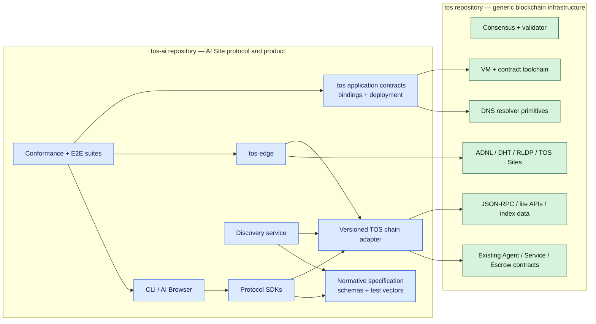
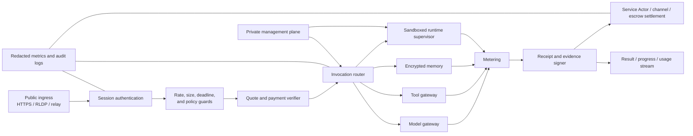
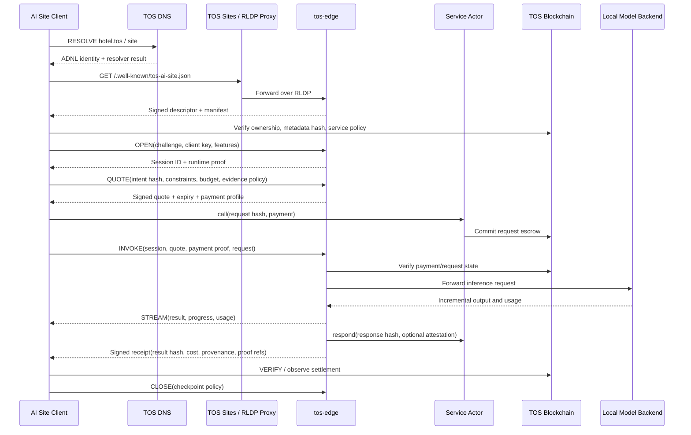
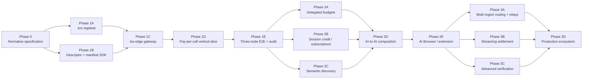

# The TOS Protocol Implementation Plan

## Status

- Source vision document: [The-TOS-Protocol.docx](The-TOS-Protocol.docx)
- Companion PDF: [The-TOS-Protocol.pdf](The-TOS-Protocol.pdf)
- Assessment date: 2026-07-29
- Scope: repository-level gap analysis and an implementation roadmap for AI Sites
- Repository model: TOS core as a dependency, with AI Site work in a separate
  product/protocol repository

## Executive Summary

`The-TOS-Protocol.docx` is a vision paper and reference architecture. It
describes the intended Internet primitive, trust model, protocol grammar, edge
node, discovery model, and economic model, but it is not yet a normative
protocol specification that independent implementations can follow.

The repository already contains substantial trust and settlement
infrastructure:

- TOS DNS and resolver chaining
- ADNL, RLDP, and the TOS Sites HTTP proxy
- Agent Account controller keys and spending limits
- concurrent Service Actor request escrow
- Task Escrow, Dispute, Capability Registry, and Proof Attestation contracts
- chain-backed query/indexing APIs
- wallet, JSON-RPC, `tosctl`, and JavaScript SDK foundations

The main missing surfaces are:

- a public `.tos` root domain registration application
- signed AI Site descriptors and manifests
- a normative TOS session and invocation protocol
- an owner-operated Edge Runtime and inference gateway
- quote, payment authorization, metering, and receipt integration
- client SDKs for the AI Site protocol
- semantic discovery and an AI Browser/user agent
- multi-region routing, relays, subscriptions, streaming settlement, and
  advanced verification

The Phase 1 MVP should not modify validator consensus, run AI workloads inside
`validator-engine`, or place the complete AI product stack in this repository.
TOS should remain the general-purpose blockchain, naming, settlement, and
ADNL/RLDP networking substrate. AI-specific application contracts, protocol
specifications, SDKs, `tos-edge`, discovery, clients, deployment tooling, and
end-to-end tests should live in a separate repository and consume stable TOS
interfaces.

## Repository Boundary and Ownership

The recommended starting point is a separate monorepo, called `tos-ai` in this
document. The name is illustrative and can be changed when the repository is
created. A monorepo keeps schemas, contract ABIs, SDKs, gateway code, and
conformance vectors versioned together during the protocol's early evolution.
Individual services can be split into additional repositories later if their
release and ownership boundaries justify it.

The central boundary rule is:

> `tos` provides reusable blockchain infrastructure; `tos-ai` implements the
> AI Site protocol and product.

| Repository | Owns | Does not own |
|---|---|---|
| `tos` (this repository) | consensus and validators, VM and generic smart-contract tooling, chain data and stable query APIs, wallet/crypto primitives, DNS resolution, ADNL/DHT/RLDP, and TOS Sites transport | AI manifests, model execution, gateway routing, semantic discovery, AI-specific clients, or AI product release orchestration |
| `tos-ai` (new repository) | normative AI Site specification, `.tos` application contracts and bindings, protocol types, chain adapter, `tos-edge`, discovery/indexing logic, SDKs, CLI/browser clients, deployments, conformance tests, and end-to-end suites | consensus rules, validator lifecycle, VM internals, or generic peer-to-peer transport implementations |

Existing AI Actor contracts and query APIs in `tos` do not need to be moved
immediately. The new repository may consume their deployed ABIs and stable
APIs as existing infrastructure. New AI Site-specific contracts should,
however, be developed, versioned, tested, and deployed from `tos-ai`.

A change belongs in `tos` only when it is a genuinely reusable blockchain or
network capability that is missing from the public integration surface.
Such work must be proposed as a separate core PR, remain independent of the AI
Site release, and preserve compatibility where practical. AI-specific behavior
must not be added to validator or consensus code merely to simplify the
application implementation.

### Repository boundary diagram



### Proposed `tos-ai` layout

```text
tos-ai/
  spec/ai-site/
  contracts/tos-domain/
  crates/protocol/
  crates/chain-adapter/
  services/tos-edge/
  services/discovery/
  sdk/typescript/
  apps/cli/
  apps/browser/
  deploy/
  tests/conformance/
  tests/e2e/
```

This plan may remain under `tos/doc/` as the initial architecture and
transition record. Once `tos-ai` exists, the normative protocol documents and
implementation plan should move there; this repository should retain a short
pointer to the new source of truth.

## Status Legend

| Status | Meaning |
|---|---|
| **Available** | Implemented in TOS core and suitable as an external dependency |
| **Partial** | A TOS primitive exists, but integration or AI Site semantics must be implemented in `tos-ai` |
| **To build** | Implement in `tos-ai` unless a row explicitly identifies a generic TOS core gap |
| **Later** | Outside the minimum viable vertical slice |

## Architecture Coverage Map

```mermaid
flowchart TB
    subgraph Client["tos-ai: Client and Discovery Plane"]
        Browser["AI Browser / User Agent<br/>TO BUILD"]
        ClientSDK["Rust + TypeScript AI Site SDKs<br/>TO BUILD"]
        Semantic["Semantic discovery and ranking<br/>TO BUILD"]
        ChainIndex["Capability/service chain index<br/>AVAILABLE"]
    end

    subgraph Trust["TOS core dependency + tos-ai deployed contracts"]
        DNS["TOS DNS + resolver chaining<br/>AVAILABLE"]
        Registrar[".tos root registrar<br/>TO BUILD"]
        Agent["Agent Account<br/>AVAILABLE / EXTEND"]
        Service["Service Actor concurrent escrow<br/>AVAILABLE / INTEGRATE"]
        Capability["Capability Registry<br/>AVAILABLE / EXTEND"]
        Task["Task Escrow + Dispute<br/>AVAILABLE"]
        Attest["Proof Attestation<br/>AVAILABLE"]
        Chain["TOS blockchain and finality<br/>AVAILABLE"]
    end

    subgraph Protocol["tos-ai: AI Site Protocol Plane"]
        Descriptor["Signed site descriptor<br/>TO BUILD"]
        Manifest["Canonical AI Site manifest<br/>TO BUILD"]
        Session["OPEN + authenticated session<br/>TO BUILD"]
        Quote["QUOTE + payment authorization<br/>TO BUILD"]
        Invoke["INVOKE + STREAM + CLOSE<br/>TO BUILD"]
        Receipt["Signed receipts and evidence envelope<br/>TO BUILD"]
        Delegate["DELEGATE capability token<br/>TO BUILD"]
    end

    subgraph Network["TOS core connectivity + tos-ai integration"]
        ADNL["ADNL / DHT / RLDP<br/>AVAILABLE"]
        Sites["rldp-http-proxy / TOS Sites<br/>AVAILABLE"]
        HTTPS["HTTPS / WebSocket / SSE binding<br/>PARTIAL"]
        Relay["NAT relay / reverse tunnel<br/>TO BUILD"]
        Routing["Multi-runtime policy routing<br/>TO BUILD"]
    end

    subgraph Edge["tos-ai: Owner-Operated Edge Plane"]
        EdgeDaemon["tos-edge daemon<br/>TO BUILD"]
        Ingress["Authenticated ingress + rate limits<br/>TO BUILD"]
        Supervisor["Runtime supervisor / sandbox<br/>TO BUILD"]
        Model["Model adapters: Ollama, vLLM, OpenAI-compatible<br/>TO BUILD"]
        Tools["MCP-style tool gateway<br/>TO BUILD"]
        Memory["Encrypted memory and retrieval<br/>TO BUILD"]
        Meter["Metering + receipt signer<br/>TO BUILD"]
        Policy["Wallet and policy enforcement<br/>PARTIAL"]
        Observe["Health, metrics, and audit logs<br/>TO BUILD"]
    end

    Browser --> ClientSDK
    ClientSDK --> DNS
    ClientSDK --> Semantic
    Semantic --> ChainIndex
    DNS --> Registrar
    DNS --> Descriptor
    Descriptor --> Manifest
    Descriptor --> Sites
    Descriptor --> HTTPS
    Manifest --> Session
    Session --> Quote
    Quote --> Service
    Quote --> Invoke
    Invoke --> Receipt
    Delegate --> Agent
    Receipt --> Attest
    Service --> Chain
    Agent --> Chain
    Capability --> Chain
    Task --> Chain
    Attest --> Chain
    Sites --> ADNL
    Sites --> Ingress
    HTTPS --> Ingress
    Relay --> Ingress
    Routing --> Ingress
    Ingress --> EdgeDaemon
    EdgeDaemon --> Supervisor
    EdgeDaemon --> Model
    EdgeDaemon --> Tools
    EdgeDaemon --> Memory
    EdgeDaemon --> Meter
    EdgeDaemon --> Policy
    EdgeDaemon --> Observe

    classDef available fill:#d8f3dc,stroke:#2d6a4f,color:#081c15;
    classDef partial fill:#fff3bf,stroke:#e67700,color:#5f3b00;
    classDef missing fill:#ffe3e3,stroke:#c92a2a,color:#5c0000;
    classDef later fill:#e9ecef,stroke:#6c757d,color:#212529;

    class DNS,ChainIndex,Task,Attest,Chain,ADNL,Sites available;
    class Agent,Service,Capability,HTTPS,Policy partial;
    class Browser,ClientSDK,Semantic,Registrar,Descriptor,Manifest,Session,Quote,Invoke,Receipt,Delegate,Relay,Routing,EdgeDaemon,Ingress,Supervisor,Model,Tools,Memory,Meter,Observe missing;
```



## Whitepaper Components and Repository Status

| Whitepaper component | Status | Existing repository foundation | Required work |
|---|---|---|---|
| Human-readable `name.tos` identity | Partial | [DNS.md](DNS.md), DNS smart contracts, ConfigParam 4 resolution | Implement the root `.tos` collection/item registry, ownership lifecycle, CLI, SDK, and deployment |
| Signed site descriptor | To build | ADNL identity and existing asymmetric key infrastructure | Define the descriptor schema, signature domain, controller/runtime authorization, expiry, health window, and endpoint selection |
| Public site manifest | To build | Service Actor and Capability Registry metadata hashes | Define canonical JSON/CBOR, schema, media type, well-known URL, signature, on-chain commitment, and update/version rules |
| Owner/controller key hierarchy | Partial | Agent Account owner/controller separation | Add runtime keys, session keys, bounded delegation, revocation, multi-controller support, and recovery semantics |
| Capability declaration | Partial | Capability Registry and metadata hashes | Standardize capability vocabulary, input/output schemas, languages, regions, pricing, evidence, and critical extensions |
| Persistent/ephemeral memory | To build | Generic storage and database libraries only | Add encrypted site memory, tenant separation, retention, deletion, retrieval, and backup policies |
| Runtime locators | Partial | DNS ADNL records and TOS Sites | Add signed multi-endpoint descriptors, transport/version negotiation, region/load metadata, expiry, and fallback |
| Runtime supervisor | To build | Process, container, and systemd foundations exist operationally | Create isolated workload lifecycle, resource quotas, network/file/tool grants, restart policy, and upgrades |
| Model gateway | To build | No AI model runtime is part of the node | Add adapters for local and remote OpenAI-compatible APIs, Ollama, vLLM, and optional GPU health |
| Tool gateway | To build | AI Actor contracts reference services and tools conceptually | Add MCP-style tool registration, policy enforcement, credentials isolation, auditing, and cancellation |
| Wallet/policy service | Partial | Agent Account limits, Service Actor access policy, Task Escrow | Add session budgets, service/category restrictions, quote binding, subscription and subcontracting rules |
| Metering and receipts | Partial | Service Actor request/response commitments and attestation | Define usage units, canonical receipts, provenance, state delta, aggregate receipts, and signer rotation |
| Native per-call payment | Partial | Concurrent Service Actor escrow | Bind quotes and invocations to requests, provide gateway observation, idempotency, confirmation policy, and refunds |
| Subscription/streaming payment | To build | Payment channel primitives and examples may be reusable | Define session credits, vouchers/channels, replay protection, incremental settlement, close and dispute paths |
| Task escrow and dispute | Available | Task Escrow and Dispute contracts | Integrate them as optional long-running invocation settlement profiles |
| Evidence and attestation | Partial | Proof Attestation and domain-separated response commitments | Standardize receipt/evidence envelopes, verifier references, issuer trust, and off-chain proof adapters |
| HTTP/RLDP access | Available | [TosSites.md](TosSites.md), `rldp-http-proxy` | Add AI Site well-known paths, authenticated sessions, streaming bindings, and protocol-specific limits |
| NAT traversal and relays | To build | ADNL tunneling foundations exist, but not a complete AI Site relay product | Add owner-selected relays/reverse tunnels without transferring site authority |
| Semantic discovery | To build | Chain-wide service/capability index exists | Add manifest ingestion, signature checks, semantic indexes, health, pricing, reputation, and plural ranking |
| AI Browser | To build | Wallet/connect/client SDK foundations | Build a CLI/desktop/extension user agent for consent, budgets, context, receipts, and composition |
| Observability | Partial | Validator and service metrics/logging patterns | Add privacy-preserving edge health, bounded metrics, tracing, usage audit, and redaction |

## Existing Infrastructure That Should Be Reused

### DNS and TOS Sites

The current DNS stack resolves on-chain records and supports resolver chaining.
`rldp-http-proxy` already resolves the `site` DNS category into an ADNL or
storage address and forwards HTTP over RLDP. These components should remain the
network foundation:

- [DNS.md](DNS.md)
- [TosSites.md](TosSites.md)
- [`rldp-http-proxy/DNSResolver.cpp`](../rldp-http-proxy/DNSResolver.cpp)
- [`rldp-http-proxy/rldp-http-proxy.cpp`](../rldp-http-proxy/rldp-http-proxy.cpp)

For the MVP, a `.tos` DNS item can keep using the existing `site` record to
point to an ADNL identity. The AI Site manifest can be served at:

```text
/.well-known/tos-ai-site.json
```

The manifest hash can be committed through the Service Actor or Capability
Registry. This avoids inventing a new DNS record type before the manifest and
descriptor specifications stabilize.

### AI Actor Contracts

The following contracts already provide useful authority and settlement
boundaries. They remain TOS core/deployed dependencies; `tos-ai` should consume
their versioned ABI rather than copy their source:

- [`agent-account-code.fc`](../crypto/smartcont/agent-account-code.fc)
- [`service-actor-code.fc`](../crypto/smartcont/service-actor-code.fc)
- [`task-escrow-code.fc`](../crypto/smartcont/task-escrow-code.fc)
- [`capability-registry-code.fc`](../crypto/smartcont/capability-registry-code.fc)
- [`dispute-code.fc`](../crypto/smartcont/dispute-code.fc)
- [`proof-attestation-code.fc`](../crypto/smartcont/proof-attestation-code.fc)

The current Service Actor is particularly valuable because it already
supports concurrent requests, request identity, policy snapshots, response
commitments, bounded live dictionaries, refunds, cleanup, and optional
attestation. It should be integrated rather than replaced for the first
pay-per-call flow.

It is not, by itself, a real-time inference protocol. An AI Site still needs
off-chain quote negotiation, request forwarding, streaming, usage metering,
receipt signing, and a rule for when the gateway considers an on-chain payment
confirmed.

### Query and Indexing APIs

The existing `tosctld` query/indexing surface can classify and expose Agent
Account, Service Actor, Task Escrow, Dispute, and Capability Registry state:

- [`agent_query_api.rs`](../tosctl/src/node-control/service/src/http/agent_query_api.rs)
- [`indexer_task.rs`](../tosctl/src/node-control/service/src/indexer/indexer_task.rs)
- [`store.rs`](../tosctl/src/node-control/service/src/indexer/store.rs)

This is a useful source for chain-authoritative fields and discovery seeds.
Semantic discovery remains a separate, non-authoritative derived service.

### Stable integration boundary

`tos-ai` should integrate with TOS through released, versioned surfaces:

- JSON-RPC and lite-server APIs
- DNS resolver and TOS Sites behavior
- supported ADNL/RLDP client interfaces
- contract ABI/schema versions and deployed code hashes
- chain/network identifiers and configuration addresses
- signed releases of any reusable client libraries

The new repository should maintain a compatibility manifest that pins the
supported TOS release range, network configuration, ABI versions, contract
code hashes, and required feature flags. Its CI should run conformance and E2E
tests against every supported TOS release. It should not vendor a mutable copy
of the node source or reach into validator-private headers and databases.

## Specification Work Required Before Protocol Coding

The vision paper contains useful concepts but leaves security-critical choices
undefined. The first engineering deliverable should be an `AI Site Protocol
v0.1` specification package.

### Required specification artifacts

```text
tos-ai/spec/ai-site/
  protocol.md
  site-descriptor.schema.json
  site-manifest.schema.json
  invocation.schema.json
  stream-event.schema.json
  delegation.schema.json
  quote.schema.json
  receipt.schema.json
  evidence.schema.json
  authentication.md
  payment-and-settlement.md
  transport-http.md
  transport-rldp.md
  errors.md
  versioning.md
  security-considerations.md
  test-vectors/
```

The specification must define:

- canonical field ordering and encoding
- hash algorithm and domain separation labels
- signature algorithm and key representation
- owner, controller, runtime, session, and delegation key relationships
- nonce, timestamp, expiry, and clock-skew rules
- correlation IDs and idempotency keys
- replay boundaries across sites, sessions, quotes, and requests
- critical versus advisory manifest fields
- unknown extension handling
- maximum sizes and nesting limits
- state transitions and legal message ordering
- cancellation and partial-stream behavior
- error taxonomy and retry safety
- payment confirmation and reorganization policy
- receipt aggregation and subcontract provenance
- privacy, retention, and selective context disclosure

### Whitepaper inconsistencies to resolve

Before declaring version 1.0:

1. The paper says there are nine protocol verbs but names ten:
   `RESOLVE`, `DESCRIBE`, `OPEN`, `QUOTE`, `INVOKE`, `STREAM`, `DELEGATE`,
   `VERIFY`, `SETTLE`, and `CLOSE`.
2. The paper says an Edge Node contains eight components, but the prose lists
   ingress/relay, resolver, runtime supervisor, model gateway, tool gateway,
   memory, wallet/policy, metering/receipts, and observability. The table
   combines or omits several of them.
3. The phrase "direct a name.tos identity toward an owner-operated local edge
   IP" must be reconciled with the existing TOS Sites model, where DNS
   normally resolves to an ADNL identity rather than exposing the origin IP.
4. The initial payment profile must choose whether a request waits for
   on-chain inclusion, consumes a prepaid balance, or uses an off-chain
   voucher/payment channel.

## On-Chain Work

The contracts in this section are application-layer code owned by `tos-ai`.
They are compiled with the TOS contract toolchain and deployed to the TOS
chain, but they do not need to be built into the node repository. Network
configuration changes, such as assigning the root resolver through ConfigParam
4, remain explicit governance/deployment operations rather than product code
coupling.

### `.tos` domain registry

Implement the design already outlined in
[ai-inference-sharing-tos-domains.md](ai-inference-sharing-tos-domains.md):

#### `TosDomainCollection`

- fixed registration price
- `TosDomainItem` code reference
- registration and grace period constants
- DNS label validation
- deterministic item address derivation
- first-deployment `StateInit`
- renewal/re-registration routing
- excess-payment refund
- administrative price/treasury policy, if governance permits it

#### `TosDomainItem`

- standard NFT ownership
- `dnsresolve` get method and resolver chaining
- `owner`, `expires_at`, and DNS dictionary
- owner-only renewal during active/grace periods
- permissionless re-registration after grace
- mandatory DNS dictionary clearing on ownership replacement
- record update authorization
- transfer behavior and expiry interaction
- deterministic address stability

#### Tooling and deployment

- `tos-ai` CLI commands for domain registration, renewal, transfer, record
  updates, and resolution
- Rust SDK and TypeScript SDK bindings
- root collection deployment
- ConfigParam 4 governance/deployment procedure
- sandbox, property, and local multi-node tests

### Agent Account extensions

The current single controller plus per-transaction/daily limits are a useful
MVP foundation. Full whitepaper delegation requires:

- more than one bounded delegation
- service or capability category allowlists
- per-service and per-session limits
- expiration and revocation
- subcontracting permission
- maximum delegation depth
- maximum aggregate task budget
- runtime/session key authorization
- recovery and controller rotation without ambiguous in-flight authority

These changes affect contract state and message formats and therefore require
explicit migration/versioning. Prefer a versioned application contract or
wrapper in `tos-ai`. Change the existing TOS core contract only if the new
capability is broadly useful outside AI Sites and can be introduced through a
separate, compatible core PR. Neither approach requires a new VM or execution
domain.

### Payment profiles

Define progressively:

1. **On-chain pay per call** using the current Service Actor.
2. **Prepaid session balance** for multiple low-latency calls.
3. **Subscription capability** with an expiry and bounded quota.
4. **Signed vouchers or payment channel** for metered calls.
5. **Streaming settlement** for long-running work.
6. **Task escrow** for acceptance/dispute-dependent workflows.

Every profile must bind:

- service contract address
- site/manifest version
- quote ID and expiry
- caller and payer
- request hash
- price/maximum budget
- evidence policy
- refund and settlement rules

## Off-Chain `tos-edge` Work

`tos-edge` belongs in `tos-ai` and should be an independent service,
preferably implemented in Rust. It should use a small, versioned chain adapter
over stable JSON-RPC/lite APIs, contract ABIs, and supported ADNL/RLDP
interfaces. It must not depend on validator internals, share mutable source
trees with `tosctl`, or be embedded in the validator process. If reusable
client functionality currently exists only inside `tosctl`, expose or extract
the smallest generic interface through a separate TOS core change instead of
linking the AI product to node-control implementation details.

### Logical component map



### Minimum daemon features

- owner and runtime key loading from a protected keystore
- signed descriptor generation and renewal
- `/.well-known/tos-ai-site.json`
- protocol endpoints for `OPEN`, `QUOTE`, `INVOKE`, `STREAM`, and `CLOSE`
- challenge-response peer authentication
- optional anonymous ephemeral sessions
- OpenAI-compatible `/v1/chat/completions`
- SSE and WebSocket streaming
- request cancellation and deadlines
- idempotency and bounded replay cache
- chain/payment observation
- usage metering
- canonical signed receipts
- bounded connection, session, invocation, and receipt tables
- model adapters for OpenAI-compatible APIs, Ollama, and vLLM
- tool allowlists and isolated credentials
- encrypted memory with retention/deletion controls
- private administrative socket/port
- health, metrics, structured logs, and prompt redaction
- systemd and Docker Compose packaging

### Later edge features

- owner-selected relays and reverse tunnels
- multi-region runtime descriptors
- latency/load/jurisdiction routing
- GPU scheduling and model lifecycle
- replicated memory
- confidential computing and remote attestation
- offline and intermittent-connectivity settlement

## Protocol Flow for the Phase 1 Vertical Slice



For low-latency production use, the on-chain `call` step should later be
replaced or supplemented by prepaid session credit or signed vouchers. The
MVP may wait for chain inclusion because correctness is more important than
latency in the first interoperable implementation.

## Client and Discovery Work

All client, SDK, and discovery components in this section belong to `tos-ai`.
They consume TOS data and transport services but have an independent release
lifecycle.

### Rust SDK

Provide:

- DNS and descriptor resolution
- manifest parsing and verification
- owner/controller/runtime authorization checks
- protocol session state machine
- quote verification
- invocation and stream handling
- receipt verification
- Service Actor, Agent Account, and Capability Registry state checks
- endpoint selection and fallback

### TypeScript SDK

Provide equivalent browser/Node.js types and verification, integrated with
the existing wallet/connect packages. Browser environments will initially
need one of:

- an HTTPS gateway
- a local TOS Sites proxy
- a browser extension/native helper that can access ADNL/RLDP

### Discovery service

Build a separate derived discovery index in `tos-ai`, seeded through the
existing chain query APIs:

- fetch public manifests
- verify owner/runtime signatures and on-chain commitments
- index capability, language, region, price, transport, and evidence policy
- track descriptor expiry and endpoint health
- keep reputation capability-specific
- expose issuer/attestation provenance
- permit multiple independent ranking implementations

Discovery results are advisory. Authorization, payment, and settlement must
always be rechecked against signed data and chain state.
Semantic ranking and manifest crawling should not be added to the core
`tosctld` indexer.

## Security Requirements

### Identity and replay

- domain-separate every descriptor, session, quote, invocation, delegation,
  receipt, and payment authorization
- bind signatures to the AI Site identity and protocol version
- enforce expiry and bounded clock skew
- make request IDs idempotent within a documented scope
- prevent reuse across sites, sessions, manifests, contracts, and chains

### Edge isolation

- never expose the administrative plane through the public site listener
- sandbox files, networks, devices, tools, and model credentials
- enforce tool grants locally; manifest declarations are not authorization
- keep controller/runtime keys outside model context
- ensure prompt injection cannot modify policy or wallet authority

### Resource bounds

All of the following must be explicitly bounded:

- open connections and streams
- session table
- quote and idempotency caches
- concurrent invocations
- prompt/context/output sizes
- tool calls and recursion depth
- subcontract count and total budget
- memory entries and retention
- receipt/evidence queues
- chain watchers and pending settlement records

### Privacy

- prompts and private memory remain off-chain
- logs and metrics redact prompt, tool credential, and personal context
- manifests declare retention/region policy
- sessions record the actual grant
- encrypted memory supports deletion and key rotation
- context references are preferred over uploading complete user memory

## Test and Release Gates

### Protocol conformance

- canonical serialization and signature vectors
- cross-language Rust/TypeScript vectors
- critical/unknown extension behavior
- invalid order/state transition tests
- idempotency, replay, expiry, and clock-skew tests
- maximum-size and nested-input limits

### Contract tests

- first domain registration
- renewal before expiry and during grace
- unauthorized renewal
- post-grace re-registration
- DNS dictionary clearing on owner replacement
- transfer and expiry interaction
- concurrent registration race
- exact refund/payment accounting
- Service Actor quote/request binding
- subscription/voucher replay
- settlement and refund under chain reorganization

### Edge tests

- tampered manifest and substituted endpoint
- owner/controller/runtime key rotation and revocation
- duplicate invoke and duplicate payment
- model timeout and partial stream
- client cancellation
- gateway crash/restart with pending settlement
- slowloris and oversized context
- connection/session/invocation saturation
- MCP tool escalation and credential isolation
- bounded-memory soak tests
- NAT relay failure and endpoint fallback

### End-to-end local network tests

The three-node local network should exercise:

1. deploy the `.tos` registry
2. register a name
3. publish DNS and manifest commitments
4. run `tos-edge` with a deterministic model stub
5. resolve over TOS DNS
6. fetch through RLDP
7. open an authenticated session
8. quote and pay through Service Actor
9. invoke and stream a response
10. verify the receipt and on-chain response commitment
11. restart an edge daemon
12. restart and catch up one validator
13. rotate a runtime key
14. expire and re-register the name
15. confirm there is no stale authority or DNS record leakage

### Release gates

- threat model complete
- independent smart-contract and gateway security review
- memory and connection soak tests
- reproducible builds
- migration/version compatibility matrix
- rollback procedure
- systemd/container hardening
- testnet observation before mainnet deployment

## Recommended Delivery Phases

Unless explicitly marked as a TOS core prerequisite, all phases below are
delivered from `tos-ai`. TOS nodes are test and production dependencies, not
the release container for the AI Site stack.



### Estimated effort

These are planning ranges, not commitments:

| Phase | Deliverable | Approximate effort |
|---|---|---|
| Phase 0 | Normative v0.1 specification and test vectors | 2-4 engineer-weeks |
| Phase 1 | Registrar, manifest, Edge MVP, pay-per-call, SDKs, E2E | 3-5 months for a 4-6 person team |
| Phase 2 | Delegation, subscriptions/channels, discovery, composition, browser | Additional 4-8 months |
| Phase 3 | Multi-region/relay, streaming settlement, advanced verification | Additional 6-12 months |

The chain-side trust primitives are relatively mature. The larger effort is
the off-chain protocol, edge product, client interoperability, operations, and
security hardening.

## Recommended Repository and Pull Request Sequence

The normal PR sequence is in the new `tos-ai` repository:

1. **Repository bootstrap and TOS compatibility contract**
   - workspace layout, licenses, CI, supported TOS release matrix, pinned
     contract ABIs/code hashes, local-network harness, and ownership rules
2. **AI Site Protocol v0.1 specification**
   - schemas, state machines, signatures, errors, HTTP/RLDP bindings, vectors
3. **`.tos` registrar contracts**
   - collection/item contracts, Rust SDK, sandbox/property tests
4. **Domain CLI and deployment**
   - `tos-ai` CLI, ConfigParam 4 procedure, local-network E2E
5. **AI Site core SDK**
   - descriptor, manifest, canonical encoding, signature verification
6. **`tos-edge` skeleton**
   - config, keystore, health, well-known manifest, bounded ingress
7. **Session and invocation**
   - `OPEN`, `QUOTE`, `INVOKE`, `STREAM`, `CLOSE`, model stub
8. **Service Actor integration**
   - quote/payment/request binding, chain watcher, response commitment, refund
9. **Receipts and evidence**
   - metering, signed receipt, attestation and verification
10. **TypeScript client**
   - wallet/payment integration and streaming invocation
11. **Local three-node acceptance suite**
    - registration through settlement, restart, rotation, expiry, and memory soak

TOS core PRs are exceptional and follow a separate sequence:

1. demonstrate that the required capability is generic and unavailable through
   a stable public interface
2. define the smallest backward-compatible core API or infrastructure change
3. add core-level tests without importing AI Site concepts into validator code
4. release or identify the TOS version containing that interface
5. update the `tos-ai` compatibility matrix and adapter

No PR should mix TOS core changes with application contracts or edge services.
The MVP is expected to require no consensus-rule change.

## Phase 1 Definition of Done

Phase 1 is complete only when an independent operator can:

1. register `name.tos`
2. bind it to an owner-controlled ADNL/TOS Site endpoint
3. publish a signed manifest committed by an on-chain service identity
4. run an ordinary local model backend
5. expose it through `tos-edge`
6. let an unfamiliar client resolve and authenticate it
7. obtain a signed quote
8. pay in TOS
9. invoke and stream the service
10. receive and verify a signed receipt
11. observe or reclaim settlement on-chain
12. rotate infrastructure without losing the site identity

Anything less is an infrastructure demo rather than the end-to-end AI Site
primitive described by the vision paper.

## Explicit Non-Goals for the MVP

- no AI execution inside `validator-engine`
- no requirement to place AI protocol, edge, discovery, or browser code in the
  `tos` core repository
- no requirement to release TOS nodes whenever the AI Site product changes
- no new execution domain or VM
- no model training or GPU marketplace
- no requirement to store prompts or outputs on-chain
- no single mandatory discovery/ranking service
- no universal reputation score
- no immediate requirement for a dedicated browser
- no dependency on advanced zero-knowledge inference proofs
- no unbounded session, receipt, memory, or settlement cache

## Related Documents

- [Shared AI Inference Services over TOS Domains](ai-inference-sharing-tos-domains.md)
- [AI Actor Model](ai-actors.md)
- [AI Actor Threat Model](ai-actor-threat-model.md)
- [AI Actor Testing Matrix](ai-actor-testing-matrix.md)
- [Reference Workflow Schemas](ai-workflow-schemas.md)
- [Agent Wallet MVP](agent-wallet-mvp.md)
- [Service Actor Concurrent Escrow Upgrade](service-actor-concurrent-escrow-upgrade.md)
- [TOS DNS](DNS.md)
- [TOS Sites and RLDP HTTP Proxy](TosSites.md)
- [TOS Roadmap](../ROADMAP.md)
