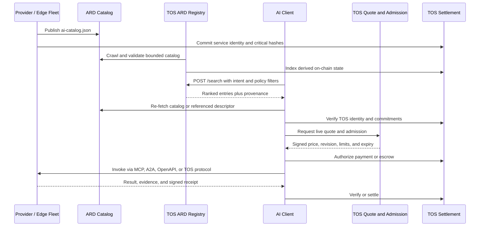

# TOS Network Compatibility with Agentic Resource Discovery

## Status

- Architecture decision and implementation requirements
- Date: July 31, 2026
- External specification: Agentic Resource Discovery (ARD) v0.9 Draft
- ARD status at assessment time: proposal, not a frozen final standard
- Applies to: `tos-protocol`, TOS ARD Registry, AI Edge Computing
  Terminals, AI Sites, storage and commerce profiles, SDKs, and gateways

## Decision

TOS Network must be compatible with the open Agentic Resource Discovery
specification and must be able to run an ARD Registry.

ARD is TOS's adopted public discovery envelope for publishing, indexing, and
searching descriptions of callable agentic resources, with optional publisher
trust metadata. TOS must not create an
incompatible general-purpose catalog or search protocol where ARD already
defines the required surface.

TOS retains responsibility for the layers that ARD deliberately leaves out:

- live service admission and scheduling
- edge and physical-terminal execution
- local real-time priority and disconnected operation
- service authentication and bounded authorization
- signed quotes, payment, escrow, metering, receipts, and settlement
- runtime, model, update, executor, and fleet isolation
- capability-specific reputation, evidence, and disputes

The architectural boundary is:

```text
ARD
  publishes and discovers a capability

MCP / A2A / OpenAPI / TOS Service Protocol
  describes or invokes the selected capability

TOS Network
  authenticates, quotes, admits, executes, meters, verifies, and settles work
```

ARD makes intelligence discoverable. TOS makes discovered intelligence
executable, verifiable, and transactable.

## Why TOS Adopts ARD

ARD provides an industry-backed discovery surface for agents, MCP servers,
skills, APIs, workflows, and nested catalogs. It is designed around:

- domain-hosted `ai-catalog.json` manifests
- domain-anchored globally unique resource identifiers
- federated registries rather than a single mandatory catalog
- natural-language and structured search
- optional cryptographic trust metadata
- protocol-neutral handoff to the resource's native invocation mechanism

This matches TOS's plural, owner-operated service model. Adopting ARD avoids
making TOS clients depend on a TOS-only discovery vocabulary and lets TOS
services participate in the broader agentic web.

ARD does not replace TOS. It explicitly stops before invocation and does not
define payment, execution, scheduling, service-level enforcement, physical
delivery, or blockchain settlement. Those remain TOS product and protocol
responsibilities.

## Normative Compatibility Profile

The key words **MUST**, **MUST NOT**, **SHOULD**, and **MAY** in this document
describe requirements for the TOS ARD compatibility profile.

### Versioning

- Implementations MUST record the exact ARD draft or released version they
  support.
- The first implementation target is ARD v0.9 as assessed on July 31, 2026.
- Parsers MUST reject structurally invalid catalogs and MUST bound unknown
  input before interpretation.
- Implementations SHOULD preserve unknown non-critical fields when proxying,
  but MUST NOT silently assign them TOS authorization or settlement meaning.
- A future incompatible ARD revision requires an explicit compatibility
  review, migration plan, and conformance update.

### Publishing

An operator with a publicly verifiable DNS name SHOULD publish:

```text
https://<publisher-fqdn>/.well-known/ai-catalog.json
```

The response MUST use HTTPS, `Content-Type: application/json`, bounded content
length, and a cache policy compatible with the catalog's update semantics.
Public catalogs intended for browser-based crawlers SHOULD expose the CORS
headers required by ARD.

Each published catalog MUST:

- declare the supported catalog specification version
- identify the host or publisher
- contain bounded entries
- use a domain-anchored ARD identifier for every entry
- provide exactly one ARD value-or-reference representation where required
- identify the resource with a valid media type
- separate stable capability description from rapidly changing availability
- avoid secrets, private endpoints, credentials, raw sensor data, and customer
  payloads

Representative natural-language queries SHOULD describe legitimate use cases
without embedding instructions that override client policy.

### Resource identifiers

Public ARD identifiers use the ARD domain-anchored form:

```text
urn:air:<publisher-fqdn>:<namespace>:<resource-name>
```

The publisher component MUST be a domain that the publisher can prove it
controls through the ARD trust model.

A `name.tos` identity is not automatically a public DNS trust anchor. A TOS
operator without a conventional public domain MUST use one of these profiles:

1. a TOS-operated or approved HTTPS gateway domain that creates a stable,
   verifiable ARD publisher namespace
2. an operator-controlled conventional DNS domain bound to the same TOS
   service identity
3. a private ARD Registry that explicitly understands `.tos` resolution and
   its trust policy

The catalog MAY include `name.tos`, the raw ADNL identity, TOS account
addresses, and on-chain commitments as extension metadata. Such metadata MUST
be signed and domain-separated. It MUST NOT be represented as standard ARD
domain verification unless the ARD specification actually recognizes that
mechanism.

### Catalog and TOS manifest relationship

ARD and TOS manifests have different jobs:

| Document | Purpose | Update pattern |
|---|---|---|
| `ai-catalog.json` | Public, protocol-neutral discovery envelope | Stable and crawlable |
| `tos-service.json` | TOS authentication, protocol, quote, payment, receipt, and endpoint semantics | Versioned operational metadata |
| Profile manifest | Model, storage, commerce, or physical-terminal contract | Profile-specific |
| Live quote/admission response | Current price, capacity reservation, deadline, and policy decision | Short-lived and authoritative |

An ARD entry MAY reference:

- an MCP server card
- an A2A agent card
- an OpenAPI document
- a nested ARD catalog
- a versioned TOS Service Protocol descriptor

TOS should request vendor-tree media types for stable TOS artifacts. Until
registration is complete, clients MUST use the exact media types specified by
the released TOS compatibility profile and MUST NOT infer behavior from a
display name or URL suffix.

The ARD record is never proof that capacity is currently available. Dynamic
queue depth, local safety state, thermal limits, price, model residency, and
device availability MUST be resolved through a live TOS quote and admission
flow.

## TOS ARD Registry

TOS must provide an independently deployable ARD Registry implementation in
the off-chain protocol product, not in `validator-engine`.

The registry MUST implement the mandatory ARD HTTP REST discovery baseline,
including the versioned `POST /search` contract. Optional ARD surfaces such as
exploration and listing MAY be implemented when their privacy and resource
bounds are defined.

The registry may ingest:

- standard public `/.well-known/ai-catalog.json` documents
- DNS-advertised ARD catalog locations
- upstream ARD registries through federation
- operator-approved private catalogs
- TOS Capability Registry and Service Actor events
- `name.tos` records resolved through a policy-approved TOS gateway
- profile-specific signed TOS manifests

The registry MUST retain provenance for every indexed field. A search response
must distinguish:

- publisher-supplied catalog data
- registry-derived ranking and health data
- TOS on-chain state
- live service observations
- third-party attestations

No registry result is authoritative by itself. Before payment or invocation,
a client MUST verify the publisher binding, current catalog or descriptor,
critical TOS identity and manifest commitments, endpoint authorization,
service activity, quote expiry, and payment destination.

### Federation

TOS follows ARD's plural-registry model:

- no single TOS Registry is mandatory
- operators may run public, private, regional, enterprise, or
  capability-specific registries
- clients may query multiple registries and apply local policy
- federation referrals and nested catalogs must have hop, depth, size, time,
  and cycle limits
- results from different registries must not be collapsed into a single
  unqualified trust score

TOS-specific ranking can include price, health, settlement history, evidence
level, region, and capability-specific reputation. Ranking remains advisory
and must be identified as registry policy, not consensus state.

## Physical AI and Edge-Terminal Mapping

A physical edge terminal SHOULD normally publish stable service capabilities,
not its complete device inventory.

Example stable ARD resources include:

- a warehouse safety-event service
- an OCR or embedding service
- a local speech transcription service
- a robot inspection workflow
- a site-controlled A2A agent
- a TOS task broker that selects devices inside a fleet

The catalog MUST NOT expose:

- raw CAN, GPIO, serial, fieldbus, or camera-administration interfaces
- unrestricted shell, container, model, or accelerator access
- precise sensitive site location unless explicitly required and authorized
- live credentials or fleet administration endpoints
- optimistic capacity as a reservation

Fleet members may remain private behind a stable broker entry. The fleet
controller and local terminal scheduler remain authoritative for:

- real-time and safety-critical priority
- local resource reservations
- offline authority
- device selection
- update state
- model and runtime compatibility
- task admission and cancellation

Disconnected terminals may continue previously authorized local work but
cannot promise public ARD availability while unreachable. A registry must age
or mark stale observations without revoking local safety functions.

## End-to-End Discovery and Transaction Flow



Discovery MUST NOT reserve hardware, move funds, grant actuator authority, or
authorize data egress. Those effects require their own explicit TOS or native
protocol authorization.

## Security Requirements

### Catalog ingestion

Registries and clients MUST defend against:

- oversized JSON, excessive nesting, duplicate keys, and decompression bombs
- SSRF, unsafe redirects, DNS rebinding, and private-address crawling
- federation loops, nested-catalog cycles, and referral amplification
- malicious media types and executable content
- schema confusion and value-plus-reference ambiguity
- stale catalogs, rollback, equivocation, and endpoint substitution
- URN/domain mismatch and forged trust metadata
- prompt injection in descriptions, tags, and representative queries
- ranking manipulation, Sybil publishers, and fabricated health
- accidental indexing of private catalogs, locations, or credentials

Catalog text is untrusted data. It MUST never become system instructions,
policy, authorization, a shell command, or an automatic payment request.

### Registry operation

Every registry MUST bound:

- catalog size and entries per catalog
- crawl concurrency, redirects, response bytes, and fetch time
- nested depth, federation hops, referrals, and query fan-out
- index document size and total retained versions
- embedding input length and model resource use
- search query size, filters, result count, and ranking time
- health probes, retries, watchers, queues, and tenant state
- cache age, invalidation work, tombstones, and audit retention

Failure and negative-result caches must expire. Repeated parse or fetch
failures must not create unbounded memory, disk, task, or log growth.

### Trust and settlement

- Domain control proves publication authority, not service quality.
- A `trustManifest` claim is not trusted until its signature, issuer, subject,
  scope, expiry, and revocation state are verified.
- A TOS on-chain record proves only the state actually committed on-chain.
- Search ranking never authorizes wallet spending or terminal actuation.
- Clients must bind payment and invocation to the exact publisher, service,
  profile, endpoint, chain, quote, and revision.
- Registry and gateway keys must be separate from wallet, terminal-update,
  fleet-owner, model-signing, and actuator keys.

## Privacy Requirements

Public catalogs should contain the minimum information needed for discovery.
Prompts, task inputs, outputs, raw sensor data, customer identities, exact
private locations, device serial numbers, private fleet membership, prices
negotiated for a specific customer, and credentials remain outside public ARD
catalogs.

Private and enterprise registries must enforce tenant isolation, access
control, query-log retention, deletion, and egress policy. Federating a private
registry must be an explicit allowlisted action.

## Implementation Ownership

| Component | Owner |
|---|---|
| ARD compatibility profile, schema mapping, Registry, crawler, federation, and conformance | `tos-protocol` |
| ARD catalog generation and TOS descriptor publishing | Edge Core plus profile repository |
| AI and physical-terminal capability mapping | `tos-ai` |
| Storage capability mapping | `tos-storage` |
| Commerce and human-service mapping | `tos-commerce` |
| TOS identity, DNS, ADNL/RLDP, chain state, settlement contracts, and stable query APIs | `tos` |

The TOS node does not crawl catalogs, compute embeddings, rank resources, or
execute ARD-discovered workloads.

## Required Implementation Work

1. Pin the supported ARD version and import its authoritative JSON Schema,
   CDDL, OpenAPI, and conformance vectors.
2. Define the TOS media types and ARD-to-TOS manifest mapping.
3. Add bounded ARD catalog generation to Edge Core.
4. Implement a standalone TOS ARD Registry with `POST /search`.
5. Add standard web, DNS, private, `.tos` gateway, chain-index, and federation
   ingestion adapters.
6. Add client-side publisher, provenance, TOS commitment, endpoint, quote, and
   settlement verification.
7. Add SDK support in Rust and TypeScript.
8. Add MCP, A2A, OpenAPI, and TOS Service Protocol handoff adapters.
9. Add operational metrics, crawl budgets, cache controls, tombstones, and
   incident response.
10. Run upstream ARD conformance plus TOS-specific security and end-to-end
    suites.

## Required Tests

- upstream ARD schema and Registry API conformance
- valid `/.well-known/ai-catalog.json` publication and discovery
- direct catalog fetch and federated search
- MCP, A2A, OpenAPI, nested catalog, and TOS descriptor handoff
- FQDN/URN/publisher/trust-manifest mismatch rejection
- `.tos` gateway and conventional-domain identity binding
- stale catalog, rollback, equivocation, and endpoint-substitution rejection
- catalog prompt-injection isolation
- SSRF, redirect, DNS-rebinding, decompression, nesting, and size limits
- federation hop, fan-out, timeout, and cycle limits
- registry restart, re-index, tombstone, and cache-expiry behavior
- concurrent waiter and upstream failure cleanup
- bounded crawler, index, embedding, queue, cache, watcher, log, and disk soak
- search result to live quote, payment, invocation, receipt, and settlement
- Physical AI local-priority, offline, update, executor, and fleet guarantees
  remaining authoritative after ARD discovery

## Rollout

### Phase 0

- publish the compatibility profile
- pin ARD v0.9 draft artifacts
- implement catalog generation and validation
- implement a local single-registry search path

### Phase 1

- expose managed AI and AI Site capabilities through ARD
- provide Rust and TypeScript discovery clients
- bridge search results into live TOS quote and settlement
- pass upstream and TOS conformance tests

### Phase 2

- add public and private federation
- add Physical AI fleet-broker resources
- add storage and commerce profiles
- add production trust, policy, abuse, and observability controls

### Phase 3

- track the final ARD standard and migrate without breaking pinned clients
- participate in the ARD ecosystem and media-type standardization
- allow third-party registries to index and invoke TOS services without a
  TOS-specific discovery integration

## Non-Goals

- replacing ARD with a TOS-only catalog protocol
- putting registry search or crawling into blockchain consensus
- treating search results as authorization, reservation, or proof
- publishing raw hardware rental or unrestricted physical control
- requiring one global TOS registry
- requiring public discovery for private or site-local capabilities
- assuming ARD standardizes execution, payment, metering, or settlement

## External References

- [Google: Announcing the Agentic Resource Discovery specification](https://developers.googleblog.com/announcing-the-agentic-resource-discovery-specification/)
- [Microsoft: Introducing the Agentic Resource Discovery specification](https://commandline.microsoft.com/agentic-resource-discovery-specification-ard/)
- [ARD specification](https://agenticresourcediscovery.org/spec/)
- [ARD publishing guide](https://agenticresourcediscovery.org/how_to_publish/)
