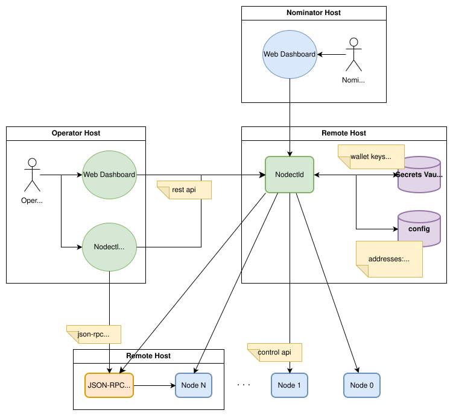

# tosctl — TOS Node Operations Tool

**tosctl** is the TOS fork of the original `nodectl` framework. It is the starting point for managing TOS nodes, monitoring node state, handling operator keys, and automating future testnet/mainnet node operations.

> **Transition note:** this fork is migrating from TOS Rust tooling to TOS tooling. User-facing entry points use `tosctl` and `tosctl-config.json`. The config JSON field for RPC is `chain_rpc`. Some internal module names may still carry TOS-origin naming during the transition and will be migrated incrementally.
>
> Planning docs:
> - [Migration Audit](docs/tosctl-migration-audit.md)
> - [Implementation Tasks](docs/tosctl-implementation-tasks.md)

## Table of Contents

- [Features](#features)
  - [Features Roadmap](#features-roadmap)
- [Architecture](#architecture)
- [Operating Modes](#operating-modes)
  - [CLI](#1-cli)
  - [Daemon](#2-daemon)
- [Building](#building)
- [Global Flags](#global-flags)
- [Commands](#commands)
  - [Configuration Commands](#configuration-commands)
  - [Key Management Commands](#key-management-commands)
  - [Authentication Commands](#authentication-commands)
  - [Deploy Commands](#deploy-commands)
  - [Service Command](#service-command)
  - [Service API Commands](#service-api-commands)
  - [RPC API](#chain-rpc-api)
- [REST API Endpoints](#rest-api-endpoints)
- [Configuration](#configuration)
  - [Config Structure](#config-structure)
  - [Section Descriptions](#section-descriptions)
  - [Default Config Example](#default-config-example)
- [Service Mode (Daemon)](#service-mode-daemon)
  - [Elections Task](#elections-task)
  - [Logging](#logging)
- [Usage Examples](#usage-examples)
- [Related Setup Guides](#related-setup-guides)

## Features

- **Multi-node** — manage multiple nodes from a single config
- **SecretVault support** — store sensitive data (like wallet keys, control server keys) in a secure vault
- **RPC API** — retrieve blockchain data through chain RPC endpoints
- **REST API Server** — HTTP API for monitoring, managing elections, and controlling tasks
- **Automatic elections** — automatic participation in validator elections
- **Pool support** — work through validator wallet or nominator pool (single-nominator)
- **Flexible stake policies** — minimum, fixed, or split50 stake strategies with per-node overrides
- **Swagger UI** — interactive API documentation

### Features roadmap

|   Feature   | Status | Comment |
|-------------|------------|-------------|
| Automatic elections | Done | - |
| Nominator Pools support | Done | Single Nominator Pool only |
| Automatic Voting for proposals | Done | - |
| REST API Server | Done | Includes Swagger UI |
| REST API cli commands | Done | - |
| Liquid Staking Pools support | Not implemented | - |

## Architecture




## Operating Modes

tosctl can operate in 2 modes.

### 1. CLI

Execute single commands with immediate exit:

```bash
tosctl <cmd>
```

There are several types of commands:

- **RPC API commands** — retrieve blockchain data
- **Configuration commands** — generate and manage config files (nodes, wallets, pools, bindings, elections)
- **Key management commands** — generate, import, and manage vault keys
- **Deploy commands** — deploy wallets and nominator pools
- **Service API commands** — interact with a running tosctl daemon

### 2. Daemon

Run as a service for automatic task execution using the `service` subcommand:

```bash
# To run service without secret vault
tosctl service -c config.json
# Or with vault
VAULT_URL=<vault-url-with-params> tosctl service -c config.json
```

In this mode, tosctl runs as a daemon and executes tasks specified in the configuration:

- **Elections Task** — automatic participation in validator elections
- **Voting Task** - automatic voting for proposals
- **REST API Server** — HTTP API for monitoring elections, validators, and controlling tasks

---

## Building

```bash
cargo build --release -p tosctl
```

The binary will be available at `target/release/tosctl`.

---

## Global Flags

| Flag | Description |
|------|-------------|
| `--help` / `-h` | Show help |
| `--version` / `-V` | Show version |

> **Note:** The `--config` (`-c`) flag is specified per subcommand (e.g. `tosctl service -c config.json`, `tosctl config-param -c config.json 34`), not globally.

---

## Commands

To enable detailed logging output, use the RUST_LOG environment variable (available log levels: error, warn, info, debug, trace):
```bash
RUST_LOG=debug tosctl ...
```

### Configuration Commands

Commands for managing tosctl configuration files. All `config` subcommands accept a global `--config` (`-c`) flag to specify the configuration file path (default: `tosctl-config.json`). This can also be set via the `CONFIG_PATH` environment variable.

#### `config generate`

Generate a new default configuration file.

| Flag | Short form | Description |
|------|------------|-------------|
| `--output <FILE>` | `-o` | Output path for the configuration file (default: `tosctl-config.json`) |
| `--force` | `-f` | Overwrite existing file |

```bash
# Generate default config
tosctl config generate

# Generate with custom path
tosctl config generate --output my-config.json

# Overwrite existing file
tosctl config generate --output my-config.json --force
```

See also: [Default Config Example](#default-config-example)

---

#### `config node`

Manage nodes (ADNL control server connections) in the configuration file.

##### `config node add`

Add a node to the configuration. Each node represents a connection to a TOS node's Control Server via ADNL protocol.

| Flag | Short form | Description |
|------|------------|-------------|
| `--name <NAME>` | `-n` | Node name (unique identifier) |
| `--control-server-endpoint <IP:PORT>` | `-e` | Control server endpoint address |
| `--control-server-pubkey <KEY>` | `-p` | Control server public key (base64) |
| `--control-client-secret-name <NAME>` | `-s` | Vault secret name for ADNL client private key |

```bash
tosctl config node add \
  --name node0 \
  --control-server-endpoint 192.168.1.100:50000 \
  --control-server-pubkey "kGViQgAAAAB..." \
  --control-client-secret-name "node0-client-secret"
```

##### `config node ls`

List all configured nodes.

```bash
tosctl config node ls
# or with json format
tosctl config node ls --format json
```

##### `config node rm`

Remove a node from the configuration.

| Flag | Short form | Description |
|------|------------|-------------|
| `--name <NAME>` | `-n` | Node name to remove |

```bash
tosctl config node rm --name node0
```

---

#### `config wallet`

Manage wallets in the configuration file. Wallets are used for validator election submissions and TOS transfers.

##### `config wallet add`

Add a wallet to the configuration. The wallet key is stored in the vault and referenced by secret name.

| Flag | Short form | Description |
|------|------------|-------------|
| `--name <NAME>` | `-n` | Wallet name (unique identifier) |
| `--secret-name <NAME>` | `-s` | Vault secret name for wallet key |
| `--version <VERSION>` | `-v` | Wallet version: `V3R2`, `V4R2`, `V5R1` (default: `V3R2`) |
| `--subwallet-id <ID>` | `-i` | Subwallet ID (default: `42`) |
| `--workchain <ID>` | `-w` | Workchain ID (default: `-1`) |

```bash
# Add a wallet with specific version and subwallet
tosctl config wallet add \
  --name wallet0 \
  --secret-name "wallet0-key" \
  --version V4R2 \
  --subwallet-id 100 \
  --workchain -1
```

##### `config wallet ls`

List all configured wallets.

```bash
tosctl config wallet ls
# or with json format
tosctl config wallet ls --format json
```

##### `config wallet rm`

Remove a wallet from the configuration.

| Flag | Short form | Description |
|------|------------|-------------|
| `--name <NAME>` | `-n` | Wallet name to remove |

```bash
tosctl config wallet rm --name wallet0
```

##### `config wallet send`

Send TOS from a configured wallet to an arbitrary address.

| Flag | Short form | Description |
|------|------------|-------------|
| `--from <NAME>` | `-f` | Source wallet name |
| `--to <ADDRESS>` | `-t` | Destination address |
| `--amount <TOS>` | `-a` | Amount in TOS |
| `--bounce <BOOL>` | `-b` | Bounce transfer to the sender if recipient fails to process it |

```bash
# Send 10 TOS from wallet0
tosctl config wallet send \
  --from wallet0 \
  --to "-1:abc123..." \
  --amount 10.0

# Send with bounce disabled (e.g. to a non-deployed address)
tosctl config wallet send \
  --from wallet0 \
  --to "EQDrjaLahLkMB-hMCmkzOyBuHJ186Fl6..." \
  --amount 5.0 \
  --bounce false
```

---

#### `config pool`

Manage nominator pools in the configuration file.

##### `config pool add`

Add a Single Nominator Pool to the configuration. Pools can be added with an existing contract address (already deployed) or with an owner address (for future deployment).

| Flag | Short form | Description |
|------|------------|-------------|
| `--name <NAME>` | `-n` | Pool name (unique identifier) |
| `--address <ADDRESS>` | `-a` | Pool contract address (if already deployed, optional) |
| `--owner <ADDRESS>` | `-o` | Owner address for deployment/verification (optional) |

```bash
# Add a pool with a known address
tosctl config pool add \
  --name pool0 \
  --address "-1:pool_contract_address"

# Add a pool with owner for future deployment
tosctl config pool add \
  --name pool0 \
  --owner "-1:owner_address"
```

##### `config pool ls`

List all configured pools.

```bash
tosctl config pool ls
# or with json format
tosctl config pool ls --format json
```

##### `config pool rm`

Remove a pool from the configuration.

| Flag | Short form | Description |
|------|------------|-------------|
| `--name <NAME>` | `-n` | Pool name to remove |

```bash
tosctl config pool rm --name pool0
```

---

#### `config bind`

Manage bindings that link nodes to wallets and pools. A binding associates a node with a wallet (required) and optionally a pool for elections participation.

##### `config bind add`

Create a binding between a node, a wallet, and an optional pool. The node and wallet must already exist in the configuration.

| Flag | Short form | Description |
|------|------------|-------------|
| `--node <NAME>` | `-n` | Node name (must exist in `nodes`) |
| `--wallet <NAME>` | `-w` | Wallet name (must exist in `wallets`) |
| `--pool <NAME>` | `-p` | Pool name (optional, must exist in `pools`) |

```bash
# Bind a wallet to a node
tosctl config bind add \
  --node node0 \
  --wallet wallet0

# Bind a wallet and pool to a node
tosctl config bind add \
  --node node0 \
  --wallet wallet0 \
  --pool pool0
```

##### `config bind ls`

List all node bindings.

```bash
tosctl config bind ls
# or with json format
tosctl config bind ls --format json
```

##### `config bind rm`

Remove a node binding.

| Flag | Short form | Description |
|------|------------|-------------|
| `--node <NAME>` | `-n` | Node name to unbind |

```bash
tosctl config bind rm --node node0
```

---

#### `config chain-rpc`

Configure the chain RPC endpoint settings.

##### `config chain-rpc set`

Set the chain RPC URL and optional API key.

| Flag | Short form | Description |
|------|------------|-------------|
| `--url <URL>` | `-u` | Chain RPC endpoint URL |
| `--api-key <KEY>` | `-k` | API key (optional) |

```bash
# Set chain RPC URL
tosctl config chain-rpc set --url "http://127.0.0.1:3301/"

# Set with API key
tosctl config chain-rpc set \
  --url "http://127.0.0.1:3301/" \
  --api-key "your-api-key"
```

---

#### `config master-wallet`

Manage the master wallet configuration.

##### `config master-wallet info`

Display information about the configured master wallet (address, version, workchain).

```bash
tosctl config master-wallet info
# or with json format
tosctl config master-wallet info --format json
```

---

#### `config log`

Manage log configuration settings (level, output mode, rotation, file path).

##### `config log ls`

Display the current log settings.

| Flag | Short form | Description |
|------|------------|-------------|
| `--format <FORMAT>` | | Output format: `table` or `json` (default: `table`) |

```bash
tosctl config log ls
tosctl config log ls --format json
```

##### `config log set`

Update one or more log settings. Changes are persisted to the config file and will take effect the next time the service is started or restarted.

| Flag | Description |
|------|-------------|
| `--level <LEVEL>` | Log level: `trace`, `debug`, `info`, `warn`, `error` |
| `--path <PATH>` | Log file path |
| `--rotation <ROTATION>` | Rotation policy: `daily`, `hourly`, `never` |
| `--output <OUTPUT>` | Output mode: `console`, `file`, `all` |
| `--max-size-mb <SIZE>` | Max log file size in MB before rotation |
| `--max-files <COUNT>` | Max number of rotated log files to keep |

```bash
# Set log level to debug
tosctl config log set --level debug

# Configure file logging with rotation
tosctl config log set --output file --path /var/log/tosctl/node.log --rotation daily

# Update multiple settings at once
tosctl config log set --level warn --max-size-mb 100 --max-files 5
```

---

#### `config elections`

Manage elections configuration, including stake policies, tick intervals, and per-binding election participation.

##### `config elections show`

Display the current elections configuration.

| Flag | Short form | Description |
|------|------------|-------------|
| `--format <FORMAT>` | | Output format: `table` or `json` (default: `table`) |

```bash
tosctl config elections show
tosctl config elections show --format json
```

##### `config elections stake-policy`

Set the default or per-node stake policy in the elections configuration.

| Flag | Short form | Description |
|------|------------|-------------|
| `--fixed <AMOUNT>` | | Fixed stake amount in TOS |
| `--split50` | | Use 50% of available balance |
| `--minimum` | | Use minimum required stake |
| `--node <NAME>` | `-n` | Apply policy only to this node (override). Omit to set the default policy. |
| `--reset` | | Remove a per-node policy override (requires `--node`) |

```bash
# Set default policy to minimum stake
tosctl config elections stake-policy --minimum

# Set fixed stake (1000 TOS)
tosctl config elections stake-policy --fixed 1000

# Override policy for a specific node
tosctl config elections stake-policy --node node0 --fixed 500

# Remove a per-node override
tosctl config elections stake-policy --node node0 --reset
```

##### `config elections tick-interval`

Set the elections check interval.

| Argument | Description |
|----------|-------------|
| `<SECONDS>` | Tick interval in seconds |

```bash
tosctl config elections tick-interval 60
```

##### `config elections max-factor`

Set the maximum factor for elections. Must be in the range [1.0..3.0].

| Argument | Description |
|----------|-------------|
| `<VALUE>` | Max factor value |

```bash
tosctl config elections max-factor 2.5
```

##### `config elections enable`

Enable elections participation for one or more bindings.

| Argument | Description |
|----------|-------------|
| `<NODES>...` | Binding name(s) to enable |

```bash
tosctl config elections enable node0 node1
```

##### `config elections disable`

Disable elections participation for one or more bindings.

| Argument | Description |
|----------|-------------|
| `<NODES>...` | Binding name(s) to disable |

```bash
tosctl config elections disable node0
```

---

#### `config stake-policy`

Shortcut for `config elections stake-policy`. Set the stake policy in the configuration file. By default the policy applies to **all nodes**. Use `--node` to set a per-node override that takes precedence over the default.

| Flag | Short form | Description |
|------|------------|-------------|
| `--fixed <AMOUNT>` | | Fixed stake amount in TOS |
| `--split50` | | Use 50% of available balance |
| `--minimum` | | Use minimum required stake |
| `--node <NAME>` | `-n` | Apply policy only to this node (per-node override). Omit to set the default policy for all nodes. |
| `--reset` | | Remove a per-node policy override (requires `--node`) |

```bash
# Set minimum stake policy (default for all nodes)
tosctl config stake-policy --minimum

# Set fixed stake (1000 TOS)
tosctl config stake-policy --fixed 1000

# Set split50 policy
tosctl config stake-policy --split50

# Override policy for a specific node
tosctl config stake-policy --node node0 --fixed 500

# Remove a per-node override (node falls back to default policy)
tosctl config stake-policy --node node0 --reset
```

---

### Key Management Commands

Commands for managing keys in the secret vault. To connect secret vault to the cli define an environment variable `VAULT_URL`.

#### `key add`

Generate a new cryptographic key and store it in the vault.

| Flag | Short form | Description |
|------|------------|-------------|
| `--name <NAME>` | `-n` | Key name (unique identifier in the vault) |
| `--algorithm <ALG>` | `-a` | Algorithm (default: `ed25519`) |
| `--extractable` | `-e` | Mark key as extractable (allows exporting the private key) |

```bash
# Generate a new key (e.g. for a wallet — non-extractable)
tosctl key add --name "wallet0-key"

# Generate an extractable key (e.g. for a control client / ADNL connection)
tosctl key add --name "control-client-key" --extractable
```

---

#### `key import`

Import an existing private key into the vault.

| Flag | Short form | Description |
|------|------------|-------------|
| `--name <NAME>` | `-n` | Key name (unique identifier in the vault) |
| `--private-key <KEY>` | `-k` | Private key (base64) |
| `--algorithm <ALG>` | `-a` | Algorithm (default: `ed25519`) |
| `--extractable` | `-e` | Mark key as extractable |

```bash
tosctl key import \
  --name "wallet0-key" \
  --private-key "base64-encoded-private-key"
```

---

#### `key ls`

List all keys stored in the vault.

```bash
tosctl key ls
```

---

#### `key rm`

Remove a key from the vault.

| Flag | Short form | Description |
|------|------------|-------------|
| `--name <NAME>` | `-n` | Key name to remove |

```bash
tosctl key rm --name "old-key"
```

---

### Authentication Commands

Commands for managing REST API users and tokens. User credentials are stored in the vault. For a detailed description of roles, token lifecycle, revocation, rate limiting, and monitoring, see the **[Security Guide](./docs/tosctl-security.md)**.

#### `auth add`

Create a new API user. The password is entered interactively and confirmed.

| Flag | Description |
|------|-------------|
| `--username <NAME>` | Username (alphanumeric, `_`, `-`, max 64 chars) |
| `--role <ROLE>` | User role: `operator` or `nominator` |

```bash
# Create an operator user (full operational access)
tosctl auth add --username admin --role operator

# Create a nominator user (read-only status access)
tosctl auth add --username viewer --role nominator
```

---

#### `auth ls`

List all configured users.

```bash
tosctl auth ls
```

---

#### `auth rm`

Remove a user.

| Argument | Description |
|----------|-------------|
| `<USERNAME>` | Username to remove |

```bash
tosctl auth rm admin
```

---

#### `auth revoke`

Revoke all tokens issued to a user. After revocation the user can log in again to obtain a new token.

| Argument / Flag | Description |
|-----------------|-------------|
| `<USERNAME>` | Username whose tokens to revoke |
| `--at <TIMESTAMP>` | Optional unix timestamp cutoff (default: now) |

```bash
# Revoke all current tokens
tosctl auth revoke admin

# Revoke tokens issued before a specific time
tosctl auth revoke admin --at 1710000000
```

---

#### `auth set ttl`

Configure token TTL (time-to-live) for each role.

| Flag | Description |
|------|-------------|
| `--operator <DURATION>` | Operator token TTL (e.g. `3600`, `30s`, `60m`, `8h`) |
| `--nominator <DURATION>` | Nominator token TTL |

```bash
tosctl auth set ttl --operator 8h --nominator 1h
```

---

### Deploy Commands

Commands for deploying contracts to the blockchain. Requires a configuration file with `chain_rpc` and `wallets` sections.

Note: wallet will be deployed only if the wallet account has at least 0.1 TOS.

#### `deploy wallet`

Deploy validator wallets defined in the configuration.

| Flag | Short form | Description |
|------|------------|-------------|
| `--config <FILE>` | `-c` | Path to the configuration file. Can also be set as an environment variable CONFIG_PATH |
| `--node <NAME>` | | Deploy a specific wallet by wallet name (as defined in `config wallet add --name`; mutually exclusive with `--all`) |
| `--all` | | Deploy all wallets (mutually exclusive with `--node`) |
| `--verbose` | | Print deployment progress |


```bash
# Deploy a specific wallet by wallet name
tosctl deploy wallet --config config.json --node wallet0

# Deploy all wallets with verbose output
tosctl deploy wallet --config config.json --all --verbose
```

---

#### `deploy pool`

Deploy a Single Nominator Pool contract.

| Option | Short form | Description |
|--------|------------|-------------|
| `--config <FILE>` | `-c` | Path to the configuration file. Can also be set as an environment variable CONFIG_PATH |
| `--node <NAME>` | | Node ID (the wallet of this node is used to deploy the pool) |
| `--owner <ADDRESS>` | | Address of the pool owner |
| `--amount <TOS>` | | Amount of TOS to transfer to the pool contract for deployment |
| `--verbose` | | Print deployment progress |

```bash
tosctl deploy pool \
  --config config.json \
  --node node0 \
  --owner "-1:owner_address_here" \
  --amount 1.5
```

The command calculates the pool address from the owner and validator wallet, sends a deploy message with the specified amount, and waits for the contract to become active. The result is printed as JSON with the pool address and deployment status.

> **Note**: The validator wallet must be in the `Active` state and have enough balance to cover the transfer amount. If the pool is already deployed, the command exits without sending a transaction.

---

### Service Command

#### `service`

Start tosctl as a background service (daemon mode). Requires a configuration file.

| Flag | Short form | Description |
|------|------------|-------------|
| `--config <FILE>` | `-c` | Path to the configuration file. Can also be set as an environment variable CONFIG_PATH |

```bash
# Start service
tosctl service -c config.json

# With debug logging (via env)
RUST_LOG=debug tosctl service -c config.json
```

---

### Service API Commands

Commands for interacting with the tosctl service REST API. The service URL is resolved in this order: explicit `--url`, then `http.bind` from `--config`. If neither is available, the command fails. When connecting from a remote machine, pass `--url` explicitly.

#### `api`

Client for the tosctl service REST API. Use this to interact with a running tosctl daemon.

| Flag | Short form | Description |
|------|------------|-------------|
| `--config <FILE>` | `-c` | Path to configuration file (reads `http.bind` for the service URL; default: `tosctl-config.json`). Can also be set via `CONFIG_PATH` env var |
| `--url <URL>` | `-u` | URL to the node control service API. Takes precedence over `--config` when both are provided |
| `--token <TOKEN>` | | JWT token for authentication (env: `TOSCTL_API_TOKEN`) |

**Subcommands:**

##### `api login`

Authenticate with the REST API and obtain a JWT token. The password is entered interactively unless `--password-stdin` is used.

| Argument / Flag | Description |
|-----------------|-------------|
| `<USERNAME>` | Username to authenticate with |
| `--password-stdin` | Read password from stdin (for non-interactive use) |

```bash
# Interactive login
tosctl api login admin

# Non-interactive (e.g. in scripts)
echo "$PASSWORD" | tosctl api login admin --password-stdin
```

The command returns the JWT token, its expiration time, and the user role. Store the token for subsequent API calls:

```bash
export TOSCTL_API_TOKEN="<token from login>"
```

Once the token is exported, all `tosctl api` commands use it automatically.

##### `api health`

Check service health.

```bash
tosctl api health
tosctl api --url http://localhost:8080 health
```

##### `api elections`

Get current elections snapshot. Optionally exclude or include nodes from elections participation.

| Flag | Description |
|------|-------------|
| `--exclude <NODES>` | Comma-separated list of nodes to exclude from elections |
| `--include <NODES>` | Comma-separated list of nodes to include in elections |

```bash
# Get elections status
tosctl api elections

# Exclude nodes from elections
tosctl api elections --exclude node0,node1

# Include nodes back into elections
tosctl api elections --include node0,node1
```

##### `api validators`

Get validators snapshot (only for controlled nodes from configuration file):

```bash
tosctl api validators
```

##### `api task`

Control background tasks (elections, voting).

| Argument | Description |
|----------|-------------|
| `<name>` | Task name: `elections` or `voting` |
| `<action>` | Action: `enable`, `disable`, or `restart` |

```bash
# Disable elections task
tosctl api task elections disable

# Enable elections task
tosctl api task elections enable

# Restart elections task
tosctl api task elections restart
```

##### `api stake-policy`

Set the stake policy for elections on a running service. Use `--node` to set a per-node override instead of changing the default policy.

| Flag | Short form | Description |
|------|------------|-------------|
| `--fixed <AMOUNT>` | | Fixed stake amount (in nanoTOS) |
| `--split50` | | Use 50% of available balance |
| `--minimum` | | Use minimum required stake |
| `--node <NAME>` | `-n` | Apply policy only to this node (per-node override). Omit to set the default policy. |

```bash
# Set minimum stake policy (default for all nodes)
tosctl api stake-policy --minimum

# Set fixed stake (1000 TOS = 1000000000000 nanoTOS)
tosctl api stake-policy --fixed 1000000000000

# Set split50 policy
tosctl api stake-policy --split50

# Override policy for a specific node
tosctl api stake-policy --node node0 --fixed 500000000000
```

---

### Chain RPC API

Commands for retrieving data from the blockchain via the chain RPC API:

#### `config-param`

Get a configuration parameter from the blockchain via the chain RPC API.

| Flag / Argument | Short form | Description |
|-----------------|------------|-------------|
| `--config <FILE>` | `-c` | Path to configuration file (provides `chain_rpc` settings). Can also be set as an environment variable CONFIG_PATH |
| `<ID>` | | Configuration parameter ID |

```bash
tosctl config-param -c config.json 34
```

---

## REST API Endpoints

When running in service mode, tosctl exposes a REST API for monitoring and management. By default, the HTTP server listens on all interfaces (`0.0.0.0:8080`) with authentication enabled and no users — all protected endpoints return `401` until at least one user is created via `tosctl auth add`. Protected endpoints require a JWT token in the `Authorization: Bearer <token>` header. See the **[Security Guide](./docs/tosctl-security.md)** for full details on roles, rate limiting, and token revocation.

> **Warning:** tosctl serves plain HTTP. If the API is reachable outside your trusted network, terminate TLS at a reverse proxy or load balancer — otherwise passwords (`/auth/login`) and JWT tokens (`Authorization` header) travel in plain text.

### Configuration

The HTTP server is configured in the `http` section of the config:

```json
{
  "http": {
    "bind": "0.0.0.0:8080",
    "enable_swagger": true
  }
}
```

### OpenAPI / Swagger

- **OpenAPI spec**: `GET /openapi.json`
- **Swagger UI**: `GET /swagger` or `GET /swagger-ui` (when `enable_swagger: true`)

### Endpoints

#### `GET /health`

Health check endpoint.

**Response:**

```json
{
  "ok": true,
  "result": "OK"
}
```

---

#### `POST /auth/login`

Authenticate and obtain a JWT token. Rate-limited: 5 failed attempts per 60s window, then blocked for 120s.

**Request:**

```json
{
  "username": "admin",
  "password": "secret"
}
```

**Response:**

```json
{
  "ok": true,
  "token": "<JWT>",
  "expires_in": 2592000,
  "role": "operator"
}
```

---

#### `GET /auth/me`

Return the identity of the authenticated user. Requires: `nominator` or `operator` role.

**Response:**

```json
{
  "ok": true,
  "username": "admin",
  "role": "operator"
}
```

---

#### `GET /auth/users`

List all users. Requires: `operator` role.

**Response:**

```json
{
  "ok": true,
  "users": [
    { "username": "admin", "role": "operator" },
    { "username": "viewer", "role": "nominator" }
  ]
}
```

---

#### `GET /v1/elections`

Get current elections snapshot. Requires: `nominator` or `operator` role.

**Response:**

```json
{
  "ok": true,
  "result": {
    "election_id": 1734523200,
    "elect_close": 1734522300,
    "min_stake": 300000000000000,
    "total_stake": 15000000000000000,
    "participants": [...],
    "failed": false,
    "finished": false
  }
}
```

---

#### `POST /v1/elections/exclude`

Exclude nodes from elections participation.

**Request:**

```json
{
  "nodes": ["node0", "node1"]
}
```

**Response:**

```json
{
  "ok": true,
  "result": {
    "excluded": ["node0", "node1"],
    "updated_at": 1734523200
  }
}
```

---

#### `POST /v1/elections/include`

Include nodes back into elections participation.

**Request:**

```json
{
  "nodes": ["node0"]
}
```

**Response:**

```json
{
  "ok": true,
  "result": {
    "excluded": ["node1"],
    "updated_at": 1734523200
  }
}
```

---

#### `GET /v1/validators`

Get current validators snapshot.

**Response:**

```json
{
  "ok": true,
  "result": {
    "validators": [...],
    "utime_since": 1734400000,
    "utime_until": 1734486400
  }
}
```

---

#### `POST /v1/stake_strategy`

Set the stake policy for elections. Optionally include a `node` field to apply the policy as a per-node override instead of changing the default.

**Request (default policy — minimum stake):**

```json
{
  "policy": "minimum"
}
```

**Request (default policy — fixed stake):**

```json
{
  "policy": { "fixed": 1000000000000 }
}
```

**Request (default policy — split50):**

```json
{
  "policy": "split50"
}
```

**Request (per-node override):**

```json
{
  "policy": { "fixed": 500000000000 },
  "node": "node0"
}
```

**Response:**

```json
{
  "ok": true,
  "result": {
    "policy": "minimum",
    "applied_at": 1734523200
  }
}
```

**Response (per-node override):**

```json
{
  "ok": true,
  "result": {
    "policy": { "fixed": 500000000000 },
    "node": "node0",
    "applied_at": 1734523200
  }
}
```

---

#### `POST /v1/task/elections`

Control the elections background task.

**Request:**

```json
{
  "action": "enable" | "disable" | "restart"
}
```

**Response:**

```json
{
  "ok": true,
  "result": {
    "enabled": true,
    "status": "running",
    "updated_at": 1734523200
  }
}
```

---

## Configuration

Configuration is specified in JSON format.

### Config Structure

```json
{
  "nodes": {
    "<node_name>": {
      "server_address": "<IP/DOMAIN NAME>:<PORT>",
      "server_key": { "type_id": 1209251014, "pub_key": "<BASE64>" },
      "client_key": { "type_id": 1209251014, "pvt_key": "<BASE64>" } | { "name": "<VAULT_SECRET_NAME>" },
      "timeouts": 5
    }
  },
  "wallets": {
    "<node_name>": {
      "key": "<HEX_PRIVATE_KEY>" | { "name": "<VAULT_SECRET_NAME>" },
      "version": "V1R3" | "V3R2" | "V4R2" | "V5R1",
      "subwallet_id": 42,
      "workchain": -1
    }
  },
  "pools": {
    "<pool_name>": {
      "kind": "snp",
      "address": "-1:<POOL_ADDRESS>",
      "owner": "-1:<OWNER_ADDRESS>"
    }
  },
  "bindings": {
    "<node_name>": {
      "wallet": "<wallet_name>",
      "pool": "<pool_name>",
      "enable": true
    }
  },
  "chain_rpc": {
    "urls": ["http://127.0.0.1:3301/"],
    "api_key": "<OPTIONAL_API_KEY>" | null
  },
  "http": {
    "bind": "0.0.0.0:8080",
    "enable_swagger": true,
    "api_key": null
  },
  // optional
  "master_wallet": {
    "key": { "name": "<VAULT_SECRET_NAME>" },
    "version": "V3R2",
    "subwallet_id": 42,
    "workchain": 0
  },
  // optional
  "elections": {
    "policy": "split50" | "minimum" | { "fixed": 1000000000000 },
    "policy_overrides": { "<node_name>": "minimum" | { "fixed": <amount> } | "split50" },
    "max_factor": 3.0,
    "tick_interval": 40
  },
  // optional
  "voting": {
    "proposals": [],
    "tick_interval": 40
  },
  // optional
  "log": {
    "path": "logs/service.log",
    "max_size_mb": 50,
    "max_files": 10,
    "rotation": "daily",
    "level": "INFO",
    "output": "console"
  },
  "tick_interval": 40
}
```

### Section Descriptions

#### `nodes`

Connection configuration for nodes via ADNL (Control Server):

- `server_address` — IP address/domain name and port of the node's Control Server
- `server_key` — server public key (inline `{ "type_id": ..., "pub_key": "..." }` or vault reference `{ "name": "..." }`)
- `client_key` — client private key for authentication (inline `{ "type_id": ..., "pvt_key": "..." }` or vault reference `{ "name": "..." }`)
- `timeouts` — connection timeout in seconds (single number) or detailed timeouts `{ "read": {...}, "write": {...} }`

#### `wallets`

Validator wallets for election submissions and TOS transfers:

- `key` — wallet private key (hex string, 64 bytes) or vault reference `{ "name": "..." }`
- `version` — wallet version (`V1R3`, `V3R2`, `V4R2`, `V5R1`)
- `subwallet_id` — subwallet ID. Has no effect for `V1R3` wallets, which do not have a subwallet concept
- `workchain` — workchain ID (default: `-1`)

#### `pools`

Nominator pool configurations. Two pool types are supported:

**Single Nominator Pool (SNP):**

- `kind` — `"snp"`
- `address` — deployed pool contract address (optional)
- `owner` — pool owner address (optional)

**Core Pool:**

- `kind` — `"core"`
- `addresses` — array of exactly 2 pool addresses
- `validator_share` — validator share percentage

#### `bindings`

Bindings link nodes to wallets and pools for elections participation:

- `wallet` — wallet name (must reference a key in `wallets`)
- `pool` — pool name (optional, must reference a key in `pools`)
- `enable` — whether this binding participates in elections (default: `false`)
- `status` — current binding status: `idle`, `participating`, `draining`, `validating` (managed automatically)

#### `chain_rpc`

Chain RPC endpoint configuration:

- `urls` — list of JSON-RPC endpoint URLs (default: `["http://127.0.0.1:3301/"]`)
- `api_key` — global API key (optional, per-endpoint keys are also supported)

#### `http`

HTTP REST API server configuration:

- `bind` — address and port to bind (default: `0.0.0.0:8080`)
- `enable_swagger` — enable Swagger UI at `/swagger` (default: `true`)
- `auth` — JWT authentication configuration (see below)

#### `http.auth`

REST API authentication settings. **Authentication is enabled by default** — a freshly generated config includes the `http.auth` section with an empty user list, so all protected endpoints return `401` until at least one user is created via `tosctl auth add`. To disable authentication and open all endpoints, remove the `http.auth` section from the config (or set it to `null`).

> **Note:** On first start the service creates a JWT signing key in the vault (secret `auth.jwt-signing-key`).
>
> **No restart required:** The service hot-reloads the configuration, so changes to users or auth settings take effect immediately.

- `operator_token_ttl` — operator token TTL in seconds (default: `2592000` — 30 days)
- `nominator_token_ttl` — nominator token TTL in seconds (default: `86400` — 1 day)
- `min_password_length` — minimum password length (default: `8`)
- `jwt_secret` — base64-encoded JWT signing key (optional; falls back to vault secret `auth.jwt-signing-key`)
- `users` — list of user entries (managed via `tosctl auth` commands)

#### `master_wallet` (optional)

Master wallet configuration, used for administrative operations. Same structure as wallet entries in the `wallets` section.

#### `elections` (optional)

Automatic elections task configuration:

- `policy` — default stake policy (applies to all nodes unless overridden):
  - `"split50"` — splits all available funds into two equal stakes (default)
  - `"minimum"` — use minimum required stake
  - `{ "fixed": <amount> }` — fixed stake amount in nanoTOS
- `policy_overrides` — per-node stake policy overrides (node name -> policy). When a node has an entry here, it takes precedence over the default `policy`. Example: `{ "node0": { "fixed": 500000000000 } }`
- `max_factor` — max factor for elections (default: 3.0, must be in range [1.0..3.0])
- `tick_interval` — interval between election checks in seconds (default: `40`)

#### `voting` (optional)

Automatic voting task configuration:

- `proposals` — list of proposal addresses to vote for
- `tick_interval` — interval between voting checks in seconds (default: `40`)

#### `log` (optional)

Logging configuration:

- `path` — log file path (optional; when `null`, file logging is disabled)
- `max_size_mb` — maximum log file size in MB before rotation (default: `50`)
- `max_files` — maximum number of rotated log files to keep (default: `10`)
- `rotation` — rotation frequency: `daily`, `hourly`, or `never` (default: `daily`)
- `level` — log level: `ERROR`, `WARN`, `INFO`, `DEBUG`, `TRACE` (default: `INFO`)
- `output` — log output target: `console`, `file`, or `all` (default: `console`)

### Default Config Example

```json
{
  "nodes": {},
  "wallets": {},
  "pools": {},
  "bindings": {},
  "chain_rpc": {
    "urls": [
      "http://127.0.0.1:3301/"
    ],
    "api_key": null
  },
  "elections": {
    "policy": "split50",
    "policy_overrides": {},
    "max_factor": 3.0,
    "tick_interval": 40
  },
  "http": {
    "bind": "0.0.0.0:8080",
    "enable_swagger": true
  },
  "master_wallet": {
    "key": {
      "name": "master-wallet-secret"
    },
    "version": "V3R2",
    "subwallet_id": 42,
    "workchain": 0
  },
  "tick_interval": 40,
  "log": {
    "max_size_mb": 50,
    "max_files": 10,
    "rotation": "daily",
    "level": "INFO",
    "output": "console"
  }
}
```

> **Tip:** Use `tosctl config generate` to create a default configuration file, then add nodes, wallets, pools, and bindings using `config node add`, `config wallet add`, `config pool add`, and `config bind add` commands.

---

## Service Mode (Daemon)

### Description

In service mode, tosctl runs as a daemon, automatically executing tasks on schedule.

### Elections Task

**Main task** — automatic participation in validator elections.

#### Algorithm:

1. **Check for active elections**
   - Query `get_active_election_id` to the Elector contract
   - If ID = 0, no elections — wait

2. **Get election parameters**
   - Configuration `#15` — election time parameters
   - Configuration `#34` — current validators
   - Query `past_elections` to the Elector contract

3. **For each enabled binding:**
   - **Stake recovery** — check and request return of frozen stake
   - **Stake calculation** - calculate round stake according to the stake policy
   - **Key generation** — create new validator key (if none exists)
   - **Bid formation** — prepare Election Bid
   - **Stake submission** — send transaction through wallet or pool

4. **Repeat** every N seconds

#### Nominator Pool Support

When a pool is present in the binding configuration:

- Transactions are sent to the pool contract
- The pool forwards funds to the Elector
- Stake is stored on the pool balance

#### Stake Policy

- `Split50` — split total available funds into two equal parts (default)
- `Minimum` — minimum stake for election participation
- `Fixed(amount)` — fixed amount in nanoTOS

Each binding resolves its effective stake policy by checking for a per-node override first (`policy_overrides`); if none is set, the default `policy` is used. This allows running nodes with different stake strategies under a single configuration.

### Logging

Configure logging output and level in the config file (`log` section). Override the log level temporarily via environment variable:

```bash
RUST_LOG=debug tosctl service -c config.json
```

---

## Usage Examples

### Initial Setup

```bash
# Generate a default configuration file
tosctl config generate --output tosctl-config.json

# Define env var CONFIG_PATH=<path> to avoid explicit `--config <path>` argument in every command.

export CONFIG_PATH=./tosctl-config.json

# Generate vault keys
tosctl key add --name "node0-adnl-key" --extractable  # ADNL key must be extractable
tosctl key add --name "wallet0-key"                    # wallet key should NOT be extractable

# Add a node
tosctl config node add \
  --name node0 \
  --control-server-endpoint 192.168.1.100:50000 \
  --control-server-pubkey "kGViQgAAAAB..." \
  --control-client-secret-name "node0-adnl-key"

# Add a wallet
tosctl config wallet add \
  --name wallet0 \
  --secret-name "wallet0-key"

# Bind wallet to node
tosctl config bind add \
  --node node0 \
  --wallet wallet0

# Set RPC API endpoint
tosctl config chain-rpc set \
  --url "http://127.0.0.1:3301/"

# Enable elections for the binding
tosctl config elections enable node0
```

### Setup with Nominator Pool

```bash
# Add a pool to the configuration
tosctl config pool add \
  --name pool0 \
  --owner "-1:owner_address"

# Bind wallet and pool to a node
tosctl config bind add \
  --node node0 \
  --wallet wallet0 \
  --pool pool0

# Deploy the pool contract
tosctl deploy pool \
  --config my-config.json \
  --node node0 \
  --owner "-1:owner_address" \
  --amount 1.5
```

### Configuration Management

```bash
# List all nodes, wallets, pools, bindings
tosctl config node ls
tosctl config wallet ls
tosctl config pool ls
tosctl config bind ls

# View log configuration
tosctl config log ls

# Set log level and output mode
tosctl config log set --level debug --output file --path /var/log/tosctl/node.log

# View elections configuration
tosctl config elections show

# Set default stake policy in config
tosctl config stake-policy --minimum

# Override policy for a specific node
tosctl config stake-policy --node node0 --fixed 500

# Remove a per-node override
tosctl config stake-policy --node node0 --reset

# Set elections tick interval
tosctl config elections tick-interval 60

# Set max factor
tosctl config elections max-factor 2.5
```

### Authentication Setup

```bash
# Create an operator user
tosctl auth add --username admin --role operator

# Create a read-only nominator user
tosctl auth add --username viewer --role nominator

# List users
tosctl auth ls

# Configure token TTL
tosctl auth set ttl --operator 8h --nominator 1h

# Log in and obtain a JWT token
tosctl api login admin

# Non-interactive login (for scripts)
echo "$PASSWORD" | tosctl api login admin --password-stdin

# Export the token for subsequent commands
export TOSCTL_API_TOKEN="<token>"

# Revoke all tokens for a user
tosctl auth revoke admin

# Remove a user
tosctl auth rm viewer
```

### Key Management

```bash
# List all vault keys
tosctl key ls

# Import an existing key
tosctl key import \
  --name "imported-key" \
  --private-key "base64-private-key" \
  --extractable

# Remove a key
tosctl key rm --name "old-key"
```

### Get Configuration Parameters (CLI mode)

```bash
# Get config param #34 (current validators)
tosctl config-param 34

# Get config param #15 (election parameters)
tosctl config-param 15
```

### Deploy Wallets and Pools

```bash
# Deploy wallet for a specific node
tosctl deploy wallet --node node0 --verbose

# Deploy all wallets
tosctl deploy wallet --all --verbose

# Deploy a Single Nominator Pool
tosctl deploy pool \
  --config config.json \
  --node node0 \
  --owner "-1:owner_address" \
  --amount 1.5
```

### Send TOS

```bash
# Send TOS from a wallet
tosctl config wallet send \
  --from wallet0 \
  --to "-1:destination_address" \
  --amount 10.0
```

### Manual staking

`tosctl config wallet stake` sends an election stake through a nominator pool. Use it to participate in elections manually.

```bash
tosctl config wallet stake -b <BINDING> -a <AMOUNT> [-m <MAX_FACTOR>]
```

| Flag | Long | Required | Default | Description |
|------|------|----------|---------|-------------|
| `-b` | `--binding` | Yes | — | Binding name (node-wallet-pool triple) |
| `-a` | `--amount` | Yes | — | Stake amount in TOS |
| `-m` | `--max-factor` | No | `3.0` | Max factor (`1.0`–`3.0`) |

Example:

```bash
tosctl config wallet stake -b node0 -a 50000 -m 2.5
```

The command validates that elections are active, manages validator keys and ADNL addresses automatically, builds and sends the stake transaction, and polls the Elector until the stake is confirmed.

### Starting the Service Daemon

```bash
# Start service (foreground) - requires config file
tosctl service

# With debug logging (via env)
RUST_LOG=debug tosctl service
```

### Managing Elections via API

```bash
# Check service health
tosctl api health

# Get elections status
tosctl api elections

# Exclude a node from elections
tosctl api elections --exclude node0

# Include a node back
tosctl api elections --include node0

# Get validators info
tosctl api validators
```

### Controlling Background Tasks

```bash
# Disable elections task
tosctl api task elections disable

# Enable elections task
tosctl api task elections enable

# Restart elections task
tosctl api task elections restart
```

### Setting Stake Policy (Runtime)

Change stake policy on a running service (via API):

```bash
# Use minimum stake (default for all nodes)
tosctl api stake-policy --minimum

# Use fixed stake (1000 TOS)
tosctl api stake-policy --fixed 1000000000000

# Use 50% of available balance
tosctl api stake-policy --split50

# Override policy for a specific node
tosctl api stake-policy --node node0 --fixed 500000000000
```

### Using REST API Directly

```bash
# Login and obtain a token
TOKEN=$(curl -s -X POST http://127.0.0.1:8080/auth/login \
  -H "Content-Type: application/json" \
  -d '{"username": "admin", "password": "secret"}' | jq -r '.token')

# Health check (public, no token required)
curl http://127.0.0.1:8080/health

# Get elections
curl http://127.0.0.1:8080/v1/elections \
  -H "Authorization: Bearer $TOKEN"

# Get validators
curl http://127.0.0.1:8080/v1/validators \
  -H "Authorization: Bearer $TOKEN"

# Exclude nodes
curl -X POST http://127.0.0.1:8080/v1/elections/exclude \
  -H "Content-Type: application/json" \
  -H "Authorization: Bearer $TOKEN" \
  -d '{"nodes": ["node0"]}'

# Set default stake policy
curl -X POST http://127.0.0.1:8080/v1/stake_strategy \
  -H "Content-Type: application/json" \
  -H "Authorization: Bearer $TOKEN" \
  -d '{"policy": "minimum"}'

# Set per-node policy override
curl -X POST http://127.0.0.1:8080/v1/stake_strategy \
  -H "Content-Type: application/json" \
  -H "Authorization: Bearer $TOKEN" \
  -d '{"policy": {"fixed": 500000000000}, "node": "node0"}'

# Control elections task
curl -X POST http://127.0.0.1:8080/v1/task/elections \
  -H "Content-Type: application/json" \
  -H "Authorization: Bearer $TOKEN" \
  -d '{"action": "restart"}'
```

---

## Related Setup Guides

- [Hashicorp Vault Dedicated Setup](./docs/hcp-vault-setup.md)
- [Node Control Service Setup](./docs/tosctl-setup.md)
- [Security Guide](./docs/tosctl-security.md) — roles, token lifecycle, rate limiting, monitoring
